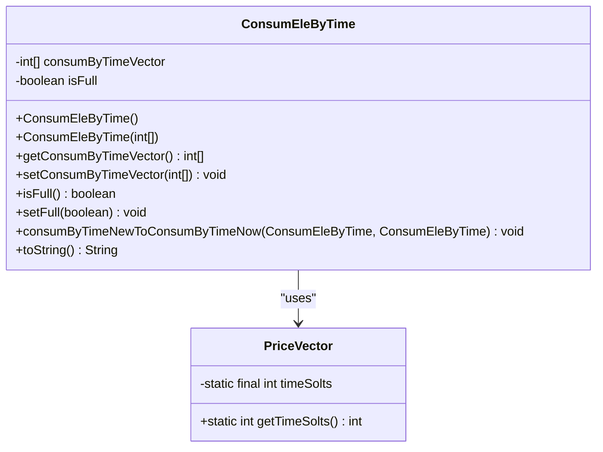
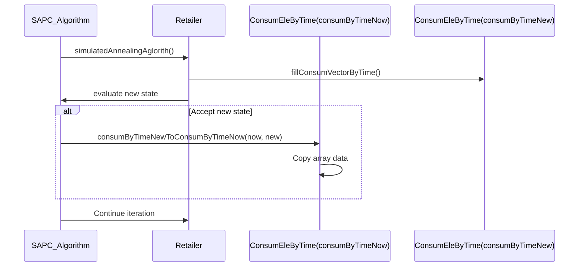
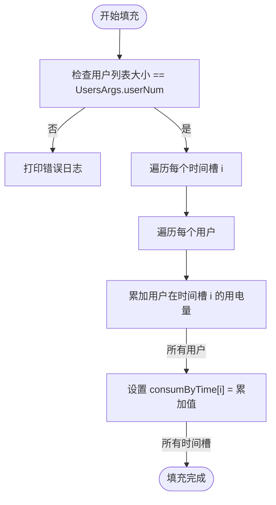
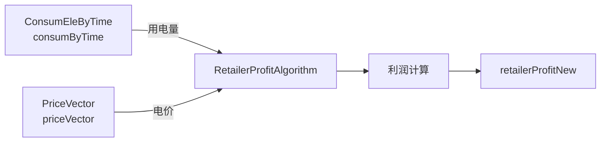

# ConsumEleByTime 系统总用电统计模型

<cite>
**Referenced Files in This Document**  
- [ConsumEleByTime.java](file://src/main/java/io/leavesfly/smartgrid/retailer/ConsumEleByTime.java)
- [Retailer.java](file://src/main/java/io/leavesfly/smartgrid/retailer/Retailer.java)
- [PriceVector.java](file://src/main/java/io/leavesfly/smartgrid/retailer/PriceVector.java)
- [RetailerProfitAlgorithm.java](file://src/main/java/io/leavesfly/smartgrid/retailer/RetailerProfitAlgorithm.java)
- [OneUserConsumVector.java](file://src/main/java/io/leavesfly/smartgrid/user/OneUserConsumVector.java)
- [RetailerInitArgs.java](file://src/main/java/io/leavesfly/smartgrid/retailer/RetailerInitArgs.java)
- [RetailerThread.java](file://src/main/java/io/leavesfly/smartgrid/retailer/RetailerThread.java)
</cite>

## 目录
1. [简介](#简介)
2. [核心数据结构](#核心数据结构)
3. [构造函数与初始化](#构造函数与初始化)
4. [关键静态方法](#关键静态方法)
5. [与零售商类的集成](#与零售商类的集成)
6. [利润计算中的角色](#利润计算中的角色)
7. [字符串表示与潜在问题](#字符串表示与潜在问题)
8. [线程安全注意事项](#线程安全注意事项)
9. [类关系图](#类关系图)

## 简介
`ConsumEleByTime` 类是智能电网系统中零售商侧的核心数据聚合模型，负责汇总全系统在各个时间槽内的总用电量。该模型通过一个整型数组 `consumByTimeVector` 存储按时间槽划分的聚合用电数据，并利用布尔标志 `isFull` 指示数据收集是否完成。本技术文档将深入解析该类的设计、实现及其在整个系统中的关键作用。

## 核心数据结构
`ConsumEleByTime` 类的核心在于其两个私有成员变量，它们共同构成了系统级用电统计的状态。

- **`consumByTimeVector`**: 一个整型数组，用于存储每个时间槽的总用电量。数组的每个索引对应一个时间槽，其值表示该时段所有用户用电量的累加和。
- **`isFull`**: 一个布尔标志位，用于指示 `consumByTimeVector` 是否已成功收集了所有用户的用电数据。当所有用户数据都已累加完毕后，此标志位应被设置为 `true`。

该数据结构的设计使得零售商能够高效地获取任意时间槽的总负荷，为后续的定价策略和利润计算提供基础数据。

**Section sources**
- [ConsumEleByTime.java](file://src/main/java/io/leavesfly/smartgrid/retailer/ConsumEleByTime.java#L3-L5)

## 构造函数与初始化
`ConsumEleByTime` 类提供了两个构造函数，其中无参构造函数是系统初始化的关键。



**Diagram sources**
- [ConsumEleByTime.java](file://src/main/java/io/leavesfly/smartgrid/retailer/ConsumEleByTime.java#L7-L11)
- [PriceVector.java](file://src/main/java/io/leavesfly/smartgrid/retailer/PriceVector.java#L6-L7)

### 无参构造函数
```java
public ConsumEleByTime(){
    consumByTimeVector = new int[PriceVector.getTimeSolts()];
    isFull = false;
}
```
此构造函数通过调用 `PriceVector.getTimeSolts()` 动态获取时间槽的数量，并据此初始化 `consumByTimeVector` 数组的长度。这种设计确保了 `ConsumEleByTime` 模型与系统定义的时间槽配置保持同步，提高了代码的灵活性和可维护性。`isFull` 标志位在初始化时被设置为 `false`，表示数据收集尚未开始。

### 有参构造函数
```java
public ConsumEleByTime(int[] consumByTimeVector ){
    this.consumByTimeVector = consumByTimeVector;
    isFull = false;
}
```
此构造函数允许外部传入一个预定义的用电量数组，用于创建一个具有初始状态的 `ConsumEleByTime` 实例。这在某些需要从特定状态开始模拟的场景下非常有用。

**Section sources**
- [ConsumEleByTime.java](file://src/main/java/io/leavesfly/smartgrid/retailer/ConsumEleByTime.java#L7-L20)

## 关键静态方法
`ConsumEleByTime` 类定义了一个关键的静态方法 `consumByTimeNewToConsumByTimeNow`，该方法在模拟退火算法的迭代过程中扮演着至关重要的角色。



**Diagram sources**
- [ConsumEleByTime.java](file://src/main/java/io/leavesfly/smartgrid/retailer/ConsumEleByTime.java#L45-L58)
- [Retailer.java](file://src/main/java/io/leavesfly/smartgrid/retailer/Retailer.java#L100-L104)
- [SAPC_Algorithm.java](file://src/main/java/io/leavesfly/smartgrid/retailer/SAPC_Algorithm.java#L25-L30)

### `consumByTimeNewToConsumByTimeNow` 方法
```java
public static void consumByTimeNewToConsumByTimeNow(
        ConsumEleByTime consumByTimeNow, ConsumEleByTime consumByTimeNew) {
    if (consumByTimeNew.getConsumByTimeVector().length != consumByTimeNow
            .getConsumByTimeVector().length) {
        return;
    }
    for (int i = 0; i < consumByTimeNew.getConsumByTimeVector().length; i++) {
        consumByTimeNow.getConsumByTimeVector()[i] = consumByTimeNew
                .getConsumByTimeVector()[i];
    }
}
```
该方法的设计目的是在模拟退火算法（SAPC_Algorithm）的迭代过程中，安全地将 `consumByTimeNew`（新状态）的用电统计数据复制到 `consumByTimeNow`（当前状态）中。它通过逐元素复制数组内容，实现了状态的“深拷贝”效果，从而防止了直接引用赋值可能导致的并发修改问题。此方法是确保算法状态正确演进的核心机制。

**Section sources**
- [ConsumEleByTime.java](file://src/main/java/io/leavesfly/smartgrid/retailer/ConsumEleByTime.java#L45-L58)

## 与零售商类的集成
`ConsumEleByTime` 模型与 `Retailer` 类紧密耦合，`Retailer` 类通过 `fillConsumVectorByTime` 静态方法负责填充该模型的数据。



**Diagram sources**
- [Retailer.java](file://src/main/java/io/leavesfly/smartgrid/retailer/Retailer.java#L100-L104)
- [OneUserConsumVector.java](file://src/main/java/io/leavesfly/smartgrid/user/OneUserConsumVector.java#L25-L27)

### `fillConsumVectorByTime` 方法
```java
public static void fillConsumVectorByTime(ConsumEleByTime consumByTime,
        List<OneUserConsumVector> userConsumVectList) {
    if (userConsumVectList.size() != UsersArgs.userNum) {
        System.out.println("fillConsumVectorByTime");
    }
    for (int i = 0; i < consumByTime.getConsumByTimeVector().length; i++) {
        int consumInTime = 0;
        for (OneUserConsumVector oneUser : userConsumVectList) {
            consumInTime += oneUser.getConsumVector()[i];
        }
        consumByTime.getConsumByTimeVector()[i] = consumInTime;
    }
}
```
此方法是数据聚合的核心逻辑。它接收一个 `ConsumEleByTime` 实例和一个 `OneUserConsumVector` 用户用电量列表。首先，它会校验用户列表的大小是否等于预设的用户总数 `UsersArgs.userNum`。然后，它通过双重循环，将所有用户在每个时间槽的用电量累加，并将结果存入 `consumByTime` 的对应数组位置。该方法由 `RetailerThread` 在接收到所有用户数据后调用。

**Section sources**
- [Retailer.java](file://src/main/java/io/leavesfly/smartgrid/retailer/Retailer.java#L100-L104)

## 利润计算中的角色
`ConsumEleByTime` 模型是计算零售商利润的关键输入参数之一，它与 `PriceVector` 一起被 `RetailerProfitAlgorithm` 类使用。



**Diagram sources**
- [RetailerProfitAlgorithm.java](file://src/main/java/io/leavesfly/smartgrid/retailer/RetailerProfitAlgorithm.java#L3-L35)
- [Retailer.java](file://src/main/java/io/leavesfly/smartgrid/retailer/Retailer.java#L95-L98)

### 在 `RetailerProfitAlgorithm` 中的应用
```java
public static float getRetialProfit(ConsumEleByTime consumByTime ,PriceVector priceVector){
    // ... 计算逻辑
    float profit=0f;
    for(int i=0;i<consumByTime.getConsumByTimeVector().length;i++){
        profit +=consumByTime.getConsumByTimeVector()[i]*priceVector.getPrices()[i];
    }
    // ... 成本计算
    return profit;
}
```
`RetailerProfitAlgorithm.getRetialProfit` 方法接收 `ConsumEleByTime` 和 `PriceVector` 作为参数。利润计算的第一步是将每个时间槽的总用电量 (`consumByTime.getConsumByTimeVector()[i]`) 乘以该时段的电价 (`priceVector.getPrices()[i]`)，得到总收入。随后，再减去一个基于总用电量的非线性成本函数。因此，`ConsumEleByTime` 提供的准确用电数据是利润计算正确性的基石。

**Section sources**
- [RetailerProfitAlgorithm.java](file://src/main/java/io/leavesfly/smartgrid/retailer/RetailerProfitAlgorithm.java#L3-L35)

## 字符串表示与潜在问题
`ConsumEleByTime` 类的 `toString()` 方法用于生成其状态的字符串表示，但其中存在一个潜在的不一致性风险。

```java
public String toString() {
    String str = "(";
    for (int i = 0; i < RetailerInitArgs.timeSlots; i++) {
        if (i == RetailerInitArgs.timeSlots - 1) {
            str += consumByTimeVector[i];
        } else {
            str += consumByTimeVector[i] + ",  ";
        }
    }
    str += ")";
    return str;
}
```
该方法在遍历时使用了 `RetailerInitArgs.timeSlots` 常量来确定循环次数。然而，`consumByTimeVector` 数组的实际长度是由 `PriceVector.getTimeSolts()` 决定的。尽管在当前代码中这两个常量的值都是4，但它们是独立定义的。如果未来 `PriceVector.timeSolts` 被修改而 `RetailerInitArgs.timeSlots` 未同步更新，`toString()` 方法将无法正确遍历整个数组，可能导致 `ArrayIndexOutOfBoundsException` 或数据截断。**最佳实践是统一使用 `PriceVector.getTimeSolts()`**。

**Section sources**
- [ConsumEleByTime.java](file://src/main/java/io/leavesfly/smartgrid/retailer/ConsumEleByTime.java#L60-L72)

## 线程安全注意事项
在多线程环境下，`ConsumEleByTime` 实例的访问需要特别注意线程安全问题。

`Retailer` 类中维护了两个 `ConsumEleByTime` 实例：`consumByTimeNow` 和 `consumByTimeNew`。`consumByTimeNew` 由多个 `RetailerThread` 并发写入（通过 `fillConsumVectorByTime` 方法）。虽然 `fillConsumVectorByTime` 方法本身不是线程安全的，但其调用点在 `RetailerThread.run()` 中被 `synchronized (retailer.getUserConsumList())` 块保护，确保了同一时间只有一个线程在执行填充操作。然而，`consumByTimeNow` 在被 `consumByTimeNewToConsumByTimeNow` 方法复制时，也应通过同步机制（如 `synchronized (retailer.getConsumByTimeNow())`）来防止读写冲突。开发者在扩展此模型时，必须严格遵守外部同步控制的原则。

**Section sources**
- [RetailerThread.java](file://src/main/java/io/leavesfly/smartgrid/retailer/RetailerThread.java#L55-L65)
- [ConsumEleByTime.java](file://src/main/java/io/leavesfly/smartgrid/retailer/ConsumEleByTime.java#L45-L58)

## 类关系图
```mermaid
graph TD
A[OneUserConsumVector] --> |包含| B[consumVector: int[]]
C[Retailer] --> |包含| D[consumByTimeNow: ConsumEleByTime]
C --> |包含| E[consumByTimeNew: ConsumEleByTime]
C --> |包含| F[userConsumVectList: List<OneUserConsumVector>]
G[PriceVector] --> |包含| H[timeSolts: int]
D --> |使用| H
E --> |使用| H
I[RetailerProfitAlgorithm] --> |使用| D
I --> |使用| G
J[SAPC_Algorithm] --> |使用| E
J --> |使用| D
K[RetailerThread] --> |使用| C
K --> |通信| A
style A fill:#f9f,stroke:#333
style C fill:#bbf,stroke:#333
style D fill:#f96,stroke:#333
style E fill:#f96,stroke:#333
style G fill:#9f9,stroke:#333
style I fill:#ff9,stroke:#333
style J fill:#9cf,stroke:#333
style K fill:#cfc,stroke:#333
```

**Diagram sources**
- [ConsumEleByTime.java](file://src/main/java/io/leavesfly/smartgrid/retailer/ConsumEleByTime.java)
- [Retailer.java](file://src/main/java/io/leavesfly/smartgrid/retailer/Retailer.java)
- [PriceVector.java](file://src/main/java/io/leavesfly/smartgrid/retailer/PriceVector.java)
- [RetailerProfitAlgorithm.java](file://src/main/java/io/leavesfly/smartgrid/retailer/RetailerProfitAlgorithm.java)
- [OneUserConsumVector.java](file://src/main/java/io/leavesfly/smartgrid/user/OneUserConsumVector.java)
- [RetailerThread.java](file://src/main/java/io/leavesfly/smartgrid/retailer/RetailerThread.java)