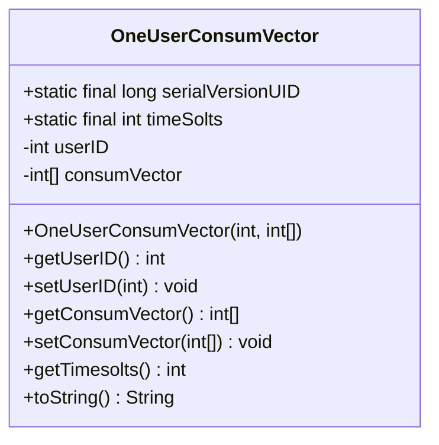
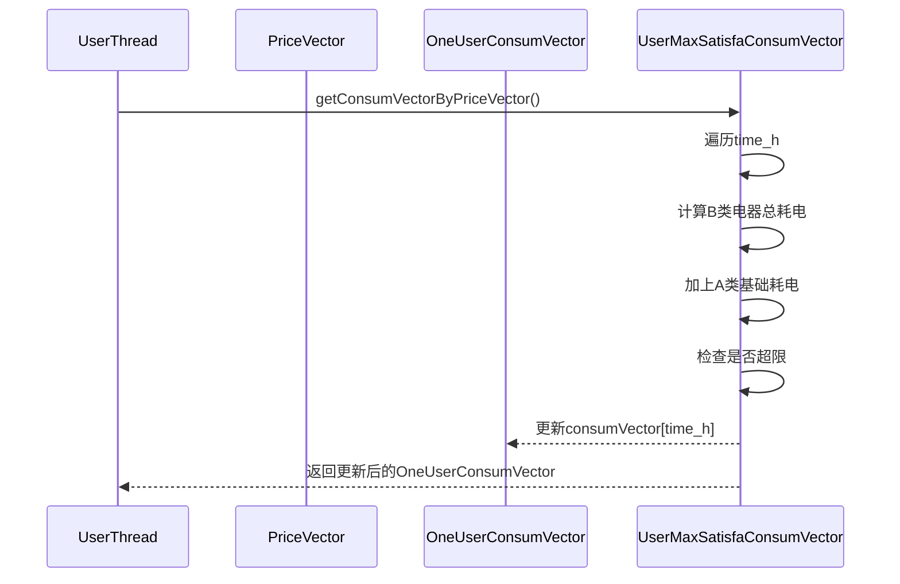
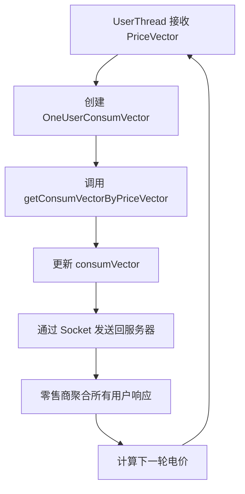
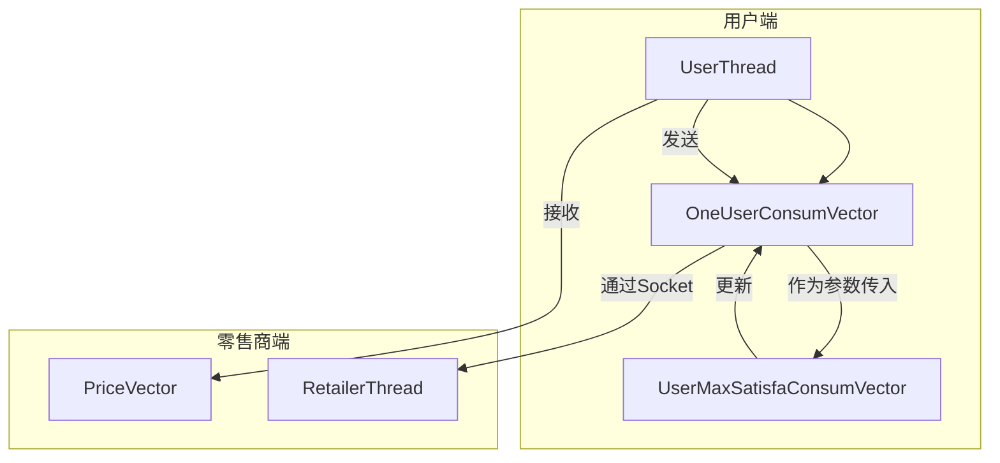

# OneUserConsumVector 用户用电向量模型

<cite>
**本文档引用文件**  
- [OneUserConsumVector.java](file://src/main/java/io/leavesfly/smartgrid/user/OneUserConsumVector.java)
- [UserMaxSatisfaConsumVector.java](file://src/main/java/io/leavesfly/smartgrid/user/UserMaxSatisfaConsumVector.java)
- [UserThread.java](file://src/main/java/io/leavesfly/smartgrid/user/UserThread.java)
- [PriceVector.java](file://src/main/java/io/leavesfly/smartgrid/retailer/PriceVector.java)
- [UsersArgs.java](file://src/main/java/io/leavesfly/smartgrid/user/UsersArgs.java)
</cite>

## 目录
1. [简介](#简介)
2. [核心数据结构设计](#核心数据结构设计)
3. [构造函数与初始化逻辑](#构造函数与初始化逻辑)
4. [用电向量计算方法解析](#用电向量计算方法解析)
5. [状态更新方法说明](#状态更新方法说明)
6. [时段一致性保障机制](#时段一致性保障机制)
7. [字符串输出格式](#字符串输出格式)
8. [在客户端-服务器通信中的角色](#在客户端-服务器通信中的角色)
9. [类关系与依赖图](#类关系与依赖图)

## 简介
`OneUserConsumVector` 是智能电网系统中用于表示单个用户在多个时段内用电计划的核心数据模型。该类封装了用户ID和一个整型数组 `consumVector`，用以描述用户在四个不同时段的电力消耗分配。作为可序列化对象，它支持通过Socket将用户的最优用电策略回传给零售商服务器，是实现分布式优化算法的关键数据载体。

## 核心数据结构设计
该类定义了两个核心字段：`userID` 用于唯一标识用户身份，`consumVector` 是一个长度为4的整型数组，表示用户在四个连续时间段内的用电量（单位：千瓦时）。类实现了 `Serializable` 接口，确保其对象可以在网络上传输，满足客户端与服务器之间数据交换的需求。

**图示来源**  
- [OneUserConsumVector.java](file://src/main/java/io/leavesfly/smartgrid/user/OneUserConsumVector.java#L4-L51)

**本节来源**  
- [OneUserConsumVector.java](file://src/main/java/io/leavesfly/smartgrid/user/OneUserConsumVector.java#L4-L51)

## 构造函数与初始化逻辑
构造函数 `OneUserConsumVector(int userID, int[] consumVector)` 接收用户ID和初始用电向量作为参数，并将其赋值给对应字段。此构造方式允许在创建实例时即完成用户身份与用电计划的绑定，常用于 `UserThread` 中根据当前电价生成新的用电响应方案。

**本节来源**  
- [OneUserConsumVector.java](file://src/main/java/io/leavesfly/smartgrid/user/OneUserConsumVector.java#L13-L17)
- [UserThread.java](file://src/main/java/io/leavesfly/smartgrid/user/UserThread.java#L47-L49)

## 用电向量计算方法解析
`getConsumVectorByPriceVector` 方法由 `UserMaxSatisfaConsumVector` 类提供，用于基于接收到的电价向量计算满足用户满意度的最大用电方案。该方法遍历每个时段，结合A类基础电器和B类可调节电器的功耗特性，综合电价影响与用户偏好，动态调整各时段用电量。最终结果通过修改传入的 `OneUserConsumVector` 实例的 `consumVector` 字段完成更新。

**图示来源**  
- [UserMaxSatisfaConsumVector.java](file://src/main/java/io/leavesfly/smartgrid/user/UserMaxSatisfaConsumVector.java#L6-L34)
- [PriceVector.java](file://src/main/java/io/leavesfly/smartgrid/retailer/PriceVector.java#L0-L106)

**本节来源**  
- [UserMaxSatisfaConsumVector.java](file://src/main/java/io/leavesfly/smartgrid/user/UserMaxSatisfaConsumVector.java#L6-L34)

## 状态更新方法说明
`setConsumVector(int[])` 和 `setUserID(int)` 方法提供了对对象内部状态的动态修改能力。在多轮优化迭代过程中，零售商服务器可能需要根据全局负荷情况多次请求用户更新其用电计划，这些方法使得 `OneUserConsumVector` 能够灵活响应变化，适应动态电价环境下的持续优化需求。

**本节来源**  
- [OneUserConsumVector.java](file://src/main/java/io/leavesfly/smartgrid/user/OneUserConsumVector.java#L27-L35)

## 时段一致性保障机制
`getTimesolts()` 是一个静态方法，返回固定的时段数量 `4`。该设计确保了 `OneUserConsumVector` 与 `PriceVector` 在结构上保持一致，避免因数组长度不匹配导致的运行时错误。这种硬编码方式虽然缺乏灵活性，但在本系统中保证了所有组件对“四时段”模型的统一认知。

**本节来源**  
- [OneUserConsumVector.java](file://src/main/java/io/leavesfly/smartgrid/user/OneUserConsumVector.java#L37-L39)
- [UsersArgs.java](file://src/main/java/io/leavesfly/smartgrid/user/UsersArgs.java#L2-L3)

## 字符串输出格式
`toString()` 方法返回格式化的字符串，形如 `"oneUserConsumVector:(1,  2,  3,  4)"`，便于日志记录和调试追踪。该输出清晰展示了用户在各个时段的具体用电量，有助于分析用户用电行为模式及系统整体运行状态。

**本节来源**  
- [OneUserConsumVector.java](file://src/main/java/io/leavesfly/smartgrid/user/OneUserConsumVector.java#L41-L51)

## 在客户端-服务器通信中的角色
在 `UserThread` 的运行逻辑中，`OneUserConsumVector` 扮演着关键的数据交换角色。每当客户端从服务器接收到新的 `PriceVector` 后，便会创建一个新的 `OneUserConsumVector` 实例，调用 `UserMaxSatisfaConsumVector.getConsumVectorByPriceVector()` 方法计算最优用电方案，并通过 `ObjectOutputStream` 将结果回传给零售商服务器。这一过程构成了闭环优化的核心数据流。

**图示来源**  
- [UserThread.java](file://src/main/java/io/leavesfly/smartgrid/user/UserThread.java#L40-L70)
- [OneUserConsumVector.java](file://src/main/java/io/leavesfly/smartgrid/user/OneUserConsumVector.java#L13-L17)

**本节来源**  
- [UserThread.java](file://src/main/java/io/leavesfly/smartgrid/user/UserThread.java#L40-L70)

## 类关系与依赖图
以下图表展示了 `OneUserConsumVector` 与其他核心组件之间的交互关系。

**图示来源**  
- [UserThread.java](file://src/main/java/io/leavesfly/smartgrid/user/UserThread.java#L40-L70)
- [UserMaxSatisfaConsumVector.java](file://src/main/java/io/leavesfly/smartgrid/user/UserMaxSatisfaConsumVector.java#L6-L34)
- [OneUserConsumVector.java](file://src/main/java/io/leavesfly/smartgrid/user/OneUserConsumVector.java#L4-L51)

**本节来源**  
- [UserThread.java](file://src/main/java/io/leavesfly/smartgrid/user/UserThread.java#L40-L70)
- [UserMaxSatisfaConsumVector.java](file://src/main/java/io/leavesfly/smartgrid/user/UserMaxSatisfaConsumVector.java#L6-L34)