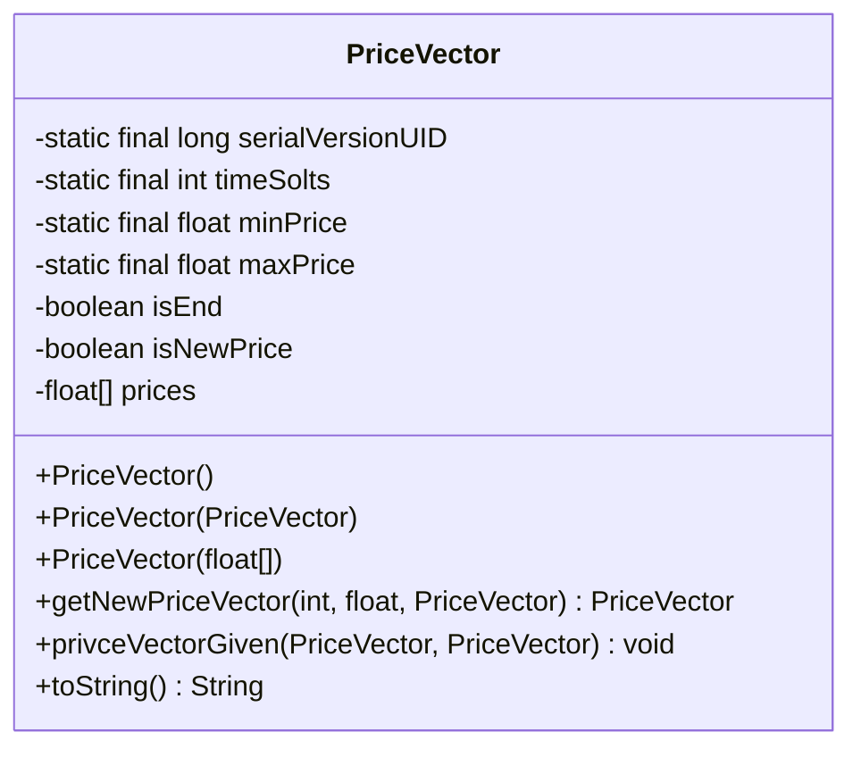
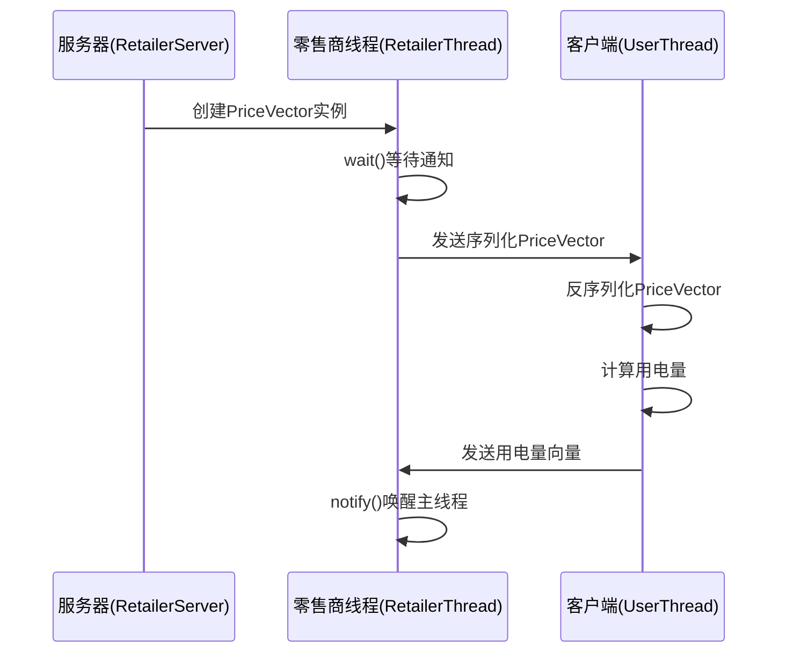
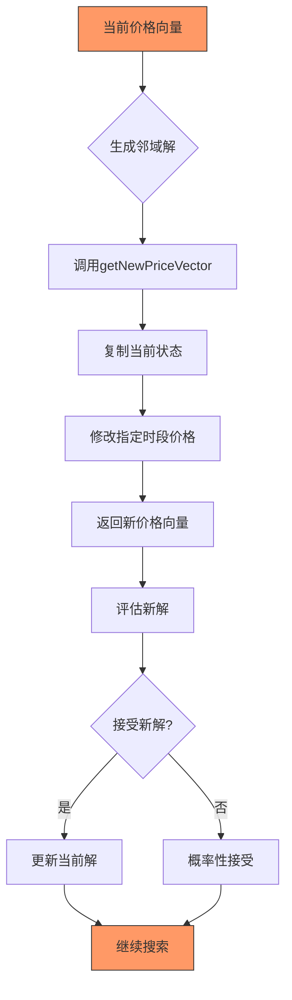
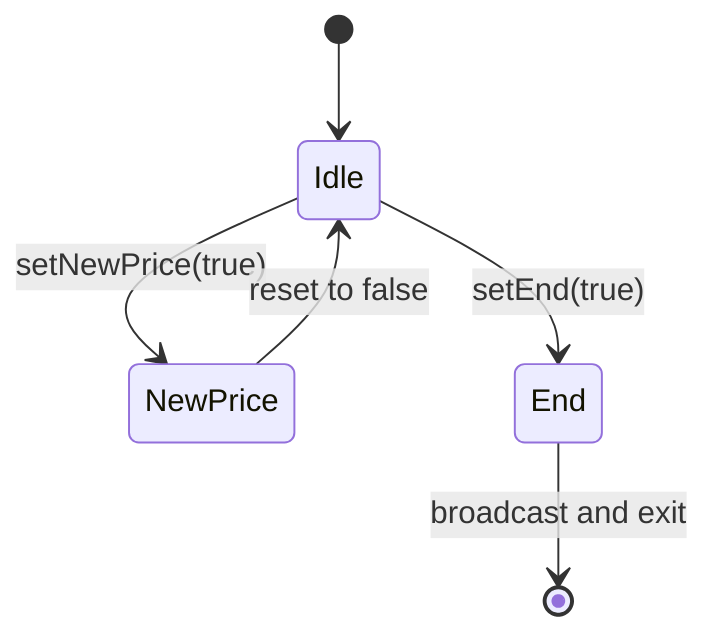
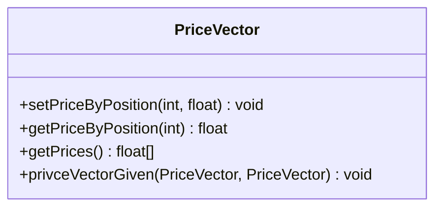
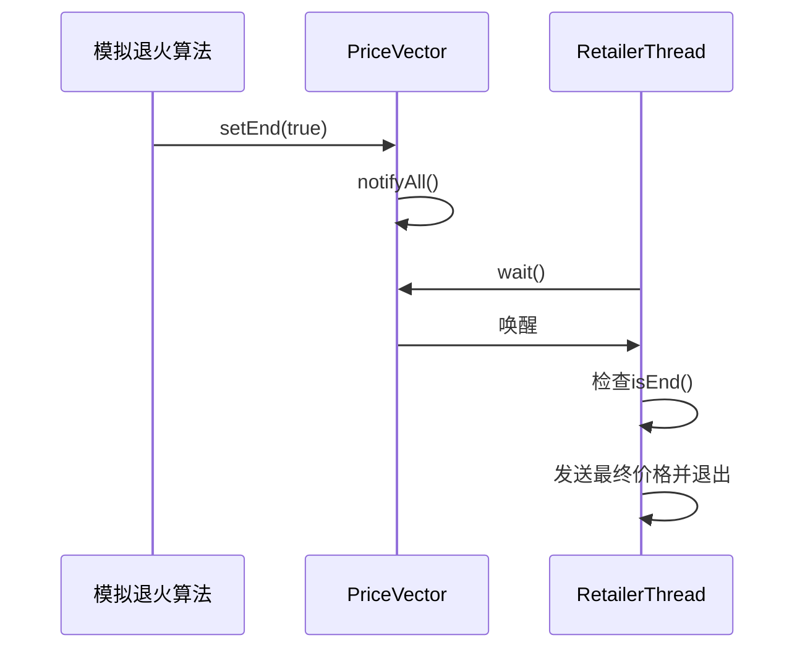

# PriceVector 价格向量模型

<cite>
**Referenced Files in This Document**   
- [PriceVector.java](file://src/main/java/io/leavesfly/smartgrid/retailer/PriceVector.java)
- [Retailer.java](file://src/main/java/io/leavesfly/smartgrid/retailer/Retailer.java)
- [SAPC_Algorithm.java](file://src/main/java/io/leavesfly/smartgrid/retailer/SAPC_Algorithm.java)
- [RetailerThread.java](file://src/main/java/io/leavesfly/smartgrid/retailer/RetailerThread.java)
- [RetailerServer.java](file://src/main/java/io/leavesfly/smartgrid/retailer/RetailerServer.java)
</cite>

## Table of Contents
1. [简介](#简介)
2. [核心数据结构](#核心数据结构)
3. [构造函数与初始化](#构造函数与初始化)
4. [序列化与网络传输](#序列化与网络传输)
5. [模拟退火算法集成](#模拟退火算法集成)
6. [同步控制机制](#同步控制机制)
7. [状态复制与数据操作](#状态复制与数据操作)
8. [优化结束信号](#优化结束信号)
9. [日志与调试支持](#日志与调试支持)
10. [实际应用示例](#实际应用示例)

## 简介

PriceVector 类是智能电网动态定价系统中的核心数据模型，用于表示不同时段的电价向量。该类作为零售商（Retailer）与用户（User）之间通信的关键数据载体，在模拟退火算法优化电价策略的过程中扮演着重要角色。通过 Socket 通信机制，PriceVector 实例在服务器端生成并广播给所有连接的客户端，实现电价信息的实时同步。

**Section sources**
- [PriceVector.java](file://src/main/java/io/leavesfly/smartgrid/retailer/PriceVector.java#L1-L10)

## 核心数据结构

PriceVector 类的核心是一个 float 数组，用于存储四个不同时段的电价信息。该设计基于智能电网中典型的分时电价策略，将一天划分为四个定价时段。



**Diagram sources**
- [PriceVector.java](file://src/main/java/io/leavesfly/smartgrid/retailer/PriceVector.java#L1-L107)

**Section sources**
- [PriceVector.java](file://src/main/java/io/leavesfly/smartgrid/retailer/PriceVector.java#L5-L15)

### 时段配置

类中定义了 `timeSolts` 常量，固定为 4，表示系统将一天划分为四个定价时段。这个值通过静态方法 `getTimeSolts()` 提供给外部组件访问，确保系统各部分对时段数量的一致理解。

### 价格边界

`minPrice` 和 `maxPrice` 分别定义了电价的下限（0.5f）和上限（1.5f），单位为元/千瓦时。这些业务规则确保生成的电价在合理的经济范围内，防止出现过高或过低的异常价格。`getOneRandomPrice()` 方法利用这两个边界值生成符合业务规则的随机电价，用于算法初始化和邻域解生成。

## 构造函数与初始化

PriceVector 提供了三种构造函数，支持不同的初始化场景。

```mermaid
flowchart TD
Start([PriceVector()]) --> RandomInit["生成随机基准价格"]
RandomInit --> Loop["循环4次"]
Loop --> SetPrice["设置每个时段价格"]
SetPrice --> Loop
Loop --> End([构造完成])
style Start fill:#f9f,stroke:#333
style End fill:#f9f,stroke:#333
```

**Diagram sources**
- [PriceVector.java](file://src/main/java/io/leavesfly/smartgrid/retailer/PriceVector.java#L17-L27)

**Section sources**
- [PriceVector.java](file://src/main/java/io/leavesfly/smartgrid/retailer/PriceVector.java#L17-L35)

### 无参构造函数

无参构造函数用于创建一个新的价格向量实例。它首先生成一个介于 `minPrice` 和 `maxPrice` 之间的随机基准价格，然后将这个价格赋值给所有四个时段，创建一个初始的、各时段价格相等的向量。这种初始化方式为模拟退火算法提供了一个合理的起点。

### 拷贝构造函数

拷贝构造函数接收另一个 PriceVector 实例作为参数，创建一个深拷贝。它不仅复制所有时段的价格，还复制 `isEnd` 标志位的状态。这种设计确保了状态的完整迁移，是算法中状态保存和恢复的基础。

### 数组构造函数

数组构造函数允许直接使用外部提供的 float 数组来初始化价格向量。这种灵活性支持从配置文件、数据库或其他数据源直接加载预定义的电价方案。

## 序列化与网络传输

PriceVector 类实现了 Serializable 接口，使其能够通过 Java 对象序列化机制在网络中传输。



**Diagram sources**
- [RetailerThread.java](file://src/main/java/io/leavesfly/smartgrid/retailer/RetailerThread.java#L30-L88)
- [RetailerServer.java](file://src/main/java/io/leavesfly/smartgrid/retailer/RetailerServer.java#L15-L42)

**Section sources**
- [PriceVector.java](file://src/main/java/io/leavesfly/smartgrid/retailer/PriceVector.java#L3)
- [RetailerThread.java](file://src/main/java/io/leavesfly/smartgrid/retailer/RetailerThread.java#L35-L38)

### 序列化兼容性

`serialVersionUID` 字段被显式定义为 `-5652678536888894383L`，确保了不同 JVM 实例之间序列化数据的兼容性。即使类的结构在未来发生微小变化，只要 `serialVersionUID` 保持不变，旧版本的序列化数据仍然可以被新版本正确反序列化，这对于分布式系统中的版本管理至关重要。

### Socket 通信载体

在零售商服务器（RetailerServer）的架构中，PriceVector 作为核心数据载体，通过 ObjectOutputStream 和 ObjectInputStream 在服务器和客户端之间传输。服务器端的 RetailerThread 线程负责将最新的 PriceVector 实例序列化后发送给所有连接的用户客户端，实现了电价信息的广播。

## 模拟退火算法集成

PriceVector 类与模拟退火算法（SAPC_Algorithm）深度集成，是算法搜索最优解过程中的核心数据结构。



**Diagram sources**
- [SAPC_Algorithm.java](file://src/main/java/io/leavesfly/smartgrid/retailer/SAPC_Algorithm.java#L32-L87)
- [PriceVector.java](file://src/main/java/io/leavesfly/smartgrid/retailer/PriceVector.java#L53-L58)

**Section sources**
- [PriceVector.java](file://src/main/java/io/leavesfly/smartgrid/retailer/PriceVector.java#L53-L58)
- [SAPC_Algorithm.java](file://src/main/java/io/leavesfly/smartgrid/retailer/SAPC_Algorithm.java#L32-L59)

### 邻域解生成

`getNewPriceVector(int position, float price, PriceVector priceVectorNew)` 方法是模拟退火算法生成邻域解的关键。它接收三个参数：要修改的时段位置、新的价格值以及一个用于存储结果的 PriceVector 实例。该方法首先调用 `privceVectorGiven` 将当前价格向量的所有值复制到目标实例，然后修改指定位置的价格，最后返回这个新的价格向量。这种设计实现了"在当前解的基础上进行微小扰动"的邻域搜索策略。

## 同步控制机制

PriceVector 类包含两个重要的布尔标志位，用于多线程环境下的同步控制。



**Diagram sources**
- [PriceVector.java](file://src/main/java/io/leavesfly/smartgrid/retailer/PriceVector.java#L12-L13)
- [RetailerThread.java](file://src/main/java/io/leavesfly/smartgrid/retailer/RetailerThread.java#L45-L48)

**Section sources**
- [PriceVector.java](file://src/main/java/io/leavesfly/smartgrid/retailer/PriceVector.java#L12-L13)

### isNewPrice 标志位

`isNewPrice` 标志位用于指示价格向量是否已被更新。在多线程环境中，当算法线程生成了一个新的价格方案后，会将此标志位置为 true，通知其他线程（如通信线程）有新的价格需要广播。接收线程在处理完新价格后，会将此标志位重置为 false，实现生产者-消费者模式的同步。

### isEnd 字段

`isEnd` 字段是一个特殊的布尔标志，用于表示优化过程的结束信号。当模拟退火算法收敛并找到最优解后，算法会调用 `setEnd(true)` 方法。这个信号会被 RetailerThread 捕获，导致其退出无限循环，向客户端发送最终的价格向量后关闭连接，从而优雅地终止整个服务。

## 状态复制与数据操作

PriceVector 类提供了灵活的数据操作接口，支持对价格向量的精确控制。



**Diagram sources**
- [PriceVector.java](file://src/main/java/io/leavesfly/smartgrid/retailer/PriceVector.java#L40-L52)

**Section sources**
- [PriceVector.java](file://src/main/java/io/leavesfly/smartgrid/retailer/PriceVector.java#L40-L52)

### 时段价格操作

`setPriceByPosition(int position, float price)` 和 `getPriceByPosition(int position)` 方法允许对特定时段的价格进行读写操作。`position` 参数指定要操作的时段（0-3），`price` 参数指定新的价格值。这些方法包含了边界检查，确保操作的时段索引有效。

### 状态复制方法

`privceVectorGiven(PriceVector priceVectorNow, PriceVector priceVectorNew)` 方法实现了两个价格向量之间的状态复制。**需要注意的是，该方法的参数顺序存在潜在的混淆风险**：第一个参数是目标向量，第二个参数是源向量，这与常见的 "copyFrom" 语义相反。在调用时必须特别注意参数顺序，否则会导致逻辑错误。正确的调用方式是 `target.privceVectorGiven(target, source)`。

## 优化结束信号

`isEnd` 字段在系统中扮演着关键的协调角色，标志着整个优化周期的完成。



**Diagram sources**
- [SAPC_Algorithm.java](file://src/main/java/io/leavesfly/smartgrid/retailer/SAPC_Algorithm.java#L89-L111)
- [RetailerThread.java](file://src/main/java/io/leavesfly/smartgrid/retailer/RetailerThread.java#L45-L48)

**Section sources**
- [PriceVector.java](file://src/main/java/io/leavesfly/smartgrid/retailer/PriceVector.java#L12)
- [SAPC_Algorithm.java](file://src/main/java/io/leavesfly/smartgrid/retailer/SAPC_Algorithm.java#L89-L111)

当算法确定最优解后，会通过 `setEnd(true)` 设置结束标志，并调用 `notifyAll()` 唤醒所有等待的线程。RetailerThread 在每次循环开始时都会检查 `isEnd()` 状态，一旦发现为 true，就会发送最终的价格向量并终止连接，从而实现整个分布式系统的协调关闭。

## 日志与调试支持

PriceVector 类提供了完善的日志和调试支持，便于开发和运维人员监控系统状态。

```mermaid
flowchart LR
A[PriceVector实例] --> B[调用toString()]
B --> C[格式化输出]
C --> D["prices:(0.8, 1.2, 0.9, 1.1)"]
D --> E[写入日志文件]
```

**Diagram sources**
- [PriceVector.java](file://src/main/java/io/leavesfly/smartgrid/retailer/PriceVector.java#L90-L100)

**Section sources**
- [PriceVector.java](file://src/main/java/io/leavesfly/smartgrid/retailer/PriceVector.java#L90-L100)

### toString() 方法

`toString()` 方法将价格向量格式化为可读的字符串，例如 "prices:(0.8, 1.2, 0.9, 1.1)"。这种格式化的输出被广泛用于日志记录，使得在调试日志中可以清晰地看到每次迭代的价格变化，对于算法调试和性能分析至关重要。

## 实际应用示例

以下代码片段展示了 PriceVector 在实际应用中的典型用法：

```java
// 创建初始价格向量
PriceVector currentPrice = new PriceVector();

// 修改第二个时段的价格
currentPrice.setPriceByPosition(1, 1.2f);

// 生成邻域解
PriceVector newPrice = new PriceVector();
currentPrice.getNewPriceVector(2, 0.9f, newPrice);

// 在日志中输出当前价格
System.out.println(currentPrice.toString());
```

这些操作展示了 PriceVector 类在模拟退火算法中的完整生命周期：从初始化、状态修改、邻域解生成到最终的结果输出。