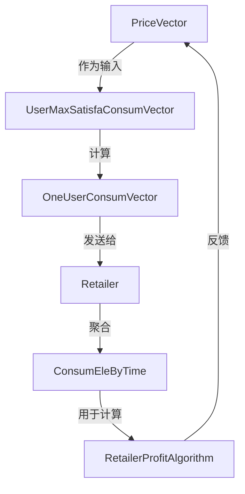
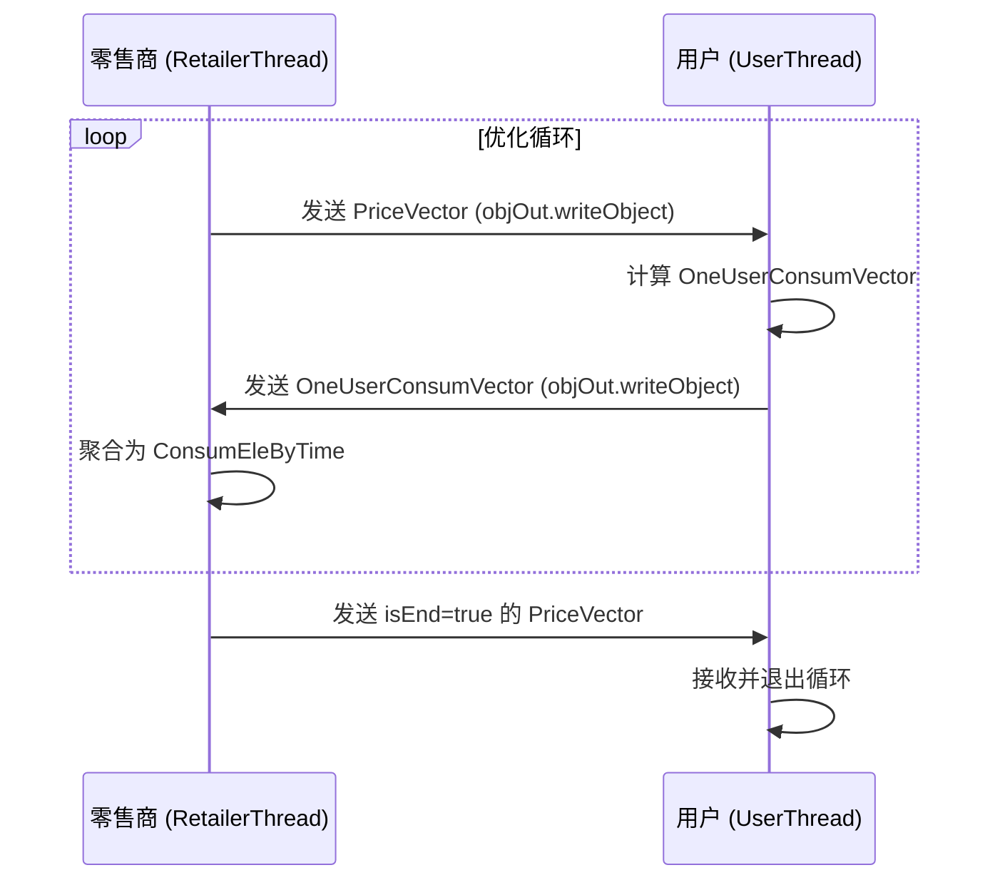

# 数据模型

<cite>
**Referenced Files in This Document**   
- [PriceVector.java](file://src/main/java/io/leavesfly/smartgrid/retailer/PriceVector.java)
- [OneUserConsumVector.java](file://src/main/java/io/leavesfly/smartgrid/user/OneUserConsumVector.java)
- [ConsumEleByTime.java](file://src/main/java/io/leavesfly/smartgrid/retailer/ConsumEleByTime.java)
- [UserThread.java](file://src/main/java/io/leavesfly/smartgrid/user/UserThread.java)
- [RetailerThread.java](file://src/main/java/io/leavesfly/smartgrid/retailer/RetailerThread.java)
- [Retailer.java](file://src/main/java/io/leavesfly/smartgrid/retailer/Retailer.java)
- [UserMaxSatisfaConsumVector.java](file://src/main/java/io/leavesfly/smartgrid/user/UserMaxSatisfaConsumVector.java)
- [RetailerProfitAlgorithm.java](file://src/main/java/io/leavesfly/smartgrid/retailer/RetailerProfitAlgorithm.java)
</cite>

## Table of Contents
1. [核心数据模型概述](#核心数据模型概述)
2. [PriceVector 电价向量](#pricevector-电价向量)
3. [OneUserConsumVector 用户用电向量](#oneuserconsumvector-用户用电向量)
4. [ConsumEleByTime 系统总用电量](#consumelebytime-系统总用电量)
5. [数据模型关系与聚合](#数据模型关系与聚合)
6. [Socket 通信与序列化机制](#socket-通信与序列化机制)
7. [数据验证与内存使用](#数据验证与内存使用)

## 核心数据模型概述

本系统围绕三个核心数据结构构建：`PriceVector`、`OneUserConsumVector` 和 `ConsumEleByTime`。这些模型共同构成了一个智能电网中零售商与用户之间交互的基础。零售商通过 `PriceVector` 向用户广播各时段的电价，用户基于此电价计算并返回自己的用电计划 `OneUserConsumVector`，零售商再将所有用户的用电向量聚合为系统总用电量 `ConsumEleByTime`，用于计算利润和优化定价策略。

**Section sources**
- [PriceVector.java](file://src/main/java/io/leavesfly/smartgrid/retailer/PriceVector.java)
- [OneUserConsumVector.java](file://src/main/java/io/leavesfly/smartgrid/user/OneUserConsumVector.java)
- [ConsumEleByTime.java](file://src/main/java/io/leavesfly/smartgrid/retailer/ConsumEleByTime.java)

## PriceVector 电价向量

`PriceVector` 类用于表示零售商在不同时间段的电价方案。

### 字段定义与业务含义

| 字段名 | 数据类型 | 业务含义 |
| :--- | :--- | :--- |
| `timeSolts` | `int` (静态常量) | 系统划分的时间段总数，固定为4个时段。 |
| `minPrice` | `float` (静态常量) | 电价的最小值，为0.5f。 |
| `maxPrice` | `float` (静态常量) | 电价的最大值，为1.5f。 |
| `isEnd` | `boolean` | 标志位，表示整个优化过程是否结束。当为 `true` 时，通知所有用户停止通信。 |
| `isNewPrice` | `boolean` | 标志位，表示当前电价是否为新生成的方案。 |
| `prices` | `float[]` | 核心数据数组，存储每个时间段的具体电价。数组长度等于 `timeSolts`。 |

### 功能与方法

- **构造函数**: 提供了多个构造函数，包括无参构造（随机生成一个初始电价）、拷贝构造（复制现有电价向量）和基于数组的构造。
- **获取与设置**: 提供了 `getPrices()` 和 `setPriceByPosition()` 等方法来访问和修改电价数组。
- **工具方法**: `getOneRandomPrice()` 用于生成指定范围内的随机电价，`toString()` 方法提供向量的字符串表示，便于日志输出。

**Section sources**
- [PriceVector.java](file://src/main/java/io/leavesfly/smartgrid/retailer/PriceVector.java#L1-L106)

## OneUserConsumVector 用户用电向量

`OneUserConsumVector` 类用于表示单个用户在各时间段的用电计划。

### 字段定义与业务含义

| 字段名 | 数据类型 | 业务含义 |
| :--- | :--- | :--- |
| `timeSolts` | `int` (静态常量) | 时间段总数，与 `PriceVector` 中的定义保持一致，为4。 |
| `userID` | `int` | 用户的唯一标识符。 |
| `consumVector` | `int[]` | 核心数据数组，存储该用户在每个时间段的计划用电量。数组长度等于 `timeSolts`。 |

### 功能与方法

- **构造函数**: 接收 `userID` 和 `consumVector` 数组进行初始化。
- **获取与设置**: 提供了 `getUserID()`、`setUserID()`、`getConsumVector()` 和 `setConsumVector()` 方法来操作用户ID和用电向量。
- **计算逻辑**: 该向量的值并非直接设定，而是由 `UserMaxSatisfaConsumVector` 类根据当前电价 `PriceVector` 计算得出，目标是最大化用户满意度。

**Section sources**
- [OneUserConsumVector.java](file://src/main/java/io/leavesfly/smartgrid/user/OneUserConsumVector.java#L1-L52)

## ConsumEleByTime 系统总用电量

`ConsumEleByTime` 类用于表示在所有用户用电计划汇总后，系统在各时间段的总用电量。

### 字段定义与业务含义

| 字段名 | 数据类型 | 业务含义 |
| :--- | :--- | :--- |
| `consumByTimeVector` | `int[]` | 核心数据数组，存储系统在每个时间段的总用电量。其长度由 `PriceVector.getTimeSolts()` 决定。 |
| `isFull` | `boolean` | 标志位，表示当前的用电量数据是否已从所有用户处收集完整。 |

### 功能与方法

- **构造函数**: 无参构造函数会根据 `PriceVector` 的时段数初始化 `consumByTimeVector` 数组。
- **聚合方法**: `fillConsumVectorByTime()` 是一个静态方法，它遍历所有用户的 `OneUserConsumVector` 列表，将每个时段的用电量累加，从而填充 `consumByTimeVector`。
- **数据同步**: `consumByTimeNewToConsumByTimeNow()` 方法用于将新的总用电量数据（`consumByTimeNew`）复制到当前数据（`consumByTimeNow`）中，确保数据一致性。

**Section sources**
- [ConsumEleByTime.java](file://src/main/java/io/leavesfly/smartgrid/retailer/ConsumEleByTime.java#L1-L60)

## 数据模型关系与聚合

这三个数据模型通过明确的业务逻辑相互关联。零售商首先生成一个 `PriceVector`，然后用户基于此电价计算出自己的 `OneUserConsumVector`。零售商作为中心节点，负责将所有用户的 `OneUserConsumVector` 聚合为一个 `ConsumEleByTime`。

**Diagram sources**
- [Retailer.java](file://src/main/java/io/leavesfly/smartgrid/retailer/Retailer.java#L62-L103)
- [UserMaxSatisfaConsumVector.java](file://src/main/java/io/leavesfly/smartgrid/user/UserMaxSatisfaConsumVector.java#L1-L49)
- [RetailerProfitAlgorithm.java](file://src/main/java/io/leavesfly/smartgrid/retailer/RetailerProfitAlgorithm.java#L1-L35)

**Section sources**
- [Retailer.java](file://src/main/java/io/leavesfly/smartgrid/retailer/Retailer.java#L62-L103)

## Socket 通信与序列化机制

系统通过 Socket 进行零售商与用户之间的通信，`PriceVector` 和 `OneUserConsumVector` 是通信的核心数据载体。为了实现对象在网络间的传输，这两个类都实现了 `java.io.Serializable` 接口。

### 通信流程

1.  **零售商发送电价**: 零售商线程 (`RetailerThread`) 通过 `ObjectOutputStream` 将 `PriceVector` 对象写入 Socket 输出流。
2.  **用户接收电价**: 用户线程 (`UserThread`) 通过 `ObjectInputStream` 从 Socket 输入流中读取 `PriceVector` 对象。
3.  **用户计算并发送用电计划**: 用户根据电价计算出 `OneUserConsumVector`，并通过 `ObjectOutputStream` 将其写回给零售商。
4.  **零售商接收用电计划**: 零售商线程通过 `ObjectInputStream` 读取来自用户的 `OneUserConsumVector` 对象。

**Diagram sources**
- [RetailerThread.java](file://src/main/java/io/leavesfly/smartgrid/retailer/RetailerThread.java#L54-L88)
- [UserThread.java](file://src/main/java/io/leavesfly/smartgrid/user/UserThread.java#L33-L65)

**Section sources**
- [RetailerThread.java](file://src/main/java/io/leavesfly/smartgrid/retailer/RetailerThread.java#L54-L88)
- [UserThread.java](file://src/main/java/io/leavesfly/smartgrid/user/UserThread.java#L33-L65)

### 序列化兼容性考虑

- **`serialVersionUID`**: `PriceVector` 和 `OneUserConsumVector` 都显式定义了 `serialVersionUID`。这是一个关键的实践，它确保了即使类的结构在未来发生微小变化（如添加非关键字段），只要 `serialVersionUID` 不变，旧版本的序列化数据仍然可以被新版本正确反序列化，反之亦然，从而保证了版本间的兼容性。
- **`ConsumEleByTime` 的缺失**: 值得注意的是，`ConsumEleByTime` 类没有实现 `Serializable` 接口。这表明它主要在零售商内部使用，不参与网络传输，因此无需序列化。

## 数据验证与内存使用

### 数据验证

系统在关键环节进行了数据验证：
- **长度检查**: 在 `RetailerProfitAlgorithm.getRetialProfit()` 方法中，会检查 `ConsumEleByTime` 的用电向量长度是否与 `PriceVector` 的电价向量长度一致，不一致则返回 `-1f`。
- **业务逻辑验证**: `UserMaxSatisfaConsumVector` 在计算用户用电量时，会检查计算结果是否超过用户的最大用电限制 `userMax`，并进行截断。

### 内存使用

- **数组大小固定**: 所有核心数据结构（`prices`, `consumVector`, `consumByTimeVector`）的数组大小都由 `timeSolts` (4) 固定决定，内存占用是可预测且恒定的。
- **对象复用**: 系统设计中体现了对象复用的思想。例如，`Retailer` 类持有 `priceVectorNew` 和 `consumByTimeNew` 作为“新”状态的容器，通过 `privceVectorGiven` 和 `consumByTimeNewToConsumByTimeNow` 方法将新状态“提交”到“当前”状态 (`priceVectorNow`, `consumByTimeNow`)，避免了频繁创建新对象，有助于减少垃圾回收压力。