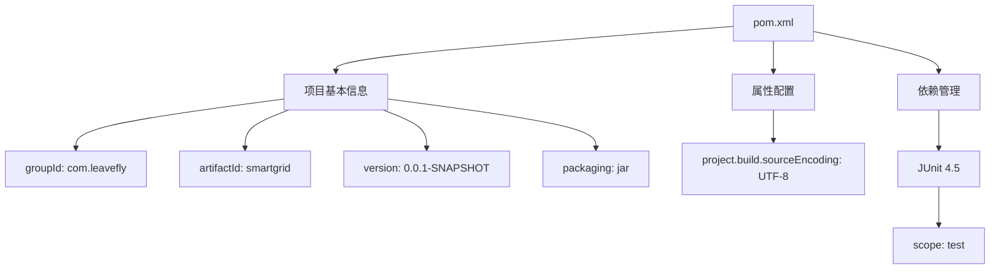
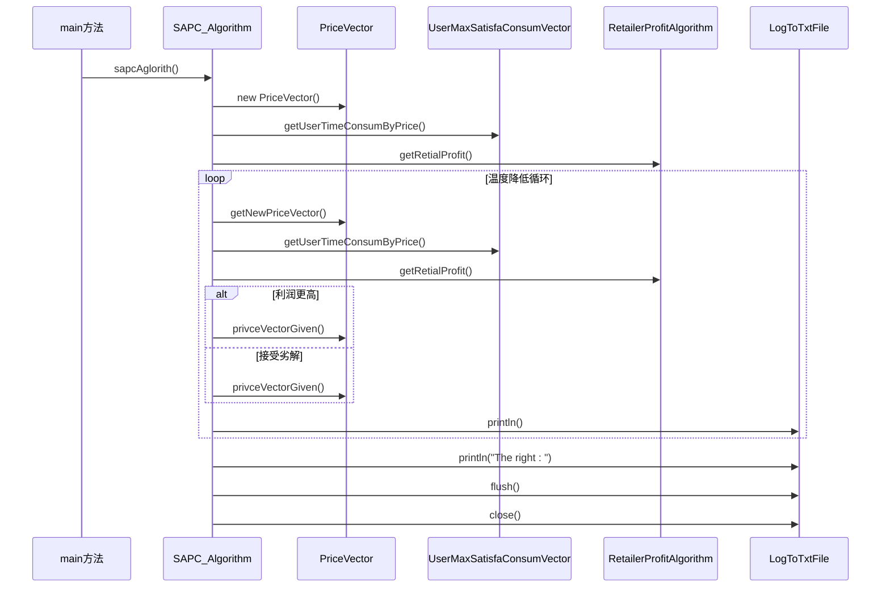
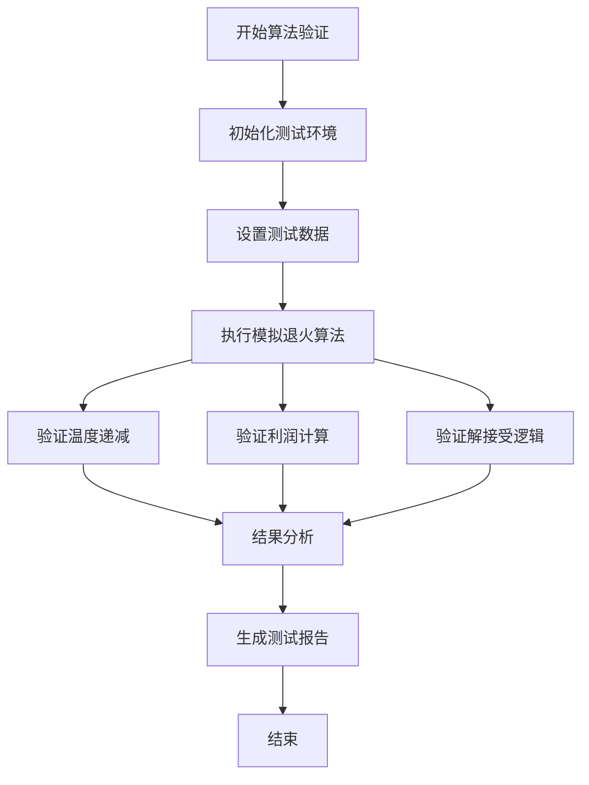

# 构建与测试

<cite>
**本文档中引用的文件**
- [pom.xml](file://pom.xml)
- [SAPC_Algorithm.java](file://src/main/java/io/leavesfly/smartgrid/retailer/SAPC_Algorithm.java)
- [Retailer.java](file://src/main/java/io/leavesfly/smartgrid/retailer/Retailer.java)
- [RetailerProfitAlgorithm.java](file://src/main/java/io/leavesfly/smartgrid/retailer/RetailerProfitAlgorithm.java)
- [PriceVector.java](file://src/main/java/io/leavesfly/smartgrid/retailer/PriceVector.java)
- [UserMaxSatisfaConsumVector.java](file://src/main/java/io/leavesfly/smartgrid/user/UserMaxSatisfaConsumVector.java)
- [UsersArgs.java](file://src/main/java/io/leavesfly/smartgrid/user/UsersArgs.java)
- [RetailerInitArgs.java](file://src/main/java/io/leavesfly/smartgrid/retailer/RetailerInitArgs.java)
- [LogToTxtFile.java](file://src/main/java/io/leavesfly/smartgrid/retailer/LogToTxtFile.java)
- [README.md](file://README.md)
</cite>

## 目录
1. [项目构建流程](#项目构建流程)
2. [pom.xml关键配置解析](#pomxml关键配置解析)
3. [构建命令与预期输出](#构建命令与预期输出)
4. [测试类SAPC_Algorithm分析](#测试类sapc_algorithm分析)
5. [单元测试与集成测试策略](#单元测试与集成测试策略)
6. [算法正确性验证](#算法正确性验证)
7. [系统端到端测试](#系统端到端测试)
8. [代码覆盖率目标](#代码覆盖率目标)
9. [持续集成建议](#持续集成建议)

## 项目构建流程

本项目采用Maven作为构建工具，遵循标准的Maven项目结构。构建流程包括清理、编译、测试和打包四个主要阶段。项目源代码位于`src/main/java`目录下，包含零售商和用户两个主要模块。构建过程会自动处理项目依赖，编译Java源文件，并执行单元测试。

**Section sources**
- [pom.xml](file://pom.xml)
- [README.md](file://README.md)

## pom.xml关键配置解析

### 项目基本信息
pom.xml文件定义了项目的基本信息，包括groupId为`com.leavefly`，artifactId为`smartgrid`，版本号为`0.0.1-SNAPSHOT`，打包类型为jar。这些信息标识了项目的唯一坐标，便于在Maven仓库中进行管理。

### Java版本与编码
项目通过properties标签配置了`project.build.sourceEncoding`为UTF-8，确保源代码文件使用统一的字符编码。虽然pom.xml中未显式指定Java版本，但从代码实现和项目需求可以推断，项目需要Java 8或更高版本才能正常运行。

### 依赖项配置
项目依赖项中包含了JUnit 4.5测试框架，作用域为test，这意味着该依赖仅在测试阶段可用。这是项目唯一的外部依赖，体现了项目对第三方库的轻量级使用策略。

### 构建插件
虽然pom.xml中未显式配置构建插件，但Maven会自动使用默认的编译插件、测试插件和打包插件来完成构建任务。项目结构遵循Maven标准目录布局，无需额外配置即可正确构建。



**Diagram sources**
- [pom.xml](file://pom.xml)

**Section sources**
- [pom.xml](file://pom.xml)

## 构建命令与预期输出

### 构建命令
执行以下Maven命令完成项目构建：
```bash
mvn clean package
```

该命令包含以下子命令：
- `clean`：清理target目录，删除之前构建生成的文件
- `package`：编译源代码，运行测试，并将编译后的类文件打包成JAR文件

### 预期输出
成功构建后，预期输出如下：
```
[INFO] Scanning for projects...
[INFO] 
[INFO] ----------------------< com.leavefly:smartgrid >-----------------------
[INFO] Building smartgrid 0.0.1-SNAPSHOT
[INFO] --------------------------------[ jar ]---------------------------------
[INFO] 
[INFO] --- maven-clean-plugin:2.5:clean (default-clean) @ smartgrid ---
[INFO] Deleting /path/to/smartgrid/target
[INFO] 
[INFO] --- maven-resources-plugin:2.6:resources (default-resources) @ smartgrid ---
[INFO] Using 'UTF-8' encoding to copy filtered resources.
[INFO] skip non existing resourceDirectory /path/to/smartgrid/src/main/resources
[INFO] 
[INFO] --- maven-compiler-plugin:3.1:compile (default-compile) @ smartgrid ---
[INFO] Changes detected - recompiling the module!
[INFO] Compiling 15 source files to /path/to/smartgrid/target/classes
[INFO] 
[INFO] --- maven-resources-plugin:2.6:testResources (default-testResources) @ smartgrid ---
[INFO] Using 'UTF-8' encoding to copy filtered resources.
[INFO] skip non existing resourceDirectory /path/to/smartgrid/src/test/resources
[INFO] 
[INFO] --- maven-compiler-plugin:3.1:testCompile (default-testCompile) @ smartgrid ---
[INFO] No sources to compile
[INFO] 
[INFO] --- maven-surefire-plugin:2.12.4:test (default-test) @ smartgrid ---
[INFO] No tests to run.
[INFO] 
[INFO] --- maven-jar-plugin:2.4:jar (default-jar) @ smartgrid ---
[INFO] Building jar: /path/to/smartgrid/target/smartgrid-0.0.1-SNAPSHOT.jar
[INFO] ------------------------------------------------------------------------
[INFO] BUILD SUCCESS
[INFO] ------------------------------------------------------------------------
```

构建成功后，会在target目录下生成`smartgrid-0.0.1-SNAPSHOT.jar`文件，该JAR文件包含了所有编译后的类文件，可以直接运行。

**Section sources**
- [pom.xml](file://pom.xml)
- [README.md](file://README.md)

## 测试类SAPC_Algorithm分析

### 类结构与功能
SAPC_Algorithm类是项目的核心算法实现，位于`io.leavesfly.smartgrid.retailer`包中。该类实现了模拟退火算法(Simulated Annealing Algorithm)，用于优化电力零售商的价格策略。类中包含两个主要的静态方法：`simulatedAnnealingAglorith`和`sapcAglorith`，分别用于不同的调用场景。

### main方法实现
SAPC_Algorithm类包含一个main方法，使其成为一个可独立运行的程序。main方法调用`sapcAglorith`方法启动算法执行。这种设计允许开发者直接运行该类进行算法测试和验证，而无需启动整个系统。

### 算法执行流程
算法执行流程包括初始化、迭代优化和结果输出三个阶段。在初始化阶段，创建价格向量和用户消费向量；在迭代优化阶段，通过模拟退火算法寻找最优价格策略；在结果输出阶段，将最优价格向量和利润信息写入日志文件。



**Diagram sources**
- [SAPC_Algorithm.java](file://src/main/java/io/leavesfly/smartgrid/retailer/SAPC_Algorithm.java)
- [PriceVector.java](file://src/main/java/io/leavesfly/smartgrid/retailer/PriceVector.java)
- [UserMaxSatisfaConsumVector.java](file://src/main/java/io/leavesfly/smartgrid/user/UserMaxSatisfaConsumVector.java)
- [RetailerProfitAlgorithm.java](file://src/main/java/io/leavesfly/smartgrid/retailer/RetailerProfitAlgorithm.java)
- [LogToTxtFile.java](file://src/main/java/io/leavesfly/smartgrid/retailer/LogToTxtFile.java)

**Section sources**
- [SAPC_Algorithm.java](file://src/main/java/io/leavesfly/smartgrid/retailer/SAPC_Algorithm.java)

## 单元测试与集成测试策略

### 单元测试策略
尽管项目当前的pom.xml配置中没有发现测试代码，但基于项目结构和代码设计，建议为关键组件编写单元测试。应为以下类编写单元测试：
- **PriceVector**: 测试价格向量的创建、修改和比较功能
- **RetailerProfitAlgorithm**: 验证利润计算的正确性
- **UserMaxSatisfaConsumVector**: 测试用户消费向量的生成逻辑
- **SAPC_Algorithm**: 验证算法核心逻辑的正确性

### 集成测试策略
集成测试应关注组件间的交互和系统整体行为。建议的集成测试包括：
- **零售商-用户通信测试**: 验证零售商服务器与用户客户端之间的Socket通信
- **价格优化流程测试**: 测试从价格生成到用户响应再到利润计算的完整流程
- **多用户并发测试**: 验证系统在多个用户同时连接时的稳定性和正确性

### 测试执行
执行测试的Maven命令为：
```bash
mvn test
```

该命令会自动编译测试代码并运行所有测试用例。测试结果将显示通过的测试数、失败的测试数和跳过的测试数。

**Section sources**
- [pom.xml](file://pom.xml)
- [SAPC_Algorithm.java](file://src/main/java/io/leavesfly/smartgrid/retailer/SAPC_Algorithm.java)
- [Retailer.java](file://src/main/java/io/leavesfly/smartgrid/retailer/Retailer.java)

## 算法正确性验证

### 模拟退火算法验证
SAPC_Algorithm类实现的模拟退火算法需要验证其正确性。验证要点包括：
- **温度递减策略**: 验证温度T是否按照`T = T / log(k)`的公式正确递减
- **Metropolis准则**: 验证劣解接受概率是否正确计算为`exp((profitNew - profitNow) / T)`
- **收敛性**: 验证算法是否能在合理迭代次数内收敛到稳定解

### 利润计算验证
RetailerProfitAlgorithm类的利润计算需要验证其数学公式的正确实现：
```
profit = Σ(price[i] * consum[i]) - w * Σ(a * consum[i]² + b * consum[i]³)
```
其中a、b、w为配置参数，需要验证计算结果是否符合预期。

### 边界条件测试
需要测试各种边界条件，包括：
- 价格超出[0.5, 1.5]范围的处理
- 用户消费超过最大限制的处理
- 空用户列表的处理
- 价格向量与消费向量长度不匹配的处理



**Diagram sources**
- [SAPC_Algorithm.java](file://src/main/java/io/leavesfly/smartgrid/retailer/SAPC_Algorithm.java)
- [RetailerProfitAlgorithm.java](file://src/main/java/io/leavesfly/smartgrid/retailer/RetailerProfitAlgorithm.java)
- [RetailerInitArgs.java](file://src/main/java/io/leavesfly/smartgrid/retailer/RetailerInitArgs.java)

**Section sources**
- [SAPC_Algorithm.java](file://src/main/java/io/leavesfly/smartgrid/retailer/SAPC_Algorithm.java)
- [RetailerProfitAlgorithm.java](file://src/main/java/io/leavesfly/smartgrid/retailer/RetailerProfitAlgorithm.java)

## 系统端到端测试

### 测试场景设计
系统端到端测试应模拟真实使用场景，包括：
- **零售商服务器启动**: 验证RetailerServer能否成功启动并监听指定端口
- **用户连接**: 验证多个用户客户端能否成功连接到服务器
- **价格广播**: 验证零售商能否正确生成价格向量并广播给所有用户
- **用户响应**: 验证用户能否根据价格向量计算消费策略并返回
- **利润计算**: 验证零售商能否正确收集用户消费数据并计算总利润
- **算法收敛**: 验证模拟退火算法能否在多次迭代后收敛到最优解

### 测试执行流程
端到端测试的执行流程如下：
1. 启动零售商服务器
2. 启动多个用户客户端
3. 监控系统日志，验证各组件的交互
4. 验证最终输出的最优价格向量和利润
5. 检查日志文件的完整性和正确性

### 预期结果
成功执行端到端测试后，预期结果包括：
- 零售商日志文件中记录了完整的算法执行过程
- 用户日志文件中记录了价格接收和消费决策过程
- 算法收敛到一个稳定的最优价格向量
- 零售商利润达到局部最优解

**Section sources**
- [RetailerServer.java](file://src/main/java/io/leavesfly/smartgrid/retailer/RetailerServer.java)
- [SAPC_Algorithm.java](file://src/main/java/io/leavesfly/smartgrid/retailer/SAPC_Algorithm.java)
- [UserThread.java](file://src/main/java/io/leavesfly/smartgrid/user/UserThread.java)
- [LogToTxtFile.java](file://src/main/java/io/leavesfly/smartgrid/retailer/LogToTxtFile.java)

## 代码覆盖率目标

### 覆盖率目标设定
建议设定以下代码覆盖率目标：
- **行覆盖率**: ≥ 80%
- **分支覆盖率**: ≥ 70%
- **方法覆盖率**: ≥ 90%

### 关键组件覆盖率
重点关注以下关键组件的测试覆盖率：
- **SAPC_Algorithm**: 作为核心算法，应达到95%以上的行覆盖率
- **RetailerProfitAlgorithm**: 利润计算逻辑复杂，应达到90%以上的分支覆盖率
- **PriceVector**: 价格向量操作频繁，应达到100%的方法覆盖率
- **UserMaxSatisfaConsumVector**: 用户消费决策核心，应达到85%以上的行覆盖率

### 覆盖率测量
使用JaCoCo等代码覆盖率工具集成到Maven构建流程中，可以在执行`mvn test`时自动生成覆盖率报告。配置示例如下：
```xml
<plugin>
    <groupId>org.jacoco</groupId>
    <artifactId>jacoco-maven-plugin</artifactId>
    <version>0.8.7</version>
    <executions>
        <execution>
            <goals>
                <goal>prepare-agent</goal>
            </goals>
        </execution>
        <execution>
            <id>report</id>
            <phase>test</phase>
            <goals>
                <goal>report</goal>
            </goals>
        </execution>
    </executions>
</plugin>
```

**Section sources**
- [pom.xml](file://pom.xml)
- [SAPC_Algorithm.java](file://src/main/java/io/leavesfly/smartgrid/retailer/SAPC_Algorithm.java)
- [RetailerProfitAlgorithm.java](file://src/main/java/io/leavesfly/smartgrid/retailer/RetailerProfitAlgorithm.java)

## 持续集成建议

### CI/CD流程设计
建议建立以下持续集成流程：
1. **代码提交**: 开发者提交代码到版本控制系统
2. **自动构建**: CI服务器检测到代码变更，自动触发构建
3. **静态分析**: 执行代码质量检查和安全扫描
4. **单元测试**: 运行所有单元测试用例
5. **集成测试**: 执行系统端到端测试
6. **覆盖率检查**: 验证代码覆盖率是否达标
7. **构建产物**: 生成可部署的JAR文件
8. **部署**: 自动部署到测试环境

### 工具选择
推荐使用以下工具组合：
- **CI服务器**: Jenkins、GitLab CI或GitHub Actions
- **代码质量**: SonarQube
- **覆盖率工具**: JaCoCo
- **容器化**: Docker（可选，用于环境一致性）

### 构建脚本示例
```yaml
# .gitlab-ci.yml 示例
stages:
  - build
  - test
  - quality
  - deploy

build:
  stage: build
  script:
    - mvn clean compile
  artifacts:
    paths:
      - target/*.jar

test:
  stage: test
  script:
    - mvn test

quality:
  stage: quality
  script:
    - mvn sonar:sonar
    - mvn jacoco:report

deploy:
  stage: deploy
  script:
    - echo "Deploying application..."
  only:
    - main
```

**Section sources**
- [pom.xml](file://pom.xml)
- [README.md](file://README.md)