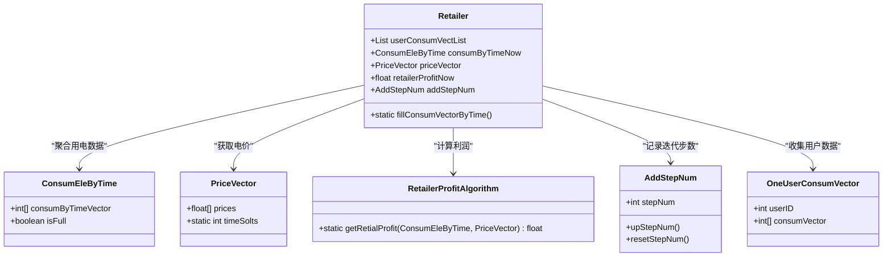

# 利润计算模型

<cite>
**本文档引用的文件**
- [Retailer.java](file://src/main/java/io/leavesfly/smartgrid/retailer/Retailer.java)
- [RetailerProfitAlgorithm.java](file://src/main/java/io/leavesfly/smartgrid/retailer/RetailerProfitAlgorithm.java)
- [ConsumEleByTime.java](file://src/main/java/io/leavesfly/smartgrid/retailer/ConsumEleByTime.java)
- [OneUserConsumVector.java](file://src/main/java/io/leavesfly/smartgrid/user/OneUserConsumVector.java)
- [AddStepNum.java](file://src/main/java/io/leavesfly/smartgrid/retailer/AddStepNum.java)
- [PriceVector.java](file://src/main/java/io/leavesfly/smartgrid/retailer/PriceVector.java)
- [RetailerInitArgs.java](file://src/main/java/io/leavesfly/smartgrid/retailer/RetailerInitArgs.java)
- [SAPC_Algorithm.java](file://src/main/java/io/leavesfly/smartgrid/retailer/SAPC_Algorithm.java)
</cite>

## 目录
1. [项目结构](#项目结构)
2. [核心组件分析](#核心组件分析)
3. [利润计算业务逻辑](#利润计算业务逻辑)
4. [数据流与调用链分析](#数据流与调用链分析)
5. [算法迭代与收敛控制](#算法迭代与收敛控制)
6. [边界情况与应对策略](#边界情况与应对策略)

## 项目结构

项目采用分层模块化设计，主要分为零售商（retailer）和用户（user）两大模块。零售商模块负责电价策略制定、用电数据聚合与利润计算；用户模块模拟用户用电行为响应电价变化。系统通过模拟退火算法（SAPC_Algorithm）优化电价策略以最大化利润。

**Section sources**
- [Retailer.java](file://src/main/java/io/leavesfly/smartgrid/retailer/Retailer.java#L1-L104)
- [OneUserConsumVector.java](file://src/main/java/io/leavesfly/smartgrid/user/OneUserConsumVector.java#L1-L52)

## 核心组件分析

### Retailer 类
作为利润计算的核心协调者，Retailer 类聚合所有用户的用电数据，并管理电价向量与利润状态。其关键字段包括：
- `userConsumVectList`：存储所有用户的用电向量
- `consumByTimeNow`：当前时段总用电量
- `priceVector`：当前电价策略
- `retailerProfitNow`：当前利润值
- `addStepNum`：算法迭代步数计数器

**Section sources**
- [Retailer.java](file://src/main/java/io/leavesfly/smartgrid/retailer/Retailer.java#L15-L45)

### ConsumEleByTime 类
该类封装按时间槽划分的总用电量数据，通过静态方法 `fillConsumVectorByTime` 将多个用户的用电向量聚合为零售商的总用电量。

**Section sources**
- [ConsumEleByTime.java](file://src/main/java/io/leavesfly/smartgrid/retailer/ConsumEleByTime.java#L1-L60)

### RetailerProfitAlgorithm 类
实现核心利润计算逻辑，包含收入函数与成本函数的数学模型。

**Section sources**
- [RetailerProfitAlgorithm.java](file://src/main/java/io/leavesfly/smartgrid/retailer/RetailerProfitAlgorithm.java#L1-L35)

## 利润计算业务逻辑

### 收入函数
收入由分时电价与对应时段用电量的加权乘积求和得出：
```
收入 = Σ(用电量[i] × 电价[i])
```

### 成本函数
成本函数采用二次与三次项组合模型，反映用电负荷增加带来的边际成本上升：
```
成本 = w × Σ(a × 用电量[i]² + b × 用电量[i]³)
```
其中 `a`、`b` 为成本系数，`w` 为成本权重，均在 `RetailerInitArgs` 中定义。

### 利润计算公式
最终利润为收入减去成本：
```
利润 = 收入 - 成本
```



**Diagram sources**
- [Retailer.java](file://src/main/java/io/leavesfly/smartgrid/retailer/Retailer.java#L15-L45)
- [RetailerProfitAlgorithm.java](file://src/main/java/io/leavesfly/smartgrid/retailer/RetailerProfitAlgorithm.java#L1-L10)
- [ConsumEleByTime.java](file://src/main/java/io/leavesfly/smartgrid/retailer/ConsumEleByTime.java#L1-L10)
- [PriceVector.java](file://src/main/java/io/leavesfly/smartgrid/retailer/PriceVector.java#L1-L10)
- [OneUserConsumVector.java](file://src/main/java/io/leavesfly/smartgrid/user/OneUserConsumVector.java#L1-L10)
- [AddStepNum.java](file://src/main/java/io/leavesfly/smartgrid/retailer/AddStepNum.java#L1-L10)

## 数据流与调用链分析

从用户上传用电数据到利润返回的完整调用链如下：


**Diagram sources**
- [Retailer.java](file://src/main/java/io/leavesfly/smartgrid/retailer/Retailer.java#L85-L100)
- [RetailerProfitAlgorithm.java](file://src/main/java/io/leavesfly/smartgrid/retailer/RetailerProfitAlgorithm.java#L5-L30)

**Section sources**
- [Retailer.java](file://src/main/java/io/leavesfly/smartgrid/retailer/Retailer.java#L85-L100)
- [RetailerProfitAlgorithm.java](file://src/main/java/io/leavesfly/smartgrid/retailer/RetailerProfitAlgorithm.java#L5-L30)

## 算法迭代与收敛控制

### AddStepNum 的作用
`AddStepNum` 类通过 `stepNum` 字段记录模拟退火算法的迭代步数，其 `upStepNum()` 方法在每次价格调整后递增计数器，用于：
- 跟踪算法执行进度
- 控制温度衰减因子（T = T / log(ROUND)）
- 判断算法收敛条件（T > E）

### 收敛判断机制
算法通过温度参数 `T` 和终止阈值 `E` 控制收敛：
- 初始温度 `T = exp(-1)`
- 终止条件 `T ≤ exp(-5)`
- 每轮迭代后温度按 `T = T / log(ROUND)` 衰减


**Diagram sources**
- [SAPC_Algorithm.java](file://src/main/java/io/leavesfly/smartgrid/retailer/SAPC_Algorithm.java#L25-L150)
- [RetailerInitArgs.java](file://src/main/java/io/leavesfly/smartgrid/retailer/RetailerInitArgs.java#L1-L15)

**Section sources**
- [SAPC_Algorithm.java](file://src/main/java/io/leavesfly/smartgrid/retailer/SAPC_Algorithm.java#L25-L150)
- [AddStepNum.java](file://src/main/java/io/leavesfly/smartgrid/retailer/AddStepNum.java#L1-L20)

## 边界情况与应对策略

| 边界情况 | 可能影响 | 应对策略 |
|--------|--------|--------|
| 用户数量不匹配 | `fillConsumVectorByTime` 校验失败 | 系统日志输出错误并终止计算 |
| 用电数据与电价时段长度不一致 | 利润计算返回-1 | 在 `getRetialProfit` 中进行长度校验 |
| 浮点数精度误差 | 利润计算偏差 | 使用 float 类型并接受合理误差范围 |
| 并发访问冲突 | 数据竞争导致状态不一致 | 使用 synchronized 关键字保护关键代码段 |
| 温度衰减过快 | 算法陷入局部最优 | 调整初始温度或衰减函数参数 |

**Section sources**
- [Retailer.java](file://src/main/java/io/leavesfly/smartgrid/retailer/Retailer.java#L90-L95)
- [RetailerProfitAlgorithm.java](file://src/main/java/io/leavesfly/smartgrid/retailer/RetailerProfitAlgorithm.java#L10-L15)
- [SAPC_Algorithm.java](file://src/main/java/io/leavesfly/smartgrid/retailer/SAPC_Algorithm.java#L50-L60)