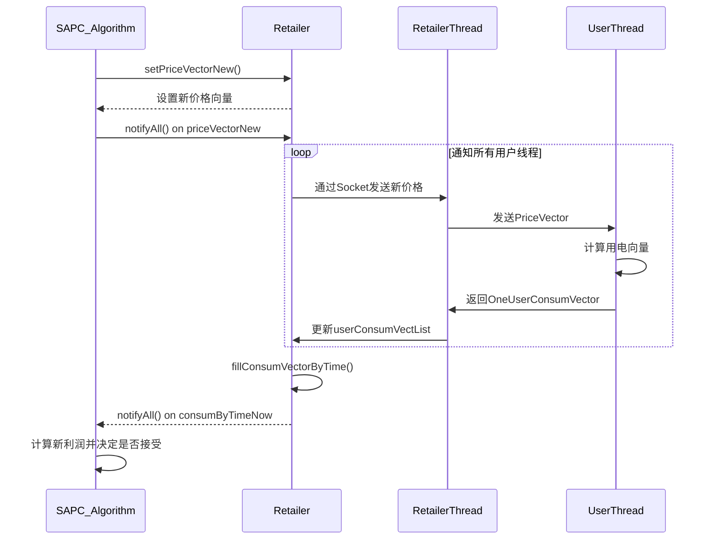

# 动态定价机制

<cite>
**本文档引用的文件**
- [Retailer.java](file://src/main/java/io/leavesfly/smartgrid/retailer/Retailer.java)
- [SAPC_Algorithm.java](file://src/main/java/io/leavesfly/smartgrid/retailer/SAPC_Algorithm.java)
- [PriceVector.java](file://src/main/java/io/leavesfly/smartgrid/retailer/PriceVector.java)
- [RetailerServer.java](file://src/main/java/io/leavesfly/smartgrid/retailer/RetailerServer.java)
- [RetailerThread.java](file://src/main/java/io/leavesfly/smartgrid/retailer/RetailerThread.java)
- [UserThread.java](file://src/main/java/io/leavesfly/smartgrid/user/UserThread.java)
- [ConsumEleByTime.java](file://src/main/java/io/leavesfly/smartgrid/retailer/ConsumEleByTime.java)
- [OneUserConsumVector.java](file://src/main/java/io/leavesfly/smartgrid/user/OneUserConsumVector.java)
- [UserMaxSatisfaConsumVector.java](file://src/main/java/io/leavesfly/smartgrid/user/UserMaxSatisfaConsumVector.java)
- [RetailerProfitAlgorithm.java](file://src/main/java/io/leavesfly/smartgrid/retailer/RetailerProfitAlgorithm.java)
- [LogToTxtFile.java](file://src/main/java/io/leavesfly/smartgrid/retailer/LogToTxtFile.java)
- [AddStepNum.java](file://src/main/java/io/leavesfly/smartgrid/retailer/AddStepNum.java)
- [RetailerInitArgs.java](file://src/main/java/io/leavesfly/smartgrid/retailer/RetailerInitArgs.java)
- [UsersArgs.java](file://src/main/java/io/leavesfly/smartgrid/user/UsersArgs.java)
</cite>

## 目录
1. [引言](#引言)
2. [核心组件与类结构](#核心组件与类结构)
3. [价格向量管理机制](#价格向量管理机制)
4. [SAPC优化算法原理](#sapc优化算法原理)
5. [多线程环境下的价格更新流程](#多线程环境下的价格更新流程)
6. [价格广播与客户端同步](#价格广播与客户端同步)
7. [时序图：价格更新与传播过程](#时序图价格更新与传播过程)
8. [线程安全机制分析](#线程安全机制分析)
9. [常见问题排查](#常见问题排查)
10. [结论](#结论)

## 引言
本文档深入阐述智能电网系统中动态定价机制的实现原理与代码逻辑。重点分析`Retailer`类如何通过`PriceVector`管理各时段电价，并与`SAPC_Algorithm`协同进行价格优化迭代。详细说明价格向量在服务器端的更新流程及其在多线程环境下的线程安全处理机制。结合模拟退火算法策略，解释新价格如何影响用户用电行为和零售商利润。

## 核心组件与类结构

### Retailer 类
作为电价管理的核心实体，`Retailer`类负责维护当前和新生成的价格向量、用户用电数据及利润计算。其主要字段包括：
- `priceVector`: 当前生效的价格向量
- `priceVectorNew`: 新生成的候选价格向量
- `userConsumVectList`: 用户用电向量列表
- `retailerProfitNow`: 当前利润
- `consumByTimeNow`: 当前时段总用电量

该类通过与`SAPC_Algorithm`协作实现价格优化。

### PriceVector 类
表示一个包含多个时段电价的向量，支持以下操作：
- 随机生成电价
- 指定位置修改价格
- 克隆价格向量
- 线程间同步通知

### SAPC_Algorithm 类
实现基于模拟退火算法的价格优化逻辑，通过迭代生成邻域解并根据接受准则决定是否更新价格。

**Section sources**
- [Retailer.java](file://src/main/java/io/leavesfly/smartgrid/retailer/Retailer.java#L1-L104)
- [PriceVector.java](file://src/main/java/io/leavesfly/smartgrid/retailer/PriceVector.java#L1-L106)
- [SAPC_Algorithm.java](file://src/main/java/io/leavesfly/smartgrid/retailer/SAPC_Algorithm.java#L1-L197)

## 价格向量管理机制

`PriceVector`类采用固定长度数组存储4个时段的电价（由`timeSolts = 4`定义），价格范围限定在0.5至1.5之间。系统通过以下方法实现价格管理：

- `getOneRandomPrice()`: 生成指定范围内的随机电价
- `getNewPriceVector(int, float, PriceVector)`: 在指定位置替换价格生成新向量
- `privceVectorGiven(PriceVector, PriceVector)`: 向量间数据复制

`Retailer`类通过`setPriceVectorNew()`和`getCurrentPriceVector()`方法对外提供价格向量的设置与获取接口。

**Section sources**
- [PriceVector.java](file://src/main/java/io/leavesfly/smartgrid/retailer/PriceVector.java#L30-L65)
- [Retailer.java](file://src/main/java/io/leavesfly/smartgrid/retailer/Retailer.java#L50-L70)

## SAPC优化算法原理

### 温度衰减策略
算法采用对数降温方式：
```java
RetailerInitArgs.T = (float) (RetailerInitArgs.T / Math.log(RetailerInitArgs.ROUND));
```
随着迭代轮次增加，温度逐渐降低，接受劣解的概率减小，确保算法收敛。

### 邻域解生成
在每轮迭代中，算法遍历每个时段位置，生成随机新价格：
```java
float randomPrice = PriceVector.getOneRandomPrice();
retailer.setPriceVectorNew(retailer.getPriceVector().getNewPriceVector(position, randomPrice, retailer.getPriceVectorNew()));
```

### 接受准则
采用Metropolis准则决定是否接受新解：
```java
if (profitNew > profitNow || Math.random() < Math.exp((profitNew - profitNow) / T))
```
允许以一定概率接受较差解，避免陷入局部最优。

**Section sources**
- [SAPC_Algorithm.java](file://src/main/java/io/leavesfly/smartgrid/retailer/SAPC_Algorithm.java#L25-L150)
- [RetailerInitArgs.java](file://src/main/java/io/leavesfly/smartgrid/retailer/RetailerInitArgs.java)

## 多线程环境下的价格更新流程

系统采用生产者-消费者模式协调价格计算与用户响应：

1. **SAPC_Algorithm**作为生产者生成新价格
2. **RetailerThread**作为消费者接收用户用电数据
3. 使用`synchronized`块和`wait()/notifyAll()`实现线程同步

关键同步点：
- 价格更新后通知所有等待线程
- 等待用户用电数据回传后再计算利润

```java
synchronized (retailer.getPriceVectorNew()) {
    retailer.getPriceVectorNew().notifyAll();
}
synchronized (retailer.getConsumByTimeNow()) {
    retailer.getConsumByTimeNow().wait();
}
```

**Section sources**
- [SAPC_Algorithm.java](file://src/main/java/io/leavesfly/smartgrid/retailer/SAPC_Algorithm.java#L30-L40)
- [RetailerThread.java](file://src/main/java/io/leavesfly/smartgrid/retailer/RetailerThread.java)

## 价格广播与客户端同步

### 服务端启动流程
`RetailerServer`启动后：
1. 创建`Retailer`实例
2. 启动监听线程接受客户端连接
3. 调用`SAPC_Algorithm.simulatedAnnealingAglorith(retailer)`开始优化

### 客户端连接
`Users`类启动多个`UserThread`，每个代表一个用户客户端，连接到零售商服务器获取最新价格。

### 价格传播路径
```
SAPC_Algorithm → Retailer.priceVectorNew → RetailerThread → UserThread → 用户用电决策
```

**Section sources**
- [RetailerServer.java](file://src/main/java/io/leavesfly/smartgrid/retailer/RetailerServer.java#L1-L42)
- [UserThread.java](file://src/main/java/io/leavesfly/smartgrid/user/UserThread.java)
- [RetailerThread.java](file://src/main/java/io/leavesfly/smartgrid/retailer/RetailerThread.java)

## 时序图：价格更新与传播过程



**Diagram sources**
- [SAPC_Algorithm.java](file://src/main/java/io/leavesfly/smartgrid/retailer/SAPC_Algorithm.java#L30-L50)
- [RetailerThread.java](file://src/main/java/io/leavesfly/smartgrid/retailer/RetailerThread.java)
- [UserThread.java](file://src/main/java/io/leavesfly/smartgrid/user/UserThread.java)

## 线程安全机制分析

系统通过以下机制保证多线程环境下的数据一致性：

### 对象级同步
对关键对象使用`synchronized`：
- `priceVectorNew`: 价格向量更新
- `consumByTimeNow`: 用电数据接收
- `addStepNum`: 初始同步信号

### wait/notify机制
```java
// 等待条件
synchronized (obj) { obj.wait(); }

// 通知条件满足
synchronized (obj) { obj.notifyAll(); }
```

### 不可变性设计
`PriceVector`在创建后通过复制方式修改，减少共享状态。

### 原子操作
价格向量赋值通过`privceVectorGiven()`方法一次性完成，避免中间状态暴露。

**Section sources**
- [SAPC_Algorithm.java](file://src/main/java/io/leavesfly/smartgrid/retailer/SAPC_Algorithm.java#L30-L45)
- [PriceVector.java](file://src/main/java/io/leavesfly/smartgrid/retailer/PriceVector.java#L80-L90)
- [AddStepNum.java](file://src/main/java/io/leavesfly/smartgrid/retailer/AddStepNum.java)

## 常见问题排查

### 价格未及时刷新
可能原因及解决方案：

| 问题现象 | 可能原因 | 排查方法 |
|---------|---------|---------|
| 客户端收不到新价格 | notifyAll()未被调用 | 检查SAPC_Algorithm中notifyAll()执行路径 |
| 价格更新卡住 | wait()后无对应notify | 确认每个wait都有对应的notifyAll |
| 价格不一致 | 多线程竞争修改 | 检查synchronized保护的临界区是否完整 |
| 初始不启动 | addStepNum未释放 | 确认初始同步信号已正确触发 |

### 调试建议
1. 启用`LogToTxtFile`日志输出
2. 检查`RetailerInitArgs.T`和`E`的初始值设置
3. 验证`UsersArgs.userNum`与实际连接数一致
4. 监控`priceVectorNew.isEnd`标志位状态

**Section sources**
- [SAPC_Algorithm.java](file://src/main/java/io/leavesfly/smartgrid/retailer/SAPC_Algorithm.java#L180-L190)
- [LogToTxtFile.java](file://src/main/java/io/leavesfly/smartgrid/retailer/LogToTxtFile.java)
- [RetailerInitArgs.java](file://src/main/java/io/leavesfly/smartgrid/retailer/RetailerInitArgs.java)

## 结论
本系统通过`Retailer`与`SAPC_Algorithm`的协同工作，实现了基于模拟退火算法的动态电价优化。`PriceVector`作为核心数据结构，通过精心设计的线程同步机制，在多线程环境下安全地完成价格更新与传播。该机制有效平衡了算法优化需求与实时性要求，为智能电网的动态定价提供了可靠的技术实现方案。