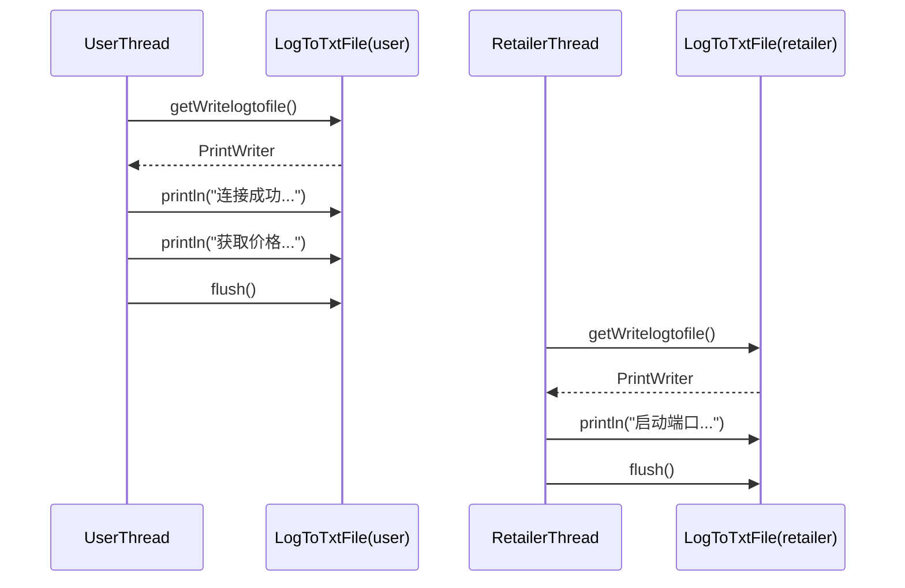
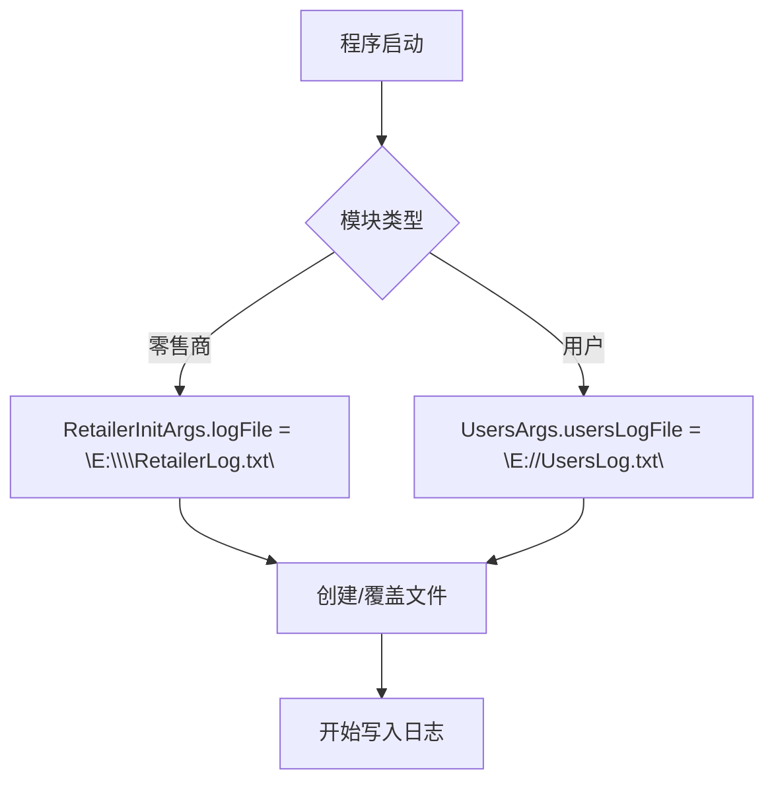

# 日志记录系统

<cite>
**Referenced Files in This Document**   
- [LogToTxtFile.java](file://src/main/java/io/leavesfly/smartgrid/retailer/LogToTxtFile.java)
- [LogToTxtFile.java](file://src/main/java/io/leavesfly/smartgrid/user/LogToTxtFile.java)
- [RetailerThread.java](file://src/main/java/io/leavesfly/smartgrid/retailer/RetailerThread.java)
- [UserThread.java](file://src/main/java/io/leavesfly/smartgrid/user/UserThread.java)
- [RetailerInitArgs.java](file://src/main/java/io/leavesfly/smartgrid/retailer/RetailerInitArgs.java)
- [UsersArgs.java](file://src/main/java/io/leavesfly/smartgrid/user/UsersArgs.java)
</cite>

## 目录
1. [日志系统架构设计](#日志系统架构设计)
2. [单例模式与线程安全机制](#单例模式与线程安全机制)
3. [跨模块日志应用](#跨模块日志应用)
4. [日志文件管理](#日志文件管理)
5. [日志调试案例](#日志调试案例)

## 日志系统架构设计

日志系统采用双模块独立部署的架构设计，为零售商（retailer）和用户（user）两个核心模块分别提供日志记录服务。系统通过在各自模块包内实现独立的 `LogToTxtFile` 类，实现了日志功能的模块化封装。这种设计确保了日志记录的高内聚性，同时避免了模块间的直接依赖。

系统架构的核心在于统一的日志接口设计。尽管 `retailer` 和 `user` 模块拥有各自的 `LogToTxtFile` 实现，但它们对外暴露的 `getWritelogtofile()` 方法签名完全一致，为上层应用提供了统一的调用契约。这种设计模式使得零售商和用户线程能够以相同的方式获取日志写入器，从而保证了日志输出格式的统一性。

**Section sources**
- [LogToTxtFile.java](file://src/main/java/io/leavesfly/smartgrid/retailer/LogToTxtFile.java#L1-L32)
- [LogToTxtFile.java](file://src/main/java/io/leavesfly/smartgrid/user/LogToTxtFile.java#L1-L32)

## 单例模式与线程安全机制

日志系统通过静态代码块和静态字段的组合，实现了基于类加载机制的单例模式。`writeLogToFile` 字段被声明为 `private final static PrintWriter`，确保了在整个JVM生命周期内，每个模块的 `LogToTxtFile` 类仅存在一个 `PrintWriter` 实例。

```mermaid
classDiagram
class LogToTxtFile {
-static FileOutputStream fileOut
-static final PrintWriter writeLogToFile
+synchronized static PrintWriter getWritelogtofile()
+static void main(String[] args)
}
note right of LogToTxtFile
静态代码块初始化文件流
writeLogToFile 为 final 静态实例
getWritelogtofile() 方法为 synchronized
end note
```

**Diagram sources**
- [LogToTxtFile.java](file://src/main/java/io/leavesfly/smartgrid/retailer/LogToTxtFile.java#L7-L18)
- [LogToTxtFile.java](file://src/main/java/io/leavesfly/smartgrid/user/LogToTxtFile.java#L7-L18)

线程安全是日志系统的关键。`getWritelogtofile()` 方法被声明为 `public synchronized static`，这确保了在多线程环境下，对日志写入器的访问是串行化的。当多个 `RetailerThread` 或 `UserThread` 实例同时尝试获取日志写入器时，JVM的同步机制会保证同一时刻只有一个线程能够进入该方法，从而有效防止了文件写入的竞态条件。

异常处理策略在静态代码块中得以体现。系统在初始化 `FileOutputStream` 时，捕获了潜在的 `FileNotFoundException`，并通过 `e.printStackTrace()` 进行了基础的错误报告。虽然此处理方式在生产环境中可能需要增强，但它确保了即使日志文件创建失败，也不会导致整个应用程序崩溃。

**Section sources**
- [LogToTxtFile.java](file://src/main/java/io/leavesfly/smartgrid/retailer/LogToTxtFile.java#L7-L25)
- [LogToTxtFile.java](file://src/main/java/io/leavesfly/smartgrid/user/LogToTxtFile.java#L7-L25)

## 跨模块日志应用

日志系统在 `RetailerThread` 和 `UserThread` 中得到了实际应用，记录了系统运行过程中的关键事件。两个模块通过调用各自包内的 `LogToTxtFile.getWritelogtofile()` 方法获取日志写入器，并使用 `println()` 方法输出结构化的日志信息。



**Diagram sources**
- [RetailerThread.java](file://src/main/java/io/leavesfly/smartgrid/retailer/RetailerThread.java#L20-L22)
- [UserThread.java](file://src/main/java/io/leavesfly/smartgrid/user/UserThread.java#L21-L23)

在 `RetailerThread` 中，日志记录了服务器端的关键事件，例如：
- **连接建立**：`LogToTxtFile.getWritelogtofile().println("启动" + socket.getPort());`
- **数据接收**：`LogToTxtFile.getWritelogtofile().println("User_" + userID + "规划得到的用电量" + oneUserConsumVector.toString());`

在 `UserThread` 中，日志则记录了客户端的行为，例如：
- **连接建立**：`LogToTxtFile.getWritelogtofile().println("User_" + userID + "当前在socket端" + socket.getLocalPort() + "获取连接成功...");`
- **价格广播**：`LogToTxtFile.getWritelogtofile().println("User_" + userID + "成功获取到广播的价格" + priceVector.toString());`
- **算法结束**：`LogToTxtFile.getWritelogtofile().println("最终零售商广播的价格是：" + priceVector.toString());`

所有日志输出后均调用 `flush()` 方法，确保日志内容被及时写入磁盘，这对于调试实时性要求高的系统至关重要。

**Section sources**
- [RetailerThread.java](file://src/main/java/io/leavesfly/smartgrid/retailer/RetailerThread.java#L20-L88)
- [UserThread.java](file://src/main/java/io/leavesfly/smartgrid/user/UserThread.java#L21-L86)

## 日志文件管理

日志文件的存储路径和命名规则由各自的配置类定义，实现了配置与代码的分离。零售商模块的日志文件路径由 `RetailerInitArgs.logFile` 常量指定，而用户模块的日志路径则由 `UsersArgs.usersLogFile` 常量指定。



**Diagram sources**
- [RetailerInitArgs.java](file://src/main/java/io/leavesfly/smartgrid/retailer/RetailerInitArgs.java#L15)
- [UsersArgs.java](file://src/main/java/io/leavesfly/smartgrid/user/UsersArgs.java#L14)

当前系统实现了最基础的文件管理策略，即程序每次运行都会在指定路径创建或覆盖一个日志文件。文件路径使用了绝对路径（如 `E:\\RetailerLog.txt`），这简化了文件定位，但也降低了程序的可移植性。目前系统未实现日志滚动（log rolling）策略，这意味着日志文件会随着程序运行而不断增大，长期运行可能导致磁盘空间耗尽。一个完善的日志系统应引入基于时间或文件大小的滚动策略，例如每日生成一个新日志文件，或当日志文件超过10MB时自动归档。

**Section sources**
- [RetailerInitArgs.java](file://src/main/java/io/leavesfly/smartgrid/retailer/RetailerInitArgs.java#L15)
- [UsersArgs.java](file://src/main/java/io/leavesfly/smartgrid/user/UsersArgs.java#L14)

## 日志调试案例

日志系统是排查系统异常的有力工具。以下是一个典型的调试案例：

**问题现象**：用户端程序 `UserThread` 无法正常接收价格信息，程序在启动后不久便无响应。

**调试步骤**：
1.  **检查用户日志** (`E://UsersLog.txt`)：首先查看 `UsersLog.txt` 文件。如果文件为空或仅包含 `"连接成功..."` 的日志，但没有 `"成功获取到广播的价格"` 的记录，则说明问题出在用户端接收数据的环节。
2.  **检查零售商日志** (`E:\\RetailerLog.txt`)：接着查看 `RetailerLog.txt` 文件。如果发现日志中包含 `"启动端口..."` 但没有后续的广播记录，或者日志在某个时间点后停止更新，则说明零售商端的算法可能已停滞。
3.  **交叉验证**：通过对比两个日志文件的时间戳，可以判断是通信链路中断还是算法逻辑问题。例如，如果用户日志显示连接成功后长时间等待，而零售商日志显示算法仍在迭代计算，则可以断定是 `SAPC_Algorithm` 的收敛速度过慢导致了用户端的“假死”现象。

通过分析日志，开发者可以快速定位问题根源。例如，如果发现零售商日志中 `ROUND` 变量的值持续增加但 `T` 温度值下降缓慢，这可能意味着模拟退火算法的降温系数 `E` 设置不当，需要调整 `RetailerInitArgs.E` 的值来优化算法性能。

**Section sources**
- [RetailerThread.java](file://src/main/java/io/leavesfly/smartgrid/retailer/RetailerThread.java#L20-L88)
- [UserThread.java](file://src/main/java/io/leavesfly/smartgrid/user/UserThread.java#L21-L86)
- [RetailerInitArgs.java](file://src/main/java/io/leavesfly/smartgrid/retailer/RetailerInitArgs.java#L1-L15)