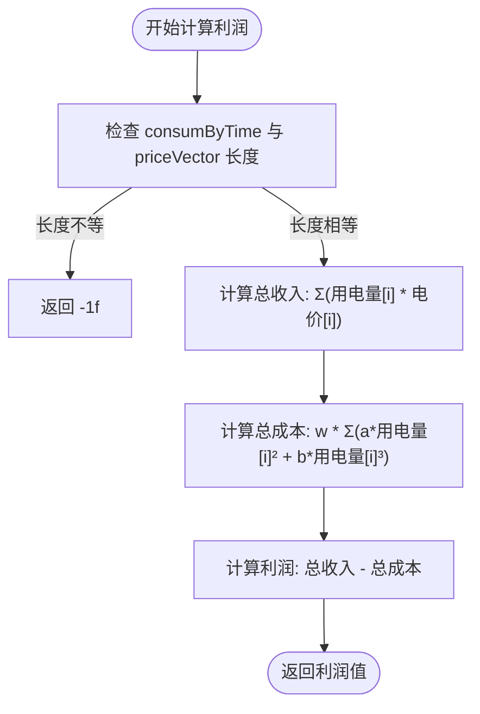
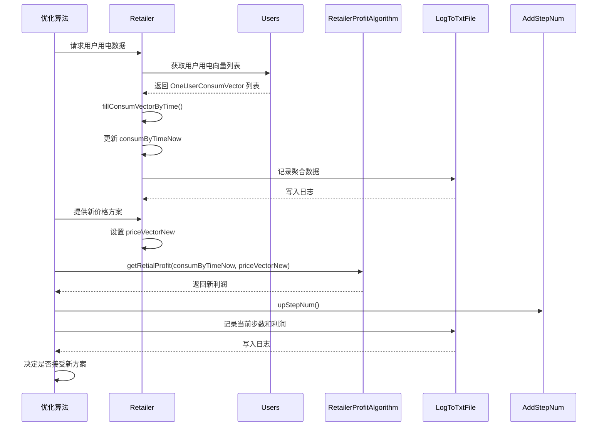

# 核心功能详解

<cite>
**本文档引用的文件**
- [Retailer.java](file://src/main/java/io/leavesfly/smartgrid/retailer/Retailer.java)
- [RetailerProfitAlgorithm.java](file://src/main/java/io/leavesfly/smartgrid/retailer/RetailerProfitAlgorithm.java)
- [AddStepNum.java](file://src/main/java/io/leavesfly/smartgrid/retailer/AddStepNum.java)
- [LogToTxtFile.java](file://src/main/java/io/leavesfly/smartgrid/retailer/LogToTxtFile.java)
- [LogToTxtFile.java](file://src/main/java/io/leavesfly/smartgrid/user/LogToTxtFile.java)
- [PriceVector.java](file://src/main/java/io/leavesfly/smartgrid/retailer/PriceVector.java)
- [ConsumEleByTime.java](file://src/main/java/io/leavesfly/smartgrid/retailer/ConsumEleByTime.java)
- [OneUserConsumVector.java](file://src/main/java/io/leavesfly/smartgrid/user/OneUserConsumVector.java)
- [RetailerInitArgs.java](file://src/main/java/io/leavesfly/smartgrid/retailer/RetailerInitArgs.java)
- [UsersArgs.java](file://src/main/java/io/leavesfly/smartgrid/user/UsersArgs.java)
</cite>

## 目录
1. [动态定价机制](#动态定价机制)
2. [利润计算逻辑](#利润计算逻辑)
3. [日志记录系统](#日志记录系统)
4. [算法迭代计数器](#算法迭代计数器)
5. [功能模块协同工作流程](#功能模块协同工作流程)

## 动态定价机制

`Retailer` 类是系统中负责管理电力零售商核心状态的核心组件，其中包含对价格向量的管理。`PriceVector` 类封装了在不同时间段的电价向量，其长度由常量 `timeSolts` 固定为 4，表示一天中的四个时隙。`PriceVector` 提供了获取和设置特定位置价格的方法（`getPriceByPosition` 和 `setPriceByPosition`），并支持基于现有价格向量生成新向量（`getNewPriceVector`），这为动态调整价格提供了基础。

`Retailer` 类通过 `priceVector` 和 `priceVectorNew` 两个字段分别维护当前价格和新生成的价格方案，以便在算法迭代中进行比较和更新。价格的初始化在 `PriceVector` 的构造函数中完成，采用随机生成的方式确保初始价格在预设的最小值（0.5f）和最大值（1.5f）之间。

**Section sources**
- [Retailer.java](file://src/main/java/io/leavesfly/smartgrid/retailer/Retailer.java#L1-L104)
- [PriceVector.java](file://src/main/java/io/leavesfly/smartgrid/retailer/PriceVector.java#L1-L107)

## 利润计算逻辑

系统的利润计算由 `RetailerProfitAlgorithm` 类的静态方法 `getRetialProfit` 实现。该方法接收 `ConsumEleByTime`（各时段总用电量）和 `PriceVector`（各时段电价）作为输入，计算零售商的总利润。

利润计算公式分为两部分：
1.  **总收入**：将每个时段的用电量与对应电价相乘后求和。
2.  **总成本**：成本部分由一个包含用电量平方项和立方项的二次函数构成，系数 `a` 和 `b` 来自 `RetailerInitArgs`，并乘以一个权重因子 `w`。

最终利润为总收入减去总成本。此方法确保了在计算前两个向量的长度一致，否则返回 -1f 表示错误。



**Diagram sources**
- [RetailerProfitAlgorithm.java](file://src/main/java/io/leavesfly/smartgrid/retailer/RetailerProfitAlgorithm.java#L1-L36)
- [RetailerInitArgs.java](file://src/main/java/io/leavesfly/smartgrid/retailer/RetailerInitArgs.java#L1-L16)

**Section sources**
- [RetailerProfitAlgorithm.java](file://src/main/java/io/leavesfly/smartgrid/retailer/RetailerProfitAlgorithm.java#L1-L36)

## 日志记录系统

系统采用单例模式实现了统一的日志记录工具 `LogToTxtFile`。该类在 `retailer` 和 `user` 两个包中分别存在，但实现机制相同，均通过静态代码块初始化一个 `PrintWriter` 对象（`writeLogToFile`），该对象指向由 `RetailerInitArgs.logFile` 或 `UsersArgs.usersLogFile` 指定的文件路径。

`getWritelogtofile()` 方法被声明为 `synchronized static`，确保了多线程环境下对日志文件写入的线程安全。任何需要记录日志的模块（如 `RetailerThread` 或 `UserThread`）都可以通过调用 `LogToTxtFile.getWritelogtofile().println(...)` 来输出日志信息，并通过 `flush()` 方法确保内容写入磁盘。

这种设计实现了日志功能的集中管理和线程安全，避免了在每个类中重复创建文件流。

```mermaid
classDiagram
class LogToTxtFile {
-static FileOutputStream fileOut
-static final PrintWriter writeLogToFile
+synchronized static PrintWriter getWritelogtofile()
+static main(String[] args)
}
note right of LogToTxtFile : 单例模式，通过静态块初始化\nwriteLogToFile，提供线程安全的\n日志写入接口
```

**Diagram sources**
- [LogToTxtFile.java](file://src/main/java/io/leavesfly/smartgrid/retailer/LogToTxtFile.java#L1-L33)
- [LogToTxtFile.java](file://src/main/java/io/leavesfly/smartgrid/user/LogToTxtFile.java#L1-L33)

**Section sources**
- [LogToTxtFile.java](file://src/main/java/io/leavesfly/smartgrid/retailer/LogToTxtFile.java#L1-L33)
- [LogToTxtFile.java](file://src/main/java/io/leavesfly/smartgrid/user/LogToTxtFile.java#L1-L33)

## 算法迭代计数器

`AddStepNum` 类是一个简单的计数器，用于跟踪算法的迭代步数。它被 `Retailer` 类持有，并在算法运行过程中被递增。

该类提供了三个核心方法：
- `upStepNum()`：将内部计数器 `stepNum` 增加 1。
- `getStepNum()`：获取当前的步数。
- `resetStepNum()`：将计数器重置为 0。

这个计数器在 `SAPC_Algorithm` 或 `simulatedAnnealingAglorith` 等优化算法中被用来控制循环次数或记录当前迭代状态，是算法执行流程控制的关键组成部分。

**Section sources**
- [AddStepNum.java](file://src/main/java/io/leavesfly/smartgrid/retailer/AddStepNum.java#L1-L21)

## 功能模块协同工作流程

系统各核心功能模块通过 `Retailer` 类进行协同工作。整体流程如下：
1.  **数据聚合**：`Retailer` 类的静态方法 `fillConsumVectorByTime` 负责聚合所有用户（`OneUserConsumVector`）的用电数据，将其累加到 `ConsumEleByTime` 对象中，形成全网各时段的总用电量。
2.  **利润计算**：当需要评估当前或新的价格方案时，系统调用 `RetailerProfitAlgorithm.getRetialProfit` 方法，传入聚合后的 `ConsumEleByTime` 和 `PriceVector`，计算出当前利润。
3.  **算法迭代**：在优化算法（如模拟退火）执行过程中，`AddStepNum` 计数器会通过 `upStepNum()` 方法递增，以跟踪迭代进度。
4.  **日志记录**：在整个流程中，无论是零售商模块还是用户模块，都可以通过调用各自包下的 `LogToTxtFile.getWritelogtofile()` 获取日志写入器，将关键信息（如当前价格、利润、步数）输出到指定的日志文件中，便于监控和调试。



**Diagram sources**
- [Retailer.java](file://src/main/java/io/leavesfly/smartgrid/retailer/Retailer.java#L1-L104)
- [ConsumEleByTime.java](file://src/main/java/io/leavesfly/smartgrid/retailer/ConsumEleByTime.java#L1-L61)
- [OneUserConsumVector.java](file://src/main/java/io/leavesfly/smartgrid/user/OneUserConsumVector.java#L1-L53)
- [RetailerProfitAlgorithm.java](file://src/main/java/io/leavesfly/smartgrid/retailer/RetailerProfitAlgorithm.java#L1-L36)
- [AddStepNum.java](file://src/main/java/io/leavesfly/smartgrid/retailer/AddStepNum.java#L1-L21)
- [LogToTxtFile.java](file://src/main/java/io/leavesfly/smartgrid/retailer/LogToTxtFile.java#L1-L33)

**Section sources**
- [Retailer.java](file://src/main/java/io/leavesfly/smartgrid/retailer/Retailer.java#L1-L104)
- [ConsumEleByTime.java](file://src/main/java/io/leavesfly/smartgrid/retailer/ConsumEleByTime.java#L1-L61)
- [RetailerProfitAlgorithm.java](file://src/main/java/io/leavesfly/smartgrid/retailer/RetailerProfitAlgorithm.java#L1-L36)
- [AddStepNum.java](file://src/main/java/io/leavesfly/smartgrid/retailer/AddStepNum.java#L1-L21)
- [LogToTxtFile.java](file://src/main/java/io/leavesfly/smartgrid/retailer/LogToTxtFile.java#L1-L33)