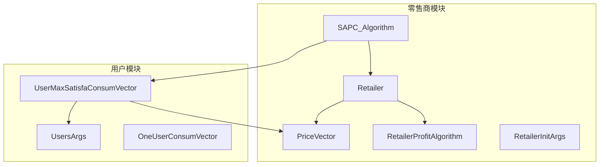
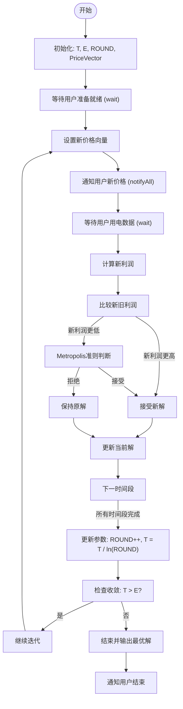
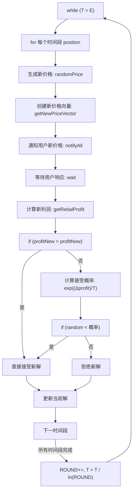
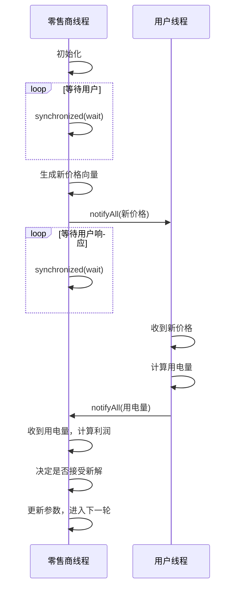
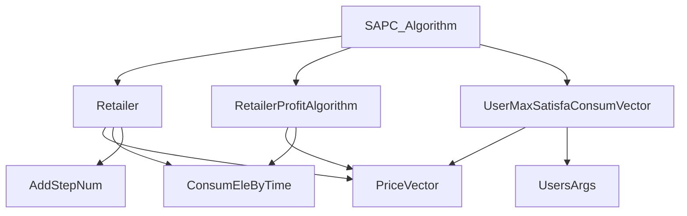

# SAPC优化算法

<cite>
**本文档引用文件**  
- [SAPC_Algorithm.java](file://src/main/java/io/leavesfly/smartgrid/retailer/SAPC_Algorithm.java)
- [Retailer.java](file://src/main/java/io/leavesfly/smartgrid/retailer/Retailer.java)
- [PriceVector.java](file://src/main/java/io/leavesfly/smartgrid/retailer/PriceVector.java)
- [RetailerProfitAlgorithm.java](file://src/main/java/io/leavesfly/smartgrid/retailer/RetailerProfitAlgorithm.java)
- [RetailerInitArgs.java](file://src/main/java/io/leavesfly/smartgrid/retailer/RetailerInitArgs.java)
- [UserMaxSatisfaConsumVector.java](file://src/main/java/io/leavesfly/smartgrid/user/UserMaxSatisfaConsumVector.java)
- [UsersArgs.java](file://src/main/java/io/leavesfly/smartgrid/user/UsersArgs.java)
- [ConsumEleByTime.java](file://src/main/java/io/leavesfly/smartgrid/retailer/ConsumEleByTime.java)
- [AddStepNum.java](file://src/main/java/io/leavesfly/smartgrid/retailer/AddStepNum.java)
</cite>

## 目录
1. [引言](#引言)
2. [项目结构](#项目结构)
3. [核心组件](#核心组件)
4. [算法架构概述](#算法架构概述)
5. [详细组件分析](#详细组件分析)
6. [依赖关系分析](#依赖关系分析)
7. [性能考量](#性能考量)
8. [故障排查指南](#故障排查指南)
9. [结论](#结论)

## 引言
本文档深入解析SAPC_Algorithm类，该类实现了基于模拟退火（Simulated Annealing）的价格控制优化算法，用于在智能电网环境中优化零售商的定价策略。算法通过与用户行为模型交互，动态调整价格向量以最大化零售商利润。文档将详细阐述算法的四个核心阶段：初始化、迭代优化、温度降低和收敛判断，并分析其多线程同步机制与时间复杂度。

## 项目结构
本项目采用分层架构，主要分为`retailer`（零售商）和`user`（用户）两大模块。`retailer`模块包含价格控制、利润计算和优化算法；`user`模块负责模拟用户在不同电价下的用电行为。核心优化逻辑位于`SAPC_Algorithm`类中，它协调`Retailer`对象的状态，并通过`UserMaxSatisfaConsumVector`计算用户响应。

**图示来源**  
- [SAPC_Algorithm.java](file://src/main/java/io/leavesfly/smartgrid/retailer/SAPC_Algorithm.java)
- [Retailer.java](file://src/main/java/io/leavesfly/smartgrid/retailer/Retailer.java)
- [UsersArgs.java](file://src/main/java/io/leavesfly/smartgrid/user/UsersArgs.java)

**本节来源**  
- [src/main/java/io/leavesfly/smartgrid](file://src/main/java/io/leavesfly/smartgrid)

## 核心组件
`SAPC_Algorithm`类是整个系统的核心，它实现了模拟退火算法来寻找最优价格向量。该算法通过修改`Retailer`对象的`PriceVector`并调用`RetailerProfitAlgorithm`评估新利润，驱动优化过程。算法的关键在于Metropolis准则的应用，允许以一定概率接受劣解，从而避免陷入局部最优。

**本节来源**  
- [SAPC_Algorithm.java](file://src/main/java/io/leavesfly/smartgrid/retailer/SAPC_Algorithm.java#L6-L196)
- [Retailer.java](file://src/main/java/io/leavesfly/smartgrid/retailer/Retailer.java#L1-L104)

## 算法架构概述
SAPC算法遵循标准的模拟退火流程，包含初始化、主循环（迭代优化与温度衰减）和终止三个阶段。算法通过`Retailer`对象与用户模块进行交互，形成一个“提出新价格 -> 获取用户响应 -> 评估利润 -> 决定接受/拒绝”的闭环。

**图示来源**  
- [SAPC_Algorithm.java](file://src/main/java/io/leavesfly/smartgrid/retailer/SAPC_Algorithm.java#L20-L190)
- [Retailer.java](file://src/main/java/io/leavesfly/smartgrid/retailer/Retailer.java#L50-L80)

## 详细组件分析

### SAPC_Algorithm类分析
`SAPC_Algorithm`类的`simulatedAnnealingAglorith`方法是算法的主入口，它实现了完整的模拟退火优化过程。

#### 算法主循环与伪代码解析
算法的主循环由一个`while`循环和一个`for`循环构成。外层`while`循环控制温度下降直至达到终止温度`E`，内层`for`循环遍历价格向量的每个时间段，尝试生成并评估新解。

**图示来源**  
- [SAPC_Algorithm.java](file://src/main/java/io/leavesfly/smartgrid/retailer/SAPC_Algorithm.java#L50-L150)

#### 关键控制参数机制
- **T (初始温度)**: 位于`RetailerInitArgs.T`，初始值为`Math.exp(-1)`。高温时，算法接受劣解的概率较高，有利于全局搜索。
- **E (终止温度)**: 位于`RetailerInitArgs.E`，值为`Math.exp(-5)`。当温度降至`E`以下时，算法停止，认为已接近最优解。
- **ROUND (迭代轮次)**: 位于`RetailerInitArgs.ROUND`，用于控制温度衰减。温度按`T = T / Math.log(ROUND)`的公式衰减，这是一种对数降温策略，确保算法在后期有足够的时间进行精细搜索。

**本节来源**  
- [SAPC_Algorithm.java](file://src/main/java/io/leavesfly/smartgrid/retailer/SAPC_Algorithm.java#L50-L150)
- [RetailerInitArgs.java](file://src/main/java/io/leavesfly/smartgrid/retailer/RetailerInitArgs.java#L2-L14)

### 多线程同步机制分析
SAPC算法在多线程环境下运行，`Retailer`和`User`分别运行在不同的线程中。`synchronized/wait/notify`机制确保了价格更新与用户响应之间的同步。

#### 同步流程
1.  **零售商等待用户就绪**: `synchronized (retailer.getAddStepNum()) { retailer.getAddStepNum().wait(); }`
2.  **生成新价格并通知用户**: `retailer.getPriceVectorNew().notifyAll();`
3.  **等待用户计算用电量**: `synchronized (retailer.getConsumByTimeNow()) { retailer.getConsumByTimeNow().wait(); }`
4.  **用户计算完毕后通知零售商**: 用户线程在计算完用电量后会调用`notifyAll()`。

这种机制确保了数据的一致性，防止了竞态条件。

**图示来源**  
- [SAPC_Algorithm.java](file://src/main/java/io/leavesfly/smartgrid/retailer/SAPC_Algorithm.java#L20-L40)
- [Retailer.java](file://src/main/java/io/leavesfly/smartgrid/retailer/Retailer.java#L50-L80)

**本节来源**  
- [SAPC_Algorithm.java](file://src/main/java/io/leavesfly/smartgrid/retailer/SAPC_Algorithm.java#L20-L190)
- [Retailer.java](file://src/main/java/io/leavesfly/smartgrid/retailer/Retailer.java#L1-L104)
- [AddStepNum.java](file://src/main/java/io/leavesfly/smartgrid/retailer/AddStepNum.java)

## 依赖关系分析
SAPC算法的实现依赖于多个核心类，它们共同构成了一个完整的优化系统。

**图示来源**  
- [SAPC_Algorithm.java](file://src/main/java/io/leavesfly/smartgrid/retailer/SAPC_Algorithm.java)
- [Retailer.java](file://src/main/java/io/leavesfly/smartgrid/retailer/Retailer.java)
- [RetailerProfitAlgorithm.java](file://src/main/java/io/leavesfly/smartgrid/retailer/RetailerProfitAlgorithm.java)

**本节来源**  
- [SAPC_Algorithm.java](file://src/main/java/io/leavesfly/smartgrid/retailer/SAPC_Algorithm.java)
- [Retailer.java](file://src/main/java/io/leavesfly/smartgrid/retailer/Retailer.java)
- [RetailerProfitAlgorithm.java](file://src/main/java/io/leavesfly/smartgrid/retailer/RetailerProfitAlgorithm.java)
- [UserMaxSatisfaConsumVector.java](file://src/main/java/io/leavesfly/smartgrid/user/UserMaxSatisfaConsumVector.java)

## 性能考量
SAPC算法的时间复杂度为O(n * m * k)，其中：
- **n**: 时段数 (`PriceVector.getTimeSolts()`)，默认为4。
- **m**: 迭代轮次，由初始温度`T`、终止温度`E`和降温速率共同决定。
- **k**: 用户数 (`UsersArgs.userNum`)，在利润计算和用户用电量聚合时产生。

**参数调优建议**:
- **提高全局最优性**: 增大初始温度`T`或减缓降温速度（例如使用`T = T * 0.95`的指数降温），但这会显著增加运行时间。
- **提高收敛速度**: 降低初始温度`T`或加快降温速度，但这可能导致算法过早收敛于局部最优解。
- **平衡策略**: 采用当前的对数降温策略`T = T / Math.log(ROUND)`是一种折中方案，能在保证一定搜索能力的同时控制迭代次数。

**本节来源**  
- [SAPC_Algorithm.java](file://src/main/java/io/leavesfly/smartgrid/retailer/SAPC_Algorithm.java#L50-L150)
- [RetailerInitArgs.java](file://src/main/java/io/leavesfly/smartgrid/retailer/RetailerInitArgs.java#L2-L14)
- [UsersArgs.java](file://src/main/java/io/leavesfly/smartgrid/user/UsersArgs.java#L2-L10)

## 故障排查指南
- **算法不收敛**: 检查`RetailerInitArgs.T`和`RetailerInitArgs.E`的值，确保`T > E`。如果`T`过低，算法可能无法跳出局部最优。
- **多线程死锁**: 确保`wait()`和`notifyAll()`的调用成对出现，且在正确的`synchronized`块内。检查`AddStepNum`和`ConsumEleByTime`对象的锁是否被正确释放。
- **利润计算异常**: 验证`RetailerProfitAlgorithm`中的参数`a`, `b`, `w`是否合理，以及`ConsumEleByTime`和`PriceVector`的长度是否匹配。

**本节来源**  
- [SAPC_Algorithm.java](file://src/main/java/io/leavesfly/smartgrid/retailer/SAPC_Algorithm.java)
- [RetailerProfitAlgorithm.java](file://src/main/java/io/leavesfly/smartgrid/retailer/RetailerProfitAlgorithm.java#L10-L30)
- [ConsumEleByTime.java](file://src/main/java/io/leavesfly/smartgrid/retailer/ConsumEleByTime.java)

## 结论
SAPC_Algorithm类成功实现了一个基于模拟退火的动态价格优化系统。该算法通过精巧的Metropolis准则和多线程同步机制，有效地在复杂的用户行为模型中寻找最优定价策略。其模块化的设计使得核心算法、利润计算和用户行为模型可以独立开发和测试。通过合理调整`T`, `E`, `ROUND`等参数，可以在收敛速度和全局最优性之间取得平衡，为智能电网的零售商提供了一个强大的决策支持工具。