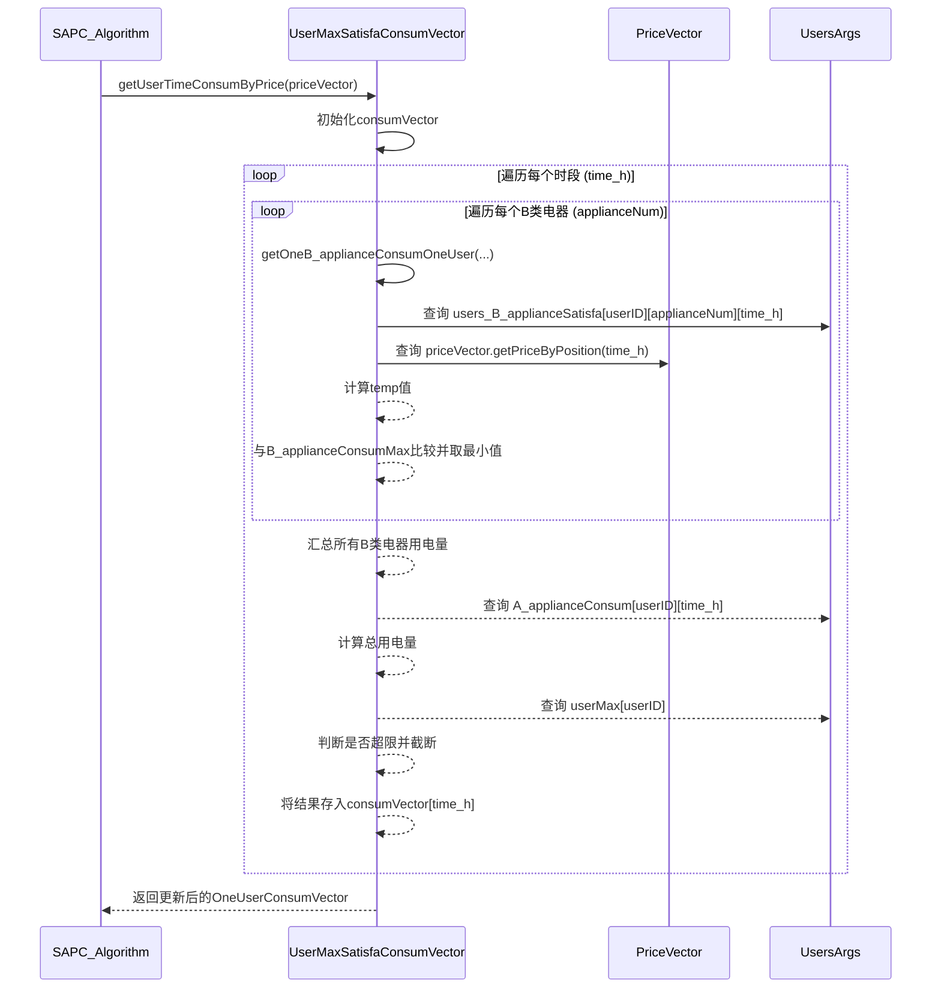
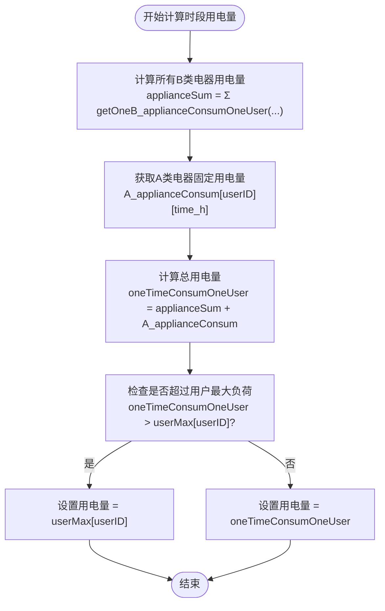
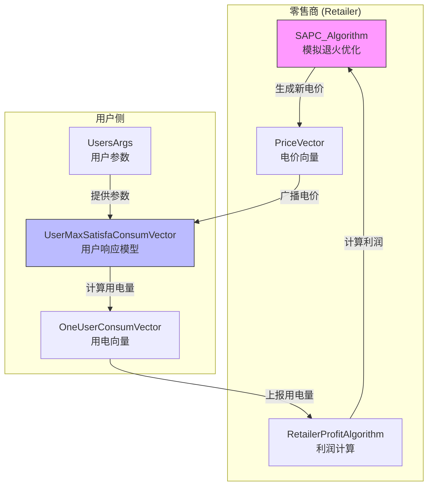

# 用户满意度模型

<cite>
**本文档引用的文件**  
- [UserMaxSatisfaConsumVector.java](file://src/main/java/io/leavesfly/smartgrid/user/UserMaxSatisfaConsumVector.java)
- [OneUserConsumVector.java](file://src/main/java/io/leavesfly/smartgrid/user/OneUserConsumVector.java)
- [UsersArgs.java](file://src/main/java/io/leavesfly/smartgrid/user/UsersArgs.java)
- [PriceVector.java](file://src/main/java/io/leavesfly/smartgrid/retailer/PriceVector.java)
- [SAPC_Algorithm.java](file://src/main/java/io/leavesfly/smartgrid/retailer/SAPC_Algorithm.java)
- [RetailerInitArgs.java](file://src/main/java/io/leavesfly/smartgrid/retailer/RetailerInitArgs.java)
</cite>

## 目录
1. [引言](#引言)
2. [核心组件与数据结构](#核心组件与数据结构)
3. [用户用电行为建模机制](#用户用电行为建模机制)
4. [用电量计算逻辑详解](#用电量计算逻辑详解)
5. [系统架构与工作流程](#系统架构与工作流程)
6. [模型对零售商利润的反馈作用](#模型对零售商利润的反馈作用)
7. [常见问题解答](#常见问题解答)
8. [结论](#结论)

## 引言

本技术文档旨在深入解析`UserMaxSatisfaConsumVector`类在智能电网电价响应系统中的核心作用。该类实现了基于用户满意度最大化原则的用电行为建模算法，通过动态响应实时电价信号，计算出用户在各时段的最优用电策略。文档将详细阐述其核心方法`getConsumVectorByPriceVector`的实现逻辑，解释关键公式`temp = 1.5*(time_h+1) / (satisfaction_factor + price)`的经济学含义，并说明该模型如何与零售商的利润优化算法协同工作，共同构成一个完整的需求响应闭环系统。

## 核心组件与数据结构

### 用户用电向量 (OneUserConsumVector)

该类用于封装单个用户在多个时段的用电量数据。

**Section sources**
- [OneUserConsumVector.java](file://src/main/java/io/leavesfly/smartgrid/user/OneUserConsumVector.java#L1-L53)

### 电价向量 (PriceVector)

该类用于表示零售商在不同时段设定的电价。

**Section sources**
- [PriceVector.java](file://src/main/java/io/leavesfly/smartgrid/retailer/PriceVector.java#L1-L107)

### 用户参数 (UsersArgs)

该类定义了系统中所有用户的静态配置参数。

**Section sources**
- [UsersArgs.java](file://src/main/java/io/leavesfly/smartgrid/user/UsersArgs.java#L1-L46)

## 用户用电行为建模机制

`UserMaxSatisfaConsumVector`类的核心功能是根据实时电价向量，为用户计算出一个最优的用电量向量，其目标是**在满足用户用电需求和设备限制的前提下，最大化用户的用电满意度**。

### 核心方法：getConsumVectorByPriceVector

该静态方法是整个用户行为模型的入口点。它接收一个`OneUserConsumVector`对象和一个`PriceVector`对象作为输入，计算并返回更新后的用电向量。

**Diagram sources**
- [UserMaxSatisfaConsumVector.java](file://src/main/java/io/leavesfly/smartgrid/user/UserMaxSatisfaConsumVector.java#L6-L34)
- [SAPC_Algorithm.java](file://src/main/java/io/leavesfly/smartgrid/retailer/SAPC_Algorithm.java#L175-L196)

## 用电量计算逻辑详解

### 核心公式：temp = 1.5*(time_h+1) / (satisfaction_factor + price)

该公式是计算单个B类电器（可调度电器）用电量的核心，其经济学含义如下：

*   **分子 `1.5*(time_h+1)`**: 代表电器在该时段的**基础使用效用或需求强度**。`time_h`代表当前时段（从0开始），`time_h+1`确保了时段索引从1开始。这个线性增长的因子表明，随着时间推移，用户对使用电器的潜在需求可能增加（例如，傍晚比上午更需要使用电器）。常数1.5是一个缩放因子，用于调整整体效用水平。
*   **分母 `satisfaction_factor + price`**: 代表使用电器的**综合成本**。
    *   `satisfaction_factor` (即 `UsersArgs.users_B_applianceSatisfa[userID][applianceNum][time_h]`): 这是用户对特定电器在特定时段的**内在满意度偏好**。一个较高的满意度因子意味着用户非常希望在此时使用该电器，这会**降低**分母，从而**增加**计算出的用电量，反映出用户的强烈偏好。
    *   `price` (即 `priceVector.getPriceByPosition(time_h)`): 这是该时段的**实时电价**。电价越高，分母越大，计算出的用电量`temp`就越小。这直接体现了**价格弹性**，即用户会因电价升高而减少用电。
*   **整体逻辑**: 该公式本质上是一个**效用/成本比**。它计算的是单位成本所能带来的效用。用户会倾向于在效用/成本比高的时段使用电器。当电价升高时，成本增加，比值下降，用户就会减少用电，从而实现了需求响应。

**Section sources**
- [UserMaxSatisfaConsumVector.java](file://src/main/java/io/leavesfly/smartgrid/user/UserMaxSatisfaConsumVector.java#L36-L48)

### A类与B类电器的用电量计算

系统将用户电器分为两类，其计算逻辑不同：

1.  **A类电器（基础电器）**:
    *   **特性**: 用电量固定，不可调度。例如照明、冰箱等必须持续运行的设备。
    *   **计算逻辑**: 其用电量直接从`UsersArgs.A_applianceConsum`二维数组中读取，该数组预设了每个用户在每个时段的基础用电量。这部分用电量是固定的，不受电价影响。
    *   **代码体现**: `UsersArgs.A_applianceConsum[oneUserConsumVector.getUserID()][time_h]`

2.  **B类电器（可调度电器）**:
    *   **特性**: 用电量可变，可以根据电价进行动态调节。例如洗衣机、电动汽车充电等。
    *   **计算逻辑**:
        *   对每个B类电器，调用`getOneB_applianceConsumOneUser`方法，使用上述核心公式计算其理论用电量`temp`。
        *   将所有B类电器的理论用电量求和，得到该时段的可变用电总量`applianceSum`。
        *   **上限保护**: 计算出的`temp`值不能超过该电器的最大允许用电量`B_applianceConsumMax`。如果超过，则取`B_applianceConsumMax`的值。
    *   **代码体现**: `UserMaxSatisfaConsumVector.getOneB_applianceConsumOneUser(...)`

### 总用电量与最大负荷限制

在计算出A类和B类电器的总用电量`oneTimeConsumOneUser`后，算法会进行最终的**负荷限制检查**：

*   **检查**: `if (oneTimeConsumOneUser > UsersArgs.userMax[oneUserConsumVector.getUserID()])`
*   **处理**: 如果总用电量超过了用户设定的最大负荷限制`userMax`，则将该时段的用电量强制截断为`userMax`的值。
*   **目的**: 这确保了用户的用电行为不会超出其物理或安全限制，是算法中一个关键的保护机制。

**Diagram sources**
- [UserMaxSatisfaConsumVector.java](file://src/main/java/io/leavesfly/smartgrid/user/UserMaxSatisfaConsumVector.java#L10-L32)

## 系统架构与工作流程

整个系统由零售商和用户两方构成，通过模拟退火算法（SAPC）进行交互。

**Diagram sources**
- [SAPC_Algorithm.java](file://src/main/java/io/leavesfly/smartgrid/retailer/SAPC_Algorithm.java#L111-L140)
- [UserMaxSatisfaConsumVector.java](file://src/main/java/io/leavesfly/smartgrid/user/UserMaxSatisfaConsumVector.java#L6-L34)
- [RetailerProfitAlgorithm.java](file://src/main/java/io/leavesfly/smartgrid/retailer/RetailerProfitAlgorithm.java#L1-L34)

**工作流程**:
1.  零售商（`SAPC_Algorithm`）初始化一个电价向量。
2.  该电价向量被发送给用户模型。
3.  用户模型（`UserMaxSatisfaConsumVector`）根据电价、用户偏好（`UsersArgs`）和设备限制，计算出用户的用电响应向量。
4.  用电向量被返回给零售商。
5.  零售商的利润算法（`RetailerProfitAlgorithm`）根据电价和总用电量计算当前利润。
6.  零售商使用模拟退火算法迭代调整电价，寻找能最大化其利润的最优电价方案。

## 模型对零售商利润的反馈作用

`UserMaxSatisfaConsumVector`模型是零售商利润优化算法的**关键反馈环节**。它不是一个孤立的模型，而是整个闭环优化系统中的“被控对象”。

*   **反馈机制**: 零售商提出的每一个电价方案，都会通过`UserMaxSatisfaConsumVector`模型得到一个对应的用户用电响应。这个响应直接决定了零售商的收入（用电量 * 电价）和成本（与用电量相关的运营成本）。
*   **有效性**: 该模型的有效性体现在它真实地模拟了用户的理性经济行为。用户会因电价升高而减少用电（尤其是可调度的B类电器），这使得零售商无法通过无限提高电价来增加利润。零售商必须在高电价（高单位利润）和低用电量（低销量）之间找到平衡点，从而促使零售商制定出更合理、更高效的电价策略。
*   **需求响应**: 该模型成功地将用户的用电行为与电价信号耦合起来，实现了**需求响应**。在用电高峰期，零售商可以设定较高电价，引导用户减少非必要用电，从而平抑负荷曲线，提高电网的稳定性和经济性。

**Section sources**
- [SAPC_Algorithm.java](file://src/main/java/io/leavesfly/smartgrid/retailer/SAPC_Algorithm.java#L111-L140)
- [RetailerProfitAlgorithm.java](file://src/main/java/io/leavesfly/smartgrid/retailer/RetailerProfitAlgorithm.java#L1-L34)

## 常见问题解答

### 为何用电量会随价格升高而降低？

这是由核心公式`temp = 1.5*(time_h+1) / (satisfaction_factor + price)`决定的。电价`price`位于分母位置。当电价升高时，分母变大，导致整个分数的值（即计算出的用电量`temp`）变小。这反映了经济学中的“价格弹性”原理，即商品（此处为电能）价格上涨时，消费者的需求量会下降。

### 满意度因子对用电行为有何影响？

满意度因子`users_B_applianceSatisfa`代表了用户对特定电器在特定时段的主观偏好。它的影响是**反向的**：一个**高**的满意度因子意味着用户非常希望在此时使用该电器。在核心公式中，高满意度因子会增大分母，但其背后的逻辑是，用户愿意为高满意度的活动支付更高的“心理成本”。在实际计算中，即使电价较高，一个极高的满意度因子也可能使得用户仍然选择使用该电器，从而维持较高的用电量。反之，低满意度因子意味着用户对此电器使用不感兴趣，即使电价很低，其用电量也可能很低。

## 结论

`UserMaxSatisfaConsumVector`类实现了一个简洁而有效的用户用电行为模型。它通过一个清晰的效用/成本比公式，将用户的满意度偏好与实时电价信号相结合，动态计算出用户的最优用电策略。该模型不仅考虑了A类和B类电器的不同特性，还通过最大负荷限制确保了计算结果的物理可行性。作为零售商利润优化算法的核心反馈环节，该模型使得整个系统能够模拟真实的需求响应场景，为研究和优化智能电网的定价策略提供了坚实的基础。