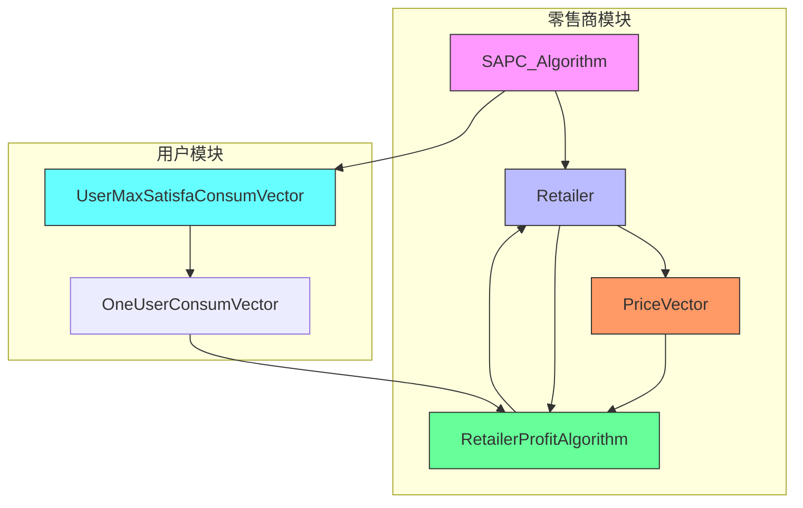
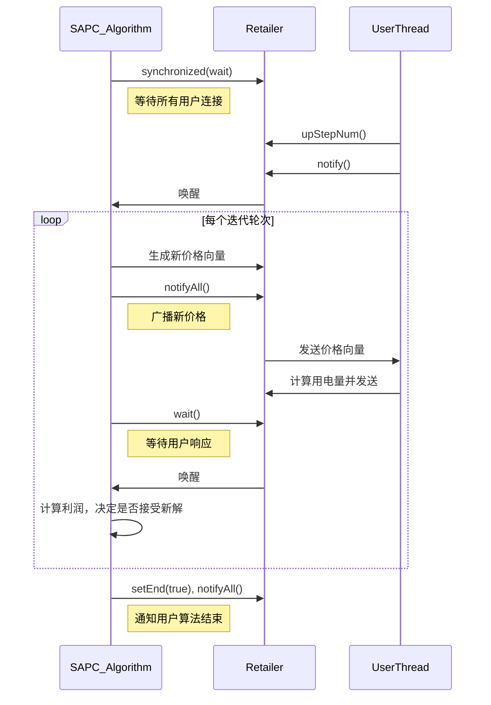
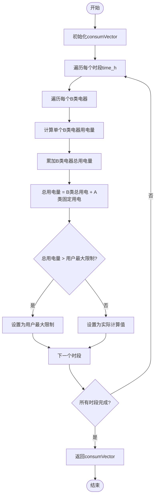

# 算法设计

<cite>
**本文档中引用的文件**  
- [SAPC_Algorithm.java](file://src/main/java/io/leavesfly/smartgrid/retailer/SAPC_Algorithm.java)
- [Retailer.java](file://src/main/java/io/leavesfly/smartgrid/retailer/Retailer.java)
- [UserMaxSatisfaConsumVector.java](file://src/main/java/io/leavesfly/smartgrid/user/UserMaxSatisfaConsumVector.java)
- [RetailerProfitAlgorithm.java](file://src/main/java/io/leavesfly/smartgrid/retailer/RetailerProfitAlgorithm.java)
- [PriceVector.java](file://src/main/java/io/leavesfly/smartgrid/retailer/PriceVector.java)
- [RetailerInitArgs.java](file://src/main/java/io/leavesfly/smartgrid/retailer/RetailerInitArgs.java)
- [README.md](file://README.md)
</cite>

## 目录
1. [引言](#引言)
2. [SAPC算法总体架构](#sapc算法总体架构)
3. [算法四个阶段详解](#算法四个阶段详解)
4. [SAPC_Algorithm与Retailer交互机制](#sapc_algorithm与retailer交互机制)
5. [UserMaxSatisfaConsumVector用户用电策略计算](#usermaxsatisfaconsumvector用户用电策略计算)
6. [算法伪代码与关键参数调优](#算法伪代码与关键参数调优)
7. [收敛性、时间复杂度与有效性分析](#收敛性时间复杂度与有效性分析)
8. [结论](#结论)

## 引言

SAPC（模拟退火价格控制）算法是智能电网需求响应管理系统中的核心优化算法，旨在通过动态电价机制引导用户合理用电，同时最大化电力零售商的利润。该算法基于模拟退火思想，在电价优化问题的解空间中进行全局搜索，避免陷入局部最优。系统通过零售商与用户的协同交互，实现供需平衡与利润优化的双重目标。

**文档来源**
- [README.md](file://README.md#L103-L128)

## SAPC算法总体架构

SAPC算法采用经典的模拟退火框架，结合电力市场特有的利润计算模型和用户行为模型，构建了一个闭环的优化系统。其核心架构由零售商（Retailer）、价格向量（PriceVector）、用户满意度最大化模块（UserMaxSatisfaConsumVector）和利润计算模块（RetailerProfitAlgorithm）组成。



**图示来源**
- [SAPC_Algorithm.java](file://src/main/java/io/leavesfly/smartgrid/retailer/SAPC_Algorithm.java)
- [Retailer.java](file://src/main/java/io/leavesfly/smartgrid/retailer/Retailer.java)
- [UserMaxSatisfaConsumVector.java](file://src/main/java/io/leavesfly/smartgrid/user/UserMaxSatisfaConsumVector.java)

## 算法四个阶段详解

### 初始化阶段

算法初始化阶段主要完成以下任务：
1. 设置初始温度T和终止温度E，根据`RetailerInitArgs`类中的定义，T初始值为e⁻¹，E为e⁻⁵。
2. 创建当前价格向量（priceVectorNow）和新价格向量（priceVectorNew）的实例。
3. 生成初始的随机价格向量，每个时段的价格在[0.5, 1.5]区间内随机生成。
4. 计算初始价格向量下的用户总用电量和零售商初始利润。

此阶段为算法的搜索过程提供了起点，确保了搜索的随机性和多样性。

**阶段来源**
- [SAPC_Algorithm.java](file://src/main/java/io/leavesfly/smartgrid/retailer/SAPC_Algorithm.java#L111-L118)
- [RetailerInitArgs.java](file://src/main/java/io/leavesfly/smartgrid/retailer/RetailerInitArgs.java#L0-L14)

### 迭代优化阶段

迭代优化是SAPC算法的核心，其流程如下：
1. 遍历价格向量的每个时段位置（position）。
2. 在当前时段生成一个随机新价格（randomPrice）。
3. 基于当前价格向量和新价格生成一个邻域解（新价格向量）。
4. 将新价格向量广播给所有用户，等待用户计算并返回其用电策略。
5. 收集所有用户的用电向量，计算系统总用电量。
6. 调用`RetailerProfitAlgorithm.getRetialProfit()`计算新价格向量下的零售商利润。

该阶段通过不断探索解空间的邻域，寻找更优的电价策略。

**阶段来源**
- [SAPC_Algorithm.java](file://src/main/java/io/leavesfly/smartgrid/retailer/SAPC_Algorithm.java#L32-L59)
- [Retailer.java](file://src/main/java/io/leavesfly/smartgrid/retailer/Retailer.java#L0-L64)

### 温度降低阶段

温度降低遵循对数冷却策略，这是模拟退火算法的关键特征。在每次完整的迭代轮次（ROUND）结束后，温度T按照以下公式更新：
```
T = T / ln(ROUND)
```
其中ROUND为当前迭代轮次编号，初始为1。随着迭代进行，ROUND增大，ln(ROUND)增大，导致T逐渐降低。温度的降低使得算法接受劣解的概率逐渐减小，从而从“探索”模式平稳过渡到“开发”模式，最终收敛到一个较优解。

**阶段来源**
- [SAPC_Algorithm.java](file://src/main/java/io/leavesfly/smartgrid/retailer/SAPC_Algorithm.java#L89-L92)
- [RetailerInitArgs.java](file://src/main/java/io/leavesfly/smartgrid/retailer/RetailerInitArgs.java#L0-L14)

### 收敛判断阶段

算法的收敛判断基于温度阈值。主循环的终止条件为：
```
while (T > E)
```
其中E是预设的终止温度（e⁻⁵）。当当前温度T降低到终止温度E以下时，循环结束，算法认为已经找到足够好的解并停止搜索。这种基于温度的收敛判断简单有效，确保了算法在有限时间内结束。

**阶段来源**
- [SAPC_Algorithm.java](file://src/main/java/io/leavesfly/smartgrid/retailer/SAPC_Algorithm.java#L32-L33)
- [RetailerInitArgs.java](file://src/main/java/io/leavesfly/smartgrid/retailer/RetailerInitArgs.java#L0-L14)

## SAPC_Algorithm与Retailer交互机制

SAPC_Algorithm与Retailer类之间存在紧密的协作关系，通过共享状态和同步机制实现交互。

### 状态共享与访问

`SAPC_Algorithm`通过`Retailer`类提供的getter和setter方法访问其内部状态：
- `getPriceVector()`和`setPriceVectorNew()`：获取和设置价格向量。
- `getRetailerProfitNow()`和`setRetailerProfitNow()`：获取和更新当前利润。
- `getConsumByTimeNow()`和`setConsumByTimeNew()`：获取当前总用电量和设置新用电量。

这种设计将算法逻辑与数据存储分离，提高了代码的模块化程度。

### 同步与通信机制

系统采用Java的`synchronized`关键字和`wait()/notifyAll()`机制实现线程同步：
1. **价格广播**：当SAPC_Algorithm生成新价格向量后，会调用`notifyAll()`唤醒所有等待的用户线程。
2. **结果等待**：SAPC_Algorithm在计算新利润前，会调用`wait()`暂停执行，直到用户线程计算完用电量并唤醒它。
3. **初始化同步**：使用`AddStepNum`对象确保所有用户连接完成后再开始计算。



**图示来源**
- [SAPC_Algorithm.java](file://src/main/java/io/leavesfly/smartgrid/retailer/SAPC_Algorithm.java)
- [RetailerThread.java](file://src/main/java/io/leavesfly/smartgrid/retailer/RetailerThread.java)

## UserMaxSatisfaConsumVector用户用电策略计算

`UserMaxSatisfaConsumVector`类负责模拟用户在给定价格下的用电决策行为，其核心是最大化用户满意度。

### 用户用电模型

用户用电分为两类：
- **A类电器**：不可调节电器，其用电量是固定的，由`UsersArgs.A_applianceConsum`数组定义。
- **B类电器**：可调节电器，其用电量可根据电价和用户满意度动态调整。

### 满意度最大化算法

`getConsumVectorByPriceVector`方法为每个用户在每个时段计算最优用电量：
1. 遍历所有时段（time_h）。
2. 计算B类电器的总用电量：对每个B类电器，调用`getOneB_applianceConsumOneUser`计算其用电量。
3. 计算总用电量：B类电器总用电量加上A类电器的固定用电量。
4. 应用用户最大用电限制：如果总用电量超过用户设定的最大值，则截断。

B类电器的用电量计算公式体现了价格与满意度的权衡：
```
用电量 = min(1.5 * (时段+1) / (满意度 + 电价), 最大允许用电量)
```
该公式表明，用户在满意度高的时段更愿意用电，但高电价会抑制用电需求。



**图示来源**
- [UserMaxSatisfaConsumVector.java](file://src/main/java/io/leavesfly/smartgrid/user/UserMaxSatisfaConsumVector.java#L0-L49)
- [UsersArgs.java](file://src/main/java/io/leavesfly/smartgrid/user/UsersArgs.java)

## 算法伪代码与关键参数调优

### SAPC算法伪代码

```
算法: SAPC_Algorithm.simulatedAnnealingAglorith(Retailer retailer)
输入: 零售商对象retailer
输出: 最优价格向量和对应利润

1.  初始化:
    1.1.  等待所有用户连接完成 (synchronized wait on addStepNum)
    1.2.  将当前价格向量复制给新价格向量
    1.3.  广播初始价格向量 (notifyAll on priceVectorNew)
    1.4.  等待用户返回用电量 (wait on consumByTimeNow)
    1.5.  设置当前利润为初始利润

2.  主循环 (当 T > E):
    2.1.  记录当前轮次 (ROUND++)
    2.2.  遍历价格向量的每个位置 (position):
        2.2.1.  生成该位置的随机新价格 (randomPrice)
        2.2.2.  基于当前向量和新价格生成新价格向量
        2.2.3.  广播新价格向量 (notifyAll)
        2.2.4.  等待用户返回新用电量 (wait)
        2.2.5.  计算新利润 (RetailerProfitAlgorithm.getRetialProfit)
        2.2.6.  Metropolis准则决策:
            if 新利润 > 当前利润 then
                接受新解 (更新价格向量和利润)
            else
                以概率 exp((新利润 - 当前利润) / T) 接受新解
    2.3.  降低温度: T = T / ln(ROUND)

3.  结束:
    3.1.  将最终解复制回当前价格向量
    3.2.  设置结束标志并通知所有用户
    3.3.  记录最终结果并关闭日志
```

### 关键参数调优建议

| 参数 | 来源 | 作用 | 调优建议 |
| :--- | :--- | :--- | :--- |
| **T (初始温度)** | `RetailerInitArgs.T` | 控制初始接受劣解的概率 | 温度过高导致搜索随机，过低导致陷入局部最优。建议通过实验确定，通常在e⁻¹到1之间。 |
| **E (终止温度)** | `RetailerInitArgs.E` | 决定算法何时停止 | 温度过高导致提前收敛，过低导致计算时间过长。建议设置为一个很小的正数，如e⁻⁵。 |
| **a, b (成本系数)** | `RetailerInitArgs.a`, `RetailerInitArgs.b` | 定义零售商的运营成本 | a和b越大，成本项对利润的影响越大，算法会倾向于平抑用电高峰。应根据实际电网成本数据设定。 |
| **w (成本权重)** | `RetailerInitArgs.w` | 调整成本项在利润中的权重 | w越大，算法越注重成本控制而非单纯收入。w=1表示成本与收入同等重要。 |
| **冷却速率** | `T = T / ln(ROUND)` | 控制温度下降速度 | 对数冷却较慢，有利于全局搜索。若需更快收敛，可尝试指数冷却 `T = T * α (α<1)`。 |

**参数来源**
- [RetailerInitArgs.java](file://src/main/java/io/leavesfly/smartgrid/retailer/RetailerInitArgs.java#L0-L14)
- [RetailerProfitAlgorithm.java](file://src/main/java/io/leavesfly/smartgrid/retailer/RetailerProfitAlgorithm.java#L0-L34)

## 收敛性、时间复杂度与有效性分析

### 收敛性分析

SAPC算法的收敛性基于模拟退火理论。理论上，只要冷却过程足够慢（如对数冷却），算法以概率1收敛到全局最优解。在本实现中：
- **冷却策略**：采用 `T = T / ln(k)` 的对数冷却，符合理论要求。
- **终止条件**：当温度低于阈值E时停止，保证了算法的有限时间终止。
- **邻域结构**：每次只改变一个时段的价格，确保了状态空间的连通性。

因此，该算法在理论上具有良好的收敛保证。

### 时间复杂度分析

设：
- `n` 为时段数量（timeSlots）
- `m` 为用户数量（userNum）
- `k` 为B类电器数量（B_applianceNum）
- `R` 为总迭代轮次数

算法的时间复杂度主要由主循环决定：
1. **外层循环**：执行次数与温度从T降到E所需轮次相关，通常为O(R)。
2. **内层循环**：遍历n个时段，O(n)。
3. **用户响应**：每个用户计算用电量的时间为O(n*k)，m个用户并行计算，但零售商需等待，故为O(n*k)。
4. **利润计算**：遍历n个时段，O(n)。

综合来看，总时间复杂度为 **O(R * n * (k + 1))**。由于R通常远大于n和k，算法的复杂度主要由迭代轮次决定。

### 在电价优化场景下的有效性

SAPC算法在电价优化场景中表现出以下有效性：
1. **全局搜索能力**：通过接受劣解的机制，能够跳出局部最优，找到更优的电价策略。
2. **模型贴合实际**：利润函数考虑了收入和成本，用户模型区分了可调与不可调负载，更贴近真实电网。
3. **动态响应**：算法可以在线运行，根据实时用户反馈调整价格，适应动态变化的用电需求。
4. **可扩展性**：框架清晰，易于引入更复杂的用户行为模型或成本函数。

然而，其有效性也依赖于参数的合理设置，不恰当的T、E或a、b、w值可能导致收敛过慢或结果不佳。

**分析来源**
- [SAPC_Algorithm.java](file://src/main/java/io/leavesfly/smartgrid/retailer/SAPC_Algorithm.java)
- [RetailerProfitAlgorithm.java](file://src/main/java/io/leavesfly/smartgrid/retailer/RetailerProfitAlgorithm.java)
- [UserMaxSatisfaConsumVector.java](file://src/main/java/io/leavesfly/smartgrid/user/UserMaxSatisfaConsumVector.java)

## 结论

SAPC算法是一个设计精巧的模拟退火应用，成功地将经典优化算法应用于智能电网的电价控制问题。它通过四个清晰的阶段——初始化、迭代优化、温度降低和收敛判断——构建了一个鲁棒的优化流程。算法通过`Retailer`类与用户进行高效交互，并利用`UserMaxSatisfaConsumVector`精确模拟用户行为，最终通过`RetailerProfitAlgorithm`评估解的质量。关键参数的合理调优对算法性能至关重要。总体而言，该算法在理论上具有良好的收敛性，在实践中为实现电网供需平衡和利润最大化提供了一个有效的解决方案。