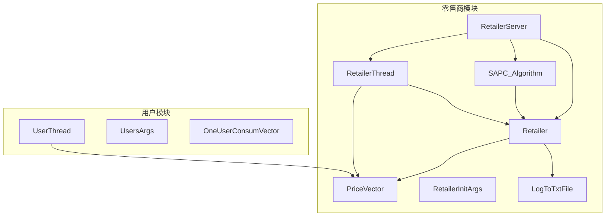
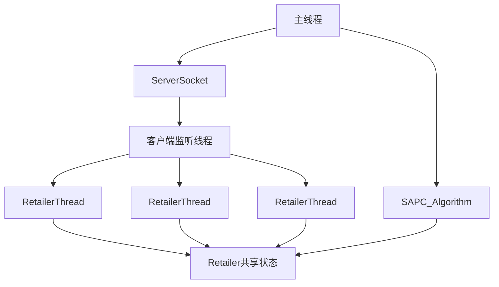
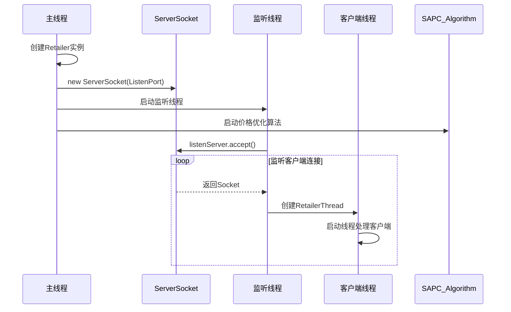
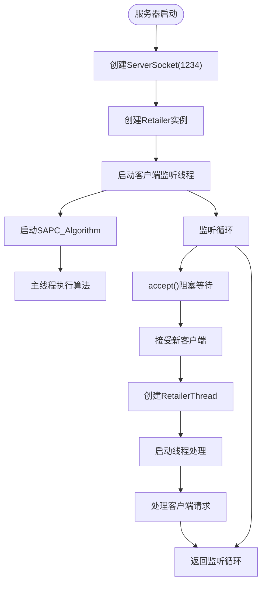
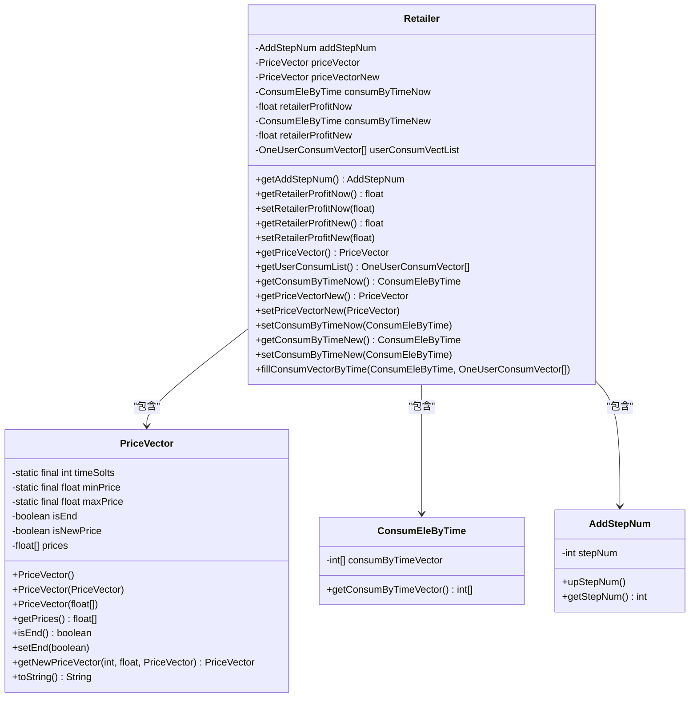
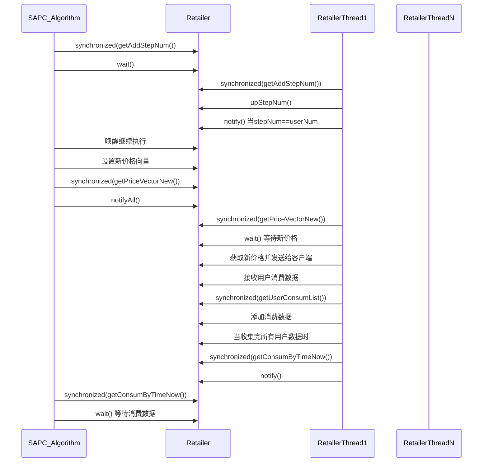
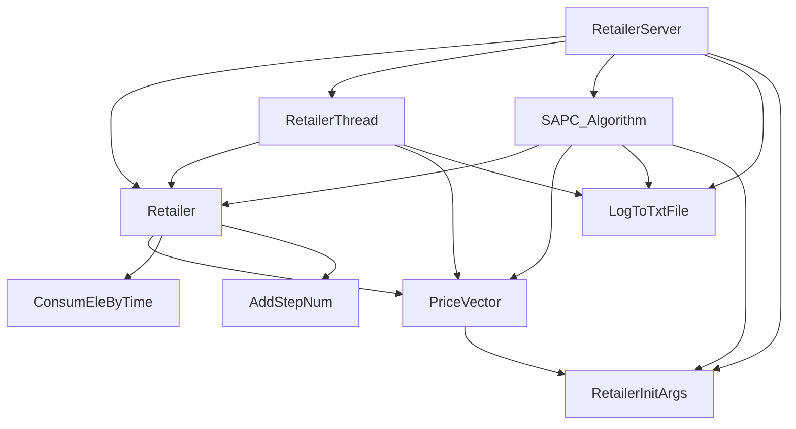
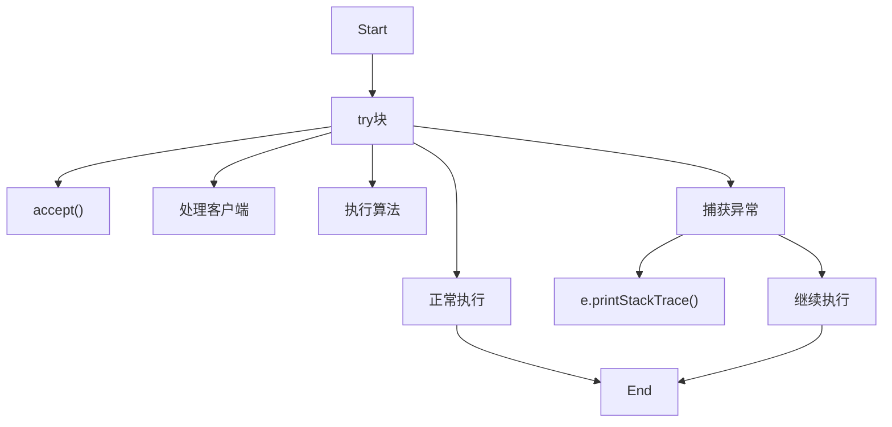

# 服务器架构

<cite>
**本文档引用的文件**  
- [RetailerServer.java](file://src/main/java/io/leavesfly/smartgrid/retailer/RetailerServer.java)
- [Retailer.java](file://src/main/java/io/leavesfly/smartgrid/retailer/Retailer.java)
- [RetailerThread.java](file://src/main/java/io/leavesfly/smartgrid/retailer/RetailerThread.java)
- [SAPC_Algorithm.java](file://src/main/java/io/leavesfly/smartgrid/retailer/SAPC_Algorithm.java)
- [PriceVector.java](file://src/main/java/io/leavesfly/smartgrid/retailer/PriceVector.java)
- [RetailerInitArgs.java](file://src/main/java/io/leavesfly/smartgrid/retailer/RetailerInitArgs.java)
- [LogToTxtFile.java](file://src/main/java/io/leavesfly/smartgrid/retailer/LogToTxtFile.java)
</cite>

## 目录
1. [简介](#简介)
2. [项目结构](#项目结构)
3. [核心组件](#核心组件)
4. [架构概览](#架构概览)
5. [详细组件分析](#详细组件分析)
6. [依赖分析](#依赖分析)
7. [性能考虑](#性能考虑)
8. [故障排除指南](#故障排除指南)
9. [结论](#结论)

## 简介
本文档详细描述了零售商服务器（RetailerServer）的架构设计，重点分析了其如何通过ServerSocket监听指定端口并接受客户端连接。文档解释了主线程与工作线程的分工机制：主线程负责启动SAPC_Algorithm进行价格优化计算，同时独立线程处理客户端接入请求。特别说明了Retailer实例作为共享状态中心被所有RetailerThread线程共享的设计原理。结合代码示例展示了ServerSocket.accept()的阻塞机制和多线程并发处理模型。同时讨论了服务器启动流程、资源释放机制和异常处理策略，并提供了服务器生命周期管理的最佳实践。

## 项目结构
零售商服务器项目采用模块化设计，主要分为零售商（retailer）和用户（user）两大模块。零售商模块包含服务器核心组件、价格优化算法和数据模型，用户模块则负责模拟用户行为。这种分层结构清晰地分离了服务端和客户端的职责。



**图示来源**  
- [RetailerServer.java](file://src/main/java/io/leavesfly/smartgrid/retailer/RetailerServer.java)
- [Retailer.java](file://src/main/java/io/leavesfly/smartgrid/retailer/Retailer.java)
- [RetailerThread.java](file://src/main/java/io/leavesfly/smartgrid/retailer/RetailerThread.java)

**本节来源**  
- [RetailerServer.java](file://src/main/java/io/leavesfly/smartgrid/retailer/RetailerServer.java)
- [Retailer.java](file://src/main/java/io/leavesfly/smartgrid/retailer/Retailer.java)

## 核心组件
零售商服务器的核心组件包括RetailerServer类、Retailer类、RetailerThread类和SAPC_Algorithm类。RetailerServer作为服务器入口点，负责初始化ServerSocket并启动客户端监听线程。Retailer类作为共享状态中心，存储价格向量、消费数据和利润计算结果。RetailerThread类处理每个客户端连接，实现与用户的通信。SAPC_Algorithm类则执行模拟退火算法进行价格优化。

**本节来源**  
- [RetailerServer.java](file://src/main/java/io/leavesfly/smartgrid/retailer/RetailerServer.java#L1-L42)
- [Retailer.java](file://src/main/java/io/leavesfly/smartgrid/retailer/Retailer.java#L1-L105)
- [RetailerThread.java](file://src/main/java/io/leavesfly/smartgrid/retailer/RetailerThread.java#L1-L89)

## 架构概览
零售商服务器采用主从线程架构，主线程负责价格优化计算，从线程负责客户端连接处理。这种设计实现了计算密集型任务和I/O密集型任务的分离，提高了系统整体性能和响应能力。



**图示来源**  
- [RetailerServer.java](file://src/main/java/io/leavesfly/smartgrid/retailer/RetailerServer.java#L1-L42)
- [SAPC_Algorithm.java](file://src/main/java/io/leavesfly/smartgrid/retailer/SAPC_Algorithm.java#L1-L198)

## 详细组件分析

### RetailerServer 分析
RetailerServer类是服务器的入口点，负责启动服务器并管理客户端连接。其主要职责包括创建ServerSocket、启动客户端监听线程和执行价格优化算法。

#### 服务器启动流程


**图示来源**  
- [RetailerServer.java](file://src/main/java/io/leavesfly/smartgrid/retailer/RetailerServer.java#L1-L42)

#### 多线程并发模型


**图示来源**  
- [RetailerServer.java](file://src/main/java/io/leavesfly/smartgrid/retailer/RetailerServer.java#L1-L42)
- [RetailerThread.java](file://src/main/java/io/leavesfly/smartgrid/retailer/RetailerThread.java#L1-L89)

**本节来源**  
- [RetailerServer.java](file://src/main/java/io/leavesfly/smartgrid/retailer/RetailerServer.java#L1-L42)

### Retailer 共享状态分析
Retailer类作为共享状态中心，被所有RetailerThread线程和SAPC_Algorithm共享，实现了数据的集中管理和同步。

#### 共享状态设计


**图示来源**  
- [Retailer.java](file://src/main/java/io/leavesfly/smartgrid/retailer/Retailer.java#L1-L105)
- [PriceVector.java](file://src/main/java/io/leavesfly/smartgrid/retailer/PriceVector.java#L1-L107)

#### 线程间同步机制


**图示来源**  
- [SAPC_Algorithm.java](file://src/main/java/io/leavesfly/smartgrid/retailer/SAPC_Algorithm.java#L1-L198)
- [RetailerThread.java](file://src/main/java/io/leavesfly/smartgrid/retailer/RetailerThread.java#L1-L89)

**本节来源**  
- [Retailer.java](file://src/main/java/io/leavesfly/smartgrid/retailer/Retailer.java#L1-L105)

### SAPC_Algorithm 价格优化分析
SAPC_Algorithm类实现了模拟退火算法，用于优化零售商的价格策略以最大化利润。

#### 算法执行流程
```mermaid
flowchart TD
Start([算法开始]) --> WaitInit["等待所有客户端连接"]
WaitInit --> SetInitPrice["设置初始价格向量"]
SetInitPrice --> NotifyPrice["通知所有客户端新价格"]
SetInitPrice --> WaitConsum["等待用户消费数据"]
WaitConsum --> CalcProfit["计算当前利润"]
CalcProfit --> LoopStart["进入退火循环"]
LoopStart --> CheckTemp["T > E?"]
CheckTemp --> |是| ForLoop["for 每个时间段"]
ForLoop --> GenNewPrice["生成随机新价格"]
GenNewPrice --> UpdatePriceVec["更新价格向量"]
UpdatePriceVec --> NotifyNewPrice["通知客户端新价格"]
NotifyNewPrice --> WaitNewConsum["等待新消费数据"]
WaitNewConsum --> CalcNewProfit["计算新利润"]
CalcNewProfit --> CompareProfit["比较新旧利润"]
CompareProfit --> |新利润更高| AcceptNew["接受新价格"]
CompareProfit --> |新利润更低| RandomAccept["随机接受"]
AcceptNew --> UpdateCurrent["更新当前价格和利润"]
RandomAccept --> |随机数<exp(Δ/T)| AcceptNew
RandomAccept --> |否则| RejectNew["拒绝新价格"]
AcceptNew --> NextPosition["下一个时间段"]
RejectNew --> NextPosition
NextPosition --> ForLoop
ForLoop --> |所有时间段完成| UpdateParams["更新退火参数"]
UpdateParams --> LoopStart
CheckTemp --> |否| Finalize["最终化最优价格"]
Finalize --> SetEndFlag["设置结束标志"]
Finalize --> NotifyAll["通知所有客户端"]
Finalize --> LogResult["记录结果并关闭日志"]
```

**图示来源**  
- [SAPC_Algorithm.java](file://src/main/java/io/leavesfly/smartgrid/retailer/SAPC_Algorithm.java#L1-L198)

**本节来源**  
- [SAPC_Algorithm.java](file://src/main/java/io/leavesfly/smartgrid/retailer/SAPC_Algorithm.java#L1-L198)

## 依赖分析
零售商服务器各组件之间存在明确的依赖关系，形成了清晰的调用链和数据流。



**图示来源**  
- [RetailerServer.java](file://src/main/java/io/leavesfly/smartgrid/retailer/RetailerServer.java#L1-L42)
- [Retailer.java](file://src/main/java/io/leavesfly/smartgrid/retailer/Retailer.java#L1-L105)
- [SAPC_Algorithm.java](file://src/main/java/io/leavesfly/smartgrid/retailer/SAPC_Algorithm.java#L1-L198)

**本节来源**  
- [RetailerServer.java](file://src/main/java/io/leavesfly/smartgrid/retailer/RetailerServer.java#L1-L42)
- [Retailer.java](file://src/main/java/io/leavesfly/smartgrid/retailer/Retailer.java#L1-L105)
- [SAPC_Algorithm.java](file://src/main/java/io/leavesfly/smartgrid/retailer/SAPC_Algorithm.java#L1-L198)

## 性能考虑
零售商服务器的性能主要受以下几个因素影响：

1. **线程管理**：每个客户端连接都创建一个新线程，当客户端数量较多时可能导致线程过多，建议使用线程池优化。
2. **同步开销**：频繁的synchronized块和wait/notify机制可能成为性能瓶颈，特别是在高并发场景下。
3. **阻塞I/O**：使用阻塞式Socket I/O，accept()和readObject()方法都会阻塞线程，影响服务器吞吐量。
4. **算法复杂度**：SAPC_Algorithm的模拟退火算法具有较高的时间复杂度，可能影响服务器响应速度。

建议的性能优化措施包括：
- 使用NIO替代传统Socket，提高I/O效率
- 引入线程池管理客户端线程，避免线程创建开销
- 优化同步机制，减少锁竞争
- 对价格优化算法进行并行化处理

## 故障排除指南
### 常见问题及解决方案

| 问题现象 | 可能原因 | 解决方案 |
|---------|---------|---------|
| 服务器无法启动 | 端口被占用 | 更改RetailerInitArgs.ListenPort值 |
| 客户端连接失败 | 服务器未启动或IP/端口错误 | 检查服务器状态和网络配置 |
| 日志文件无法创建 | 路径不存在或权限不足 | 确保E:\路径存在且有写入权限 |
| 算法执行缓慢 | 退火参数设置不当 | 调整T、E等参数值 |
| 数据不同步 | 线程同步问题 | 检查synchronized块和wait/notify使用 |

### 异常处理策略
服务器实现了基本的异常处理机制，主要通过try-catch块捕获和处理异常：



**本节来源**  
- [RetailerServer.java](file://src/main/java/io/leavesfly/smartgrid/retailer/RetailerServer.java#L1-L42)
- [RetailerThread.java](file://src/main/java/io/leavesfly/smartgrid/retailer/RetailerThread.java#L1-L89)
- [SAPC_Algorithm.java](file://src/main/java/io/leavesfly/smartgrid/retailer/SAPC_Algorithm.java#L1-L198)

## 结论
零售商服务器采用主从线程架构，成功实现了客户端连接处理与价格优化计算的分离。通过Retailer实例作为共享状态中心，实现了多线程间的有效数据共享和同步。ServerSocket.accept()的阻塞机制确保了客户端连接的可靠处理，而独立的算法线程保证了价格优化计算的连续性。

服务器生命周期管理包括：启动时初始化ServerSocket和共享状态，运行时并发处理客户端请求和执行优化算法，关闭时通过设置结束标志和通知机制优雅地终止所有线程。这种设计模式为类似的服务器应用提供了有价值的参考。

未来改进方向包括引入非阻塞I/O、使用线程池优化资源管理、增强异常处理机制和添加更完善的监控功能。