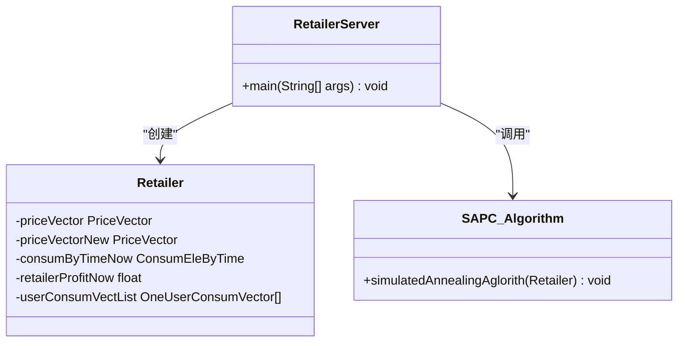
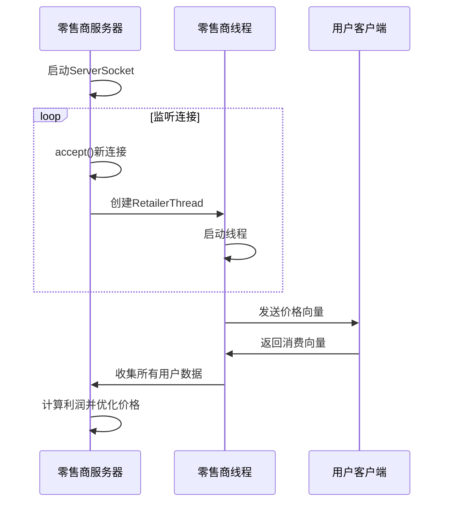
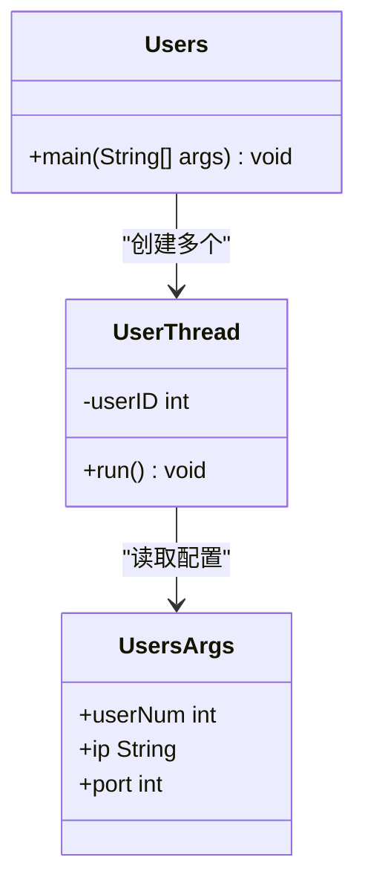
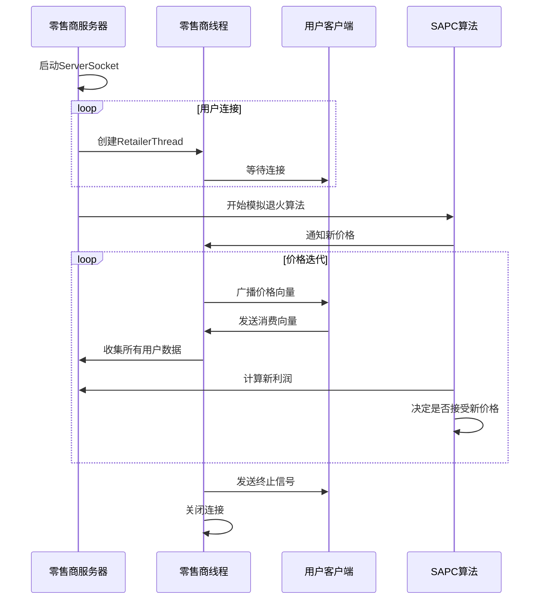

# 系统架构

<cite>
**本文档中引用的文件**  
- [RetailerServer.java](file://src/main/java/io/leavesfly/smartgrid/retailer/RetailerServer.java)
- [RetailerThread.java](file://src/main/java/io/leavesfly/smartgrid/retailer/RetailerThread.java)
- [UserThread.java](file://src/main/java/io/leavesfly/smartgrid/user/UserThread.java)
- [SAPC_Algorithm.java](file://src/main/java/io/leavesfly/smartgrid/retailer/SAPC_Algorithm.java)
- [Retailer.java](file://src/main/java/io/leavesfly/smartgrid/retailer/Retailer.java)
- [PriceVector.java](file://src/main/java/io/leavesfly/smartgrid/retailer/PriceVector.java)
- [Users.java](file://src/main/java/io/leavesfly/smartgrid/user/Users.java)
- [UsersArgs.java](file://src/main/java/io/leavesfly/smartgrid/user/UsersArgs.java)
- [RetailerInitArgs.java](file://src/main/java/io/leavesfly/smartgrid/retailer/RetailerInitArgs.java)
</cite>

## 目录
1. [系统上下文图](#系统上下文图)
2. [客户端-服务器通信模型](#客户端-服务器通信模型)
3. [零售商服务器设计](#零售商服务器设计)
4. [多线程并发处理机制](#多线程并发处理机制)
5. [用户线程实现](#用户线程实现)
6. [组件交互流程](#组件交互流程)
7. [架构决策分析](#架构决策分析)
8. [关键设计考量](#关键设计考量)

## 系统上下文图

```mermaid
graph TD
subgraph "智能电网系统"
RetailerServer["零售商服务器<br/>- 监听端口 1234<br/>- 运行模拟退火算法"]
UserClients["用户客户端<br/>- 多个用户线程<br/>- 连接至零售商"]
end
RetailerServer < --> UserClients
style RetailerServer fill:#f9f,stroke:#333
style UserClients fill:#bbf,stroke:#333
```

**图示来源**  
- [RetailerServer.java](file://src/main/java/io/leavesfly/smartgrid/retailer/RetailerServer.java#L1-L42)
- [UserThread.java](file://src/main/java/io/leavesfly/smartgrid/user/UserThread.java#L1-L86)
- [Users.java](file://src/main/java/io/leavesfly/smartgrid/user/Users.java#L1-L13)

## 客户端-服务器通信模型

本系统采用基于Socket的客户端-服务器通信模型，零售商作为服务器端，用户作为客户端。通信采用Java对象序列化机制，通过ObjectInputStream和ObjectOutputStream传输PriceVector和OneUserConsumVector等对象。

通信协议特点：
- **持久连接**：每个用户与服务器建立长期Socket连接
- **异步广播**：服务器向所有连接的用户广播价格向量
- **同步响应**：用户接收价格后计算并返回消费向量
- **终止信号**：通过PriceVector的isEnd标志通知通信结束

**图示来源**  
- [RetailerThread.java](file://src/main/java/io/leavesfly/smartgrid/retailer/RetailerThread.java#L1-L88)
- [UserThread.java](file://src/main/java/io/leavesfly/smartgrid/user/UserThread.java#L1-L86)

## 零售商服务器设计

零售商服务器（RetailerServer）是系统的核心控制节点，负责监听连接、管理零售商状态和执行优化算法。

主要职责：
- 创建ServerSocket监听指定端口（默认1234）
- 启动独立线程处理客户端连接
- 初始化零售商核心对象（Retailer）
- 执行模拟退火算法（SAPC_Algorithm）进行价格优化

服务器启动后，同时运行两个主要线程：一个用于接受客户端连接，另一个用于执行价格优化算法。



**图示来源**  
- [RetailerServer.java](file://src/main/java/io/leavesfly/smartgrid/retailer/RetailerServer.java#L1-L42)
- [Retailer.java](file://src/main/java/io/leavesfly/smartgrid/retailer/Retailer.java#L1-L104)
- [SAPC_Algorithm.java](file://src/main/java/io/leavesfly/smartgrid/retailer/SAPC_Algorithm.java#L1-L197)

## 多线程并发处理机制

### 零售商线程管理

RetailerServer使用多线程模型为每个连接的用户创建独立的RetailerThread实例。服务器主线程通过accept()方法监听连接请求，每当有新用户连接时，立即创建新的线程进行处理，确保连接处理不会阻塞后续连接。

```java
new Thread(new RetailerThread(socket, retailer)).start();
```

这种设计实现了连接处理的并行化，每个用户连接由独立线程处理，互不影响。

### 同步与协调机制

系统使用多种同步机制确保线程安全和协调：

1. **初始化同步**：使用AddStepNum计数器确保所有用户连接建立后才开始计算
2. **价格广播同步**：使用PriceVector对象的wait/notify机制协调价格广播
3. **数据收集同步**：使用userConsumList的同步块确保线程安全的数据收集



**图示来源**  
- [RetailerServer.java](file://src/main/java/io/leavesfly/smartgrid/retailer/RetailerServer.java#L1-L42)
- [RetailerThread.java](file://src/main/java/io/leavesfly/smartgrid/retailer/RetailerThread.java#L1-L88)
- [SAPC_Algorithm.java](file://src/main/java/io/leavesfly/smartgrid/retailer/SAPC_Algorithm.java#L1-L197)

## 用户线程实现

用户线程（UserThread）代表智能电网中的电力消费者，负责与零售商服务器通信并根据价格制定用电策略。

### 连接建立

每个用户线程在启动时创建Socket连接到零售商服务器：

```java
Socket socket = new Socket(UsersArgs.ip, UsersArgs.port);
```

连接参数通过UsersArgs类配置，包括服务器IP地址和端口号。

### 数据交换流程

1. **接收价格**：从ObjectInputStream读取PriceVector对象
2. **计算策略**：调用UserMaxSatisfaConsumVector算法计算最优用电方案
3. **发送响应**：将OneUserConsumVector对象写入ObjectOutputStream
4. **循环处理**：持续处理价格更新直到收到终止信号

### 用户启动机制

Users类负责启动所有用户线程，根据UsersArgs.userNum配置创建指定数量的用户实例：

```java
for (int i = 0; i < UsersArgs.userNum; i++) {
    Thread user = new Thread(new UserThread(i));
    user.start();
}
```



**图示来源**  
- [UserThread.java](file://src/main/java/io/leavesfly/smartgrid/user/UserThread.java#L1-L86)
- [Users.java](file://src/main/java/io/leavesfly/smartgrid/user/Users.java#L1-L13)
- [UsersArgs.java](file://src/main/java/io/leavesfly/smartgrid/user/UsersArgs.java)

## 组件交互流程

### 主要交互序列



### 数据流分析

1. **下行数据流**（服务器 → 用户）：
   - PriceVector对象包含各时段电价
   - 通过ObjectOutputStream序列化传输
   - 使用wait/notify机制确保同步广播

2. **上行数据流**（用户 → 服务器）：
   - OneUserConsumVector对象包含用户用电计划
   - 通过ObjectInputStream反序列化接收
   - 在同步块中添加到共享列表

3. **内部数据流**：
   - Retailer对象在各线程间共享
   - 使用多个同步对象（AddStepNum、PriceVector等）协调访问

**图示来源**  
- [RetailerServer.java](file://src/main/java/io/leavesfly/smartgrid/retailer/RetailerServer.java#L1-L42)
- [RetailerThread.java](file://src/main/java/io/leavesfly/smartgrid/retailer/RetailerThread.java#L1-L88)
- [UserThread.java](file://src/main/java/io/leavesfly/smartgrid/user/UserThread.java#L1-L86)
- [SAPC_Algorithm.java](file://src/main/java/io/leavesfly/smartgrid/retailer/SAPC_Algorithm.java#L1-L197)

## 架构决策分析

### Socket vs HTTP选择

系统选择原始Socket而非HTTP协议，主要基于以下考虑：

1. **性能需求**：频繁的价格更新和响应需要低延迟通信
2. **连接持久性**：长期连接避免重复建立连接的开销
3. **二进制效率**：Java对象序列化比JSON/XML更高效
4. **控制精度**：直接控制通信流程，无需HTTP协议开销

### 多线程模型评估

#### 优势
- **简单直观**：每个连接一个线程，逻辑清晰
- **开发效率**：Java线程模型成熟，易于实现
- **实时性**：连接处理即时响应，无队列延迟

#### 可扩展性限制
- **线程开销**：每个线程约占用1MB栈空间
- **上下文切换**：大量线程导致CPU切换开销增加
- **连接上限**：受限于系统最大文件描述符数量
- **资源竞争**：共享数据结构需要复杂同步机制

当用户数量超过数百时，建议采用NIO或线程池模型优化。

**图示来源**  
- [RetailerServer.java](file://src/main/java/io/leavesfly/smartgrid/retailer/RetailerServer.java#L1-L42)
- [RetailerThread.java](file://src/main/java/io/leavesfly/smartgrid/retailer/RetailerThread.java#L1-L88)

## 关键设计考量

### 线程安全

系统通过以下机制确保线程安全：

1. **同步块**：对共享资源访问使用synchronized关键字
2. **等待/通知**：使用wait()和notify()/notifyAll()协调线程
3. **不可变对象**：PriceVector在传输时创建副本
4. **原子操作**：AddStepNum的计数操作保证原子性

```java
synchronized (retailer.getPriceVectorNew()) {
    retailer.getPriceVectorNew().wait();
}
```

### 资源管理

1. **连接管理**：在finally块中确保Socket、InputStream和OutputStream正确关闭
2. **内存管理**：及时清理userConsumList避免内存泄漏
3. **线程管理**：线程异常捕获防止线程泄漏

### 连接超时处理

当前实现未显式设置连接超时，可能存在的风险：
- **连接泄漏**：异常断开的连接可能无法及时释放资源
- **线程阻塞**：readObject()可能无限期阻塞

建议改进方案：
- 设置Socket超时：socket.setSoTimeout(30000)
- 使用守护线程监控异常连接
- 实现心跳机制检测连接活性

### 异常处理

系统采用基础异常处理机制：
- 捕获Exception基类处理所有异常
- 打印堆栈跟踪便于调试
- 确保资源在异常情况下仍能释放

**图示来源**  
- [RetailerThread.java](file://src/main/java/io/leavesfly/smartgrid/retailer/RetailerThread.java#L1-L88)
- [UserThread.java](file://src/main/java/io/leavesfly/smartgrid/user/UserThread.java#L1-L86)
- [Retailer.java](file://src/main/java/io/leavesfly/smartgrid/retailer/Retailer.java#L1-L104)