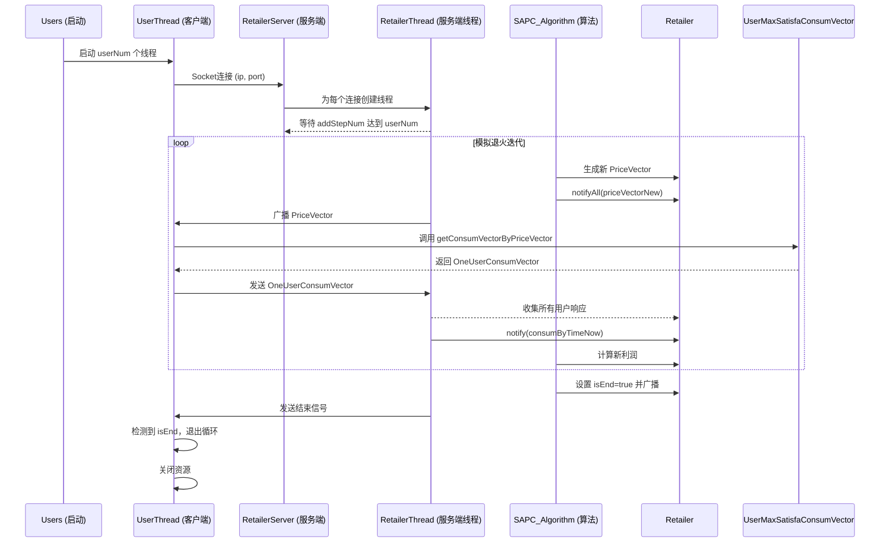
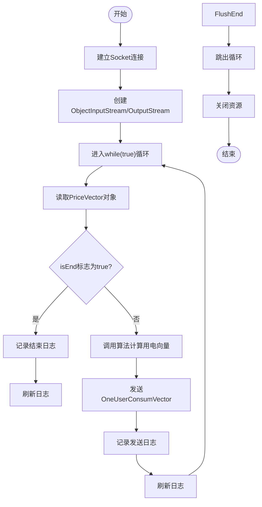
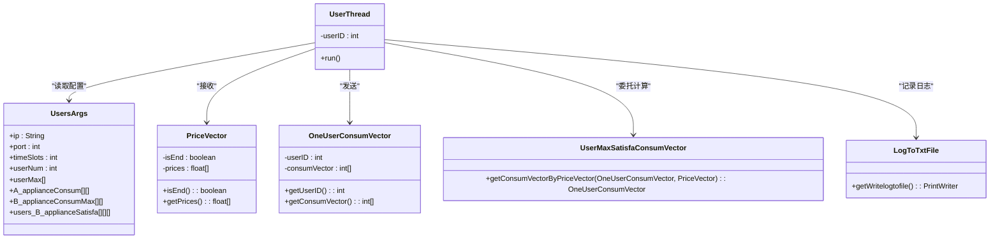

# 客户端线程（UserThread）

<cite>
**本文档引用的文件**   
- [UserThread.java](file://src/main/java/io/leavesfly/smartgrid/user/UserThread.java)
- [UsersArgs.java](file://src/main/java/io/leavesfly/smartgrid/user/UsersArgs.java)
- [PriceVector.java](file://src/main/java/io/leavesfly/smartgrid/retailer/PriceVector.java)
- [OneUserConsumVector.java](file://src/main/java/io/leavesfly/smartgrid/user/OneUserConsumVector.java)
- [UserMaxSatisfaConsumVector.java](file://src/main/java/io/leavesfly/smartgrid/user/UserMaxSatisfaConsumVector.java)
- [LogToTxtFile.java](file://src/main/java/io/leavesfly/smartgrid/user/LogToTxtFile.java)
- [RetailerThread.java](file://src/main/java/io/leavesfly/smartgrid/retailer/RetailerThread.java)
- [SAPC_Algorithm.java](file://src/main/java/io/leavesfly/smartgrid/retailer/SAPC_Algorithm.java)
</cite>

## 目录
1. [简介](#简介)
2. [项目结构](#项目结构)
3. [核心组件](#核心组件)
4. [架构概述](#架构概述)
5. [详细组件分析](#详细组件分析)
6. [依赖分析](#依赖分析)
7. [性能考量](#性能考量)
8. [故障排除指南](#故障排除指南)
9. [结论](#结论)

## 简介
`UserThread` 类是智能电网模拟系统中客户端的核心组件，负责模拟用户行为。该线程根据 `UsersArgs` 配置与服务器建立 Socket 连接，持续监听服务器广播的价格向量（`PriceVector`）。当接收到价格向量后，`UserThread` 调用 `UserMaxSatisfaConsumVector.getConsumVectorByPriceVector` 方法，结合用户偏好和约束条件，计算出最优的用电策略，并将生成的 `OneUserConsumVector` 回传给服务器。该机制是实现供需平衡和零售商利润优化的关键环节。本文档将深入解析其设计与运行机制。

## 项目结构
该项目采用分层包结构，清晰地分离了零售商（retailer）和用户（user）的逻辑。

```mermaid
graph TD
subgraph "用户模块 (user)"
UserThread[UserThread.java]
UsersArgs[UsersArgs.java]
OneUserConsumVector[OneUserConsumVector.java]
UserMaxSatisfaConsumVector[UserMaxSatisfaConsumVector.java]
LogToTxtFile[LogToTxtFile.java]
Users[Users.java]
end
subgraph "零售商模块 (retailer)"
RetailerThread[RetailerThread.java]
PriceVector[PriceVector.java]
Retailer[Retailer.java]
SAPC_Algorithm[SAPC_Algorithm.java]
RetailerServer[RetailerServer.java]
RetailerProfitAlgorithm[RetailerProfitAlgorithm.java]
end
UserThread --> PriceVector : "接收"
UserThread --> OneUserConsumVector : "发送"
UserThread --> UserMaxSatisfaConsumVector : "调用计算"
UserThread --> UsersArgs : "读取配置"
UserThread --> LogToTxtFile : "日志记录"
RetailerThread --> UserThread : "通信"
```

**图示来源**
- [UserThread.java](file://src/main/java/io/leavesfly/smartgrid/user/UserThread.java)
- [UsersArgs.java](file://src/main/java/io/leavesfly/smartgrid/user/UsersArgs.java)
- [PriceVector.java](file://src/main/java/io/leavesfly/smartgrid/retailer/PriceVector.java)
- [OneUserConsumVector.java](file://src/main/java/io/leavesfly/smartgrid/user/OneUserConsumVector.java)
- [RetailerThread.java](file://src/main/java/io/leavesfly/smartgrid/retailer/RetailerThread.java)

**本节来源**
- [src/main/java/io/leavesfly/smartgrid](file://src/main/java/io/leavesfly/smartgrid)

## 核心组件
`UserThread` 的核心功能围绕着与服务器的通信循环展开。它首先根据 `UsersArgs` 中的 `ip` 和 `port` 静态配置建立到 `RetailerServer` 的 TCP 连接。连接建立后，它创建 `ObjectInputStream` 和 `ObjectOutputStream` 用于序列化对象的传输。其主循环通过 `ObjectInputStream` 持续监听服务器广播的 `PriceVector` 对象。

**本节来源**
- [UserThread.java](file://src/main/java/io/leavesfly/smartgrid/user/UserThread.java#L15-L30)
- [UsersArgs.java](file://src/main/java/io/leavesfly/smartgrid/user/UsersArgs.java#L3-L7)

## 架构概述
该系统采用经典的客户端-服务器（C/S）架构。`RetailerServer` 作为中心节点，监听端口并为每个连接的客户端启动一个 `RetailerThread`。`Users` 类作为客户端入口，根据 `UsersArgs.userNum` 启动多个 `UserThread` 实例。`SAPC_Algorithm` 在零售商端运行模拟退火算法，迭代生成新的电价方案。当新方案生成时，`Retailer` 对象的状态被更新，`RetailerThread` 通过 `wait/notify` 机制被唤醒，将新的 `PriceVector` 广播给所有 `UserThread`。`UserThread` 计算用电计划并返回，`RetailerThread` 收集所有用户的响应，当数量达到 `userNum` 时，通知零售商进行利润计算，从而完成一个优化迭代。



**图示来源**
- [UserThread.java](file://src/main/java/io/leavesfly/smartgrid/user/UserThread.java)
- [RetailerThread.java](file://src/main/java/io/leavesfly/smartgrid/retailer/RetailerThread.java)
- [SAPC_Algorithm.java](file://src/main/java/io/leavesfly/smartgrid/retailer/SAPC_Algorithm.java)
- [Users.java](file://src/main/java/io/leavesfly/smartgrid/user/Users.java)

## 详细组件分析

### UserThread 运行机制分析
`UserThread` 的 `run()` 方法是其核心逻辑的体现。它在一个 `while(true)` 循环中持续工作，体现了其作为长期运行的客户端代理的角色。

#### 连接建立与初始化
线程启动后，立即尝试通过 `new Socket(UsersArgs.ip, UsersArgs.port)` 建立到服务器的连接。成功后，会创建用于对象序列化通信的 `ObjectInputStream` 和 `ObjectOutputStream`。此过程在 `try` 块中，确保任何连接异常都能被捕获。

**本节来源**
- [UserThread.java](file://src/main/java/io/leavesfly/smartgrid/user/UserThread.java#L15-L25)

#### 价格向量监听与处理
循环的核心是 `objIn.readObject()`，它阻塞式地等待服务器推送的 `PriceVector` 对象。一旦接收到，会立即通过 `System.out` 和 `LogToTxtFile` 记录日志。

##### 终止信号检测
接收到 `PriceVector` 后的第一件事是调用 `priceVector.isEnd()` 检查其 `isEnd` 标志位。这是实现优雅退出的关键。`SAPC_Algorithm` 在完成所有优化迭代后，会将 `priceVectorNew` 的 `isEnd` 标志设置为 `true` 并通过 `notifyAll` 唤醒所有 `RetailerThread`。`RetailerThread` 会将这个设置了 `isEnd` 标志的 `PriceVector` 广播给所有 `UserThread`。`UserThread` 检测到此标志后，会打印日志、刷新日志缓冲区，然后执行 `break` 语句跳出 `while` 循环，进入资源清理阶段。



**图示来源**
- [UserThread.java](file://src/main/java/io/leavesfly/smartgrid/user/UserThread.java#L33-L45)
- [PriceVector.java](file://src/main/java/io/leavesfly/smartgrid/retailer/PriceVector.java#L65-L70)
- [SAPC_Algorithm.java](file://src/main/java/io/leavesfly/smartgrid/retailer/SAPC_Algorithm.java#L188-L190)

#### 用电策略计算与回传
如果 `isEnd` 标志为 `false`，则进入正常计算流程。首先，根据 `UsersArgs.timeSlots` 创建一个整型数组，并用当前 `userID` 初始化一个 `OneUserConsumVector` 对象。接着，调用静态方法 `UserMaxSatisfaConsumVector.getConsumVectorByPriceVector()`，传入当前的用电向量和价格向量。该方法内部会根据复杂的用户满意度模型（考虑了 `A_applianceConsum` 和 `B_applianceSatisfa` 等参数）计算出每个时段的最优用电量，并更新 `OneUserConsumVector`。最后，通过 `objOut.writeObject()` 将计算结果回传给服务器。

**本节来源**
- [UserThread.java](file://src/main/java/io/leavesfly/smartgrid/user/UserThread.java#L46-L60)
- [UserMaxSatisfaConsumVector.java](file://src/main/java/io/leavesfly/smartgrid/user/UserMaxSatisfaConsumVector.java#L4-L48)

#### 资源释放与异常处理
在 `while` 循环结束后，`try` 块会执行 `objOut.flush()` 确保所有数据已发送，然后按顺序关闭 `ObjectInputStream`、`ObjectOutputStream` 和 `Socket`。这保证了网络资源的正确释放。整个 `run()` 方法被一个顶层的 `catch(Exception e)` 包裹，任何未预期的异常（如网络中断、序列化错误）都会被捕获并打印堆栈跟踪，防止线程因异常而静默崩溃。

**本节来源**
- [UserThread.java](file://src/main/java/io/leavesfly/smartgrid/user/UserThread.java#L61-L70)
- [UserThread.java](file://src/main/java/io/leavesfly/smartgrid/user/UserThread.java#L71-L75)

## 依赖分析
`UserThread` 的运行依赖于多个关键组件。它直接依赖 `UsersArgs` 获取服务器地址、端口和用户配置。它与 `PriceVector` 和 `OneUserConsumVector` 进行通信，这两个类都实现了 `Serializable` 接口，是网络传输的基础。其核心计算逻辑依赖于 `UserMaxSatisfaConsumVector` 类。日志功能则通过单例模式的 `LogToTxtFile` 类实现。在系统层面，它与 `RetailerThread` 形成了一对一的通信关系，共同构成了客户端-服务器交互的基础。



**图示来源**
- [UserThread.java](file://src/main/java/io/leavesfly/smartgrid/user/UserThread.java)
- [UsersArgs.java](file://src/main/java/io/leavesfly/smartgrid/user/UsersArgs.java)
- [PriceVector.java](file://src/main/java/io/leavesfly/smartgrid/retailer/PriceVector.java)
- [OneUserConsumVector.java](file://src/main/java/io/leavesfly/smartgrid/user/OneUserConsumVector.java)
- [UserMaxSatisfaConsumVector.java](file://src/main/java/io/leavesfly/smartgrid/user/UserMaxSatisfaConsumVector.java)
- [LogToTxtFile.java](file://src/main/java/io/leavesfly/smartgrid/user/LogToTxtFile.java)

## 性能考量
当多个 `UserThread` 实例并发运行时，系统性能会受到显著影响。**网络延迟**是主要瓶颈，所有 `UserThread` 的响应必须在 `RetailerThread` 的 `wait()` 超时前返回，否则会导致零售商端计算超时或逻辑错误。**资源消耗**方面，每个 `UserThread` 都维护一个独立的 Socket 连接和线程，随着 `userNum` 的增加，服务器的线程和文件描述符开销会线性增长，可能导致服务器资源耗尽。为优化性能，建议：
1.  **增加超时机制**：在 `objIn.readObject()` 和 `objOut.writeObject()` 上设置合理的超时，避免线程无限期阻塞。
2.  **使用线程池**：客户端可以使用线程池来管理 `UserThread`，避免频繁创建和销毁线程的开销。
3.  **优化算法**：`UserMaxSatisfaConsumVector.getConsumVectorByPriceVector` 的计算复杂度直接影响响应速度，应确保其高效。
4.  **异步通信**：考虑使用 NIO 或异步框架（如 Netty）替代传统的阻塞 I/O，以支持更高的并发。

## 故障排除指南
- **连接失败**：检查 `UsersArgs.ip` 和 `UsersArgs.port` 是否与 `RetailerServer` 的监听地址和端口匹配。确保服务器已启动。
- **线程卡死**：如果 `UserThread` 在 `readObject()` 处长时间阻塞，可能是服务器未广播 `PriceVector`，或网络中断。检查 `RetailerThread` 是否正常运行。
- **日志未输出**：确认 `UsersArgs.usersLogFile` 指定的路径 `E://UsersLog.txt` 存在且有写入权限。检查 `LogToTxtFile` 的静态初始化块是否因 `FileNotFoundException` 而失败。
- **计算结果异常**：检查 `UsersArgs` 中的用户配置（如 `userMax`, `A_applianceConsum`）是否正确加载。验证 `UserMaxSatisfaConsumVector` 的计算逻辑是否符合预期。
- **内存泄漏**：确保 `UserThread` 在收到 `isEnd` 信号后能正常退出并释放 `Socket` 资源。监控长时间运行时的内存使用情况。

**本节来源**
- [UserThread.java](file://src/main/java/io/leavesfly/smartgrid/user/UserThread.java#L71-L75)
- [LogToTxtFile.java](file://src/main/java/io/leavesfly/smartgrid/user/LogToTxtFile.java#L9-L15)
- [UsersArgs.java](file://src/main/java/io/leavesfly/smartgrid/user/UsersArgs.java#L8)

## 结论
`UserThread` 是智能电网模拟系统中不可或缺的客户端组件，它成功地模拟了用户对动态电价的响应行为。通过与 `RetailerThread` 的协同工作，实现了价格信号的接收、最优用电策略的计算和结果的反馈。其设计清晰，利用了 `wait/notify` 机制和对象序列化进行高效的跨线程和跨进程通信。优雅的退出机制通过 `isEnd` 标志位实现，确保了系统在优化结束时能有序关闭。尽管在高并发下存在资源消耗和延迟的挑战，但其核心设计为系统的可扩展性和稳定性奠定了坚实的基础。