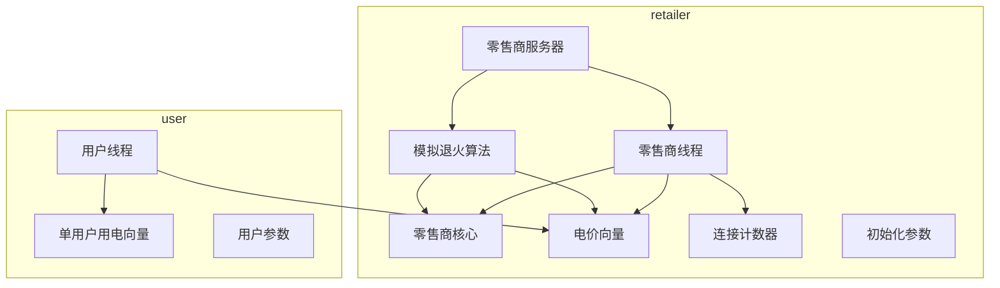
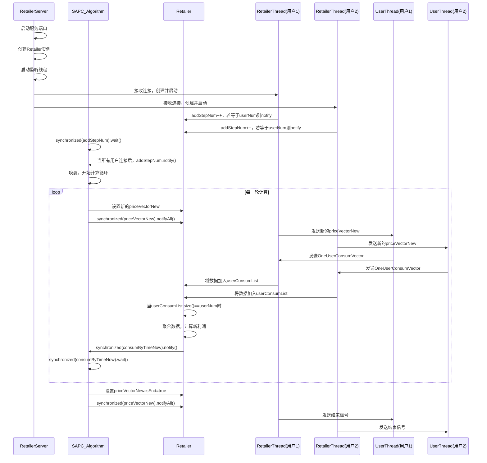
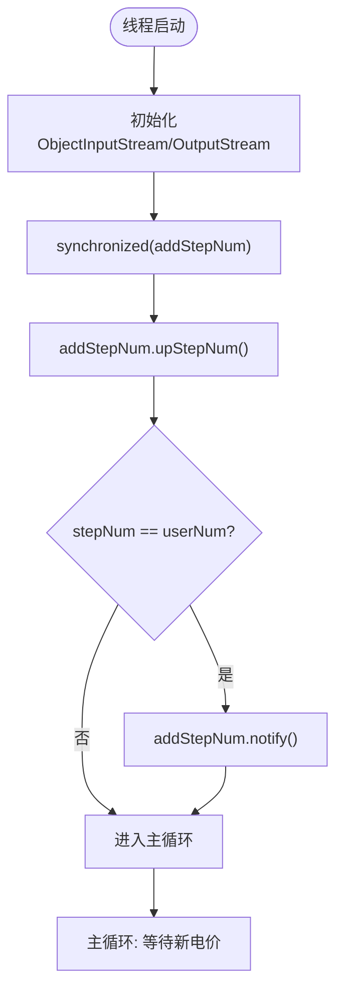
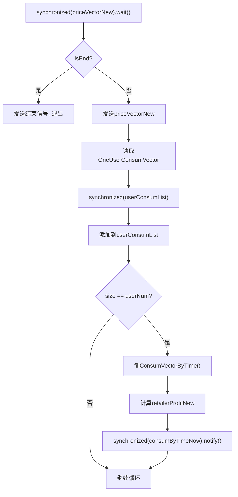
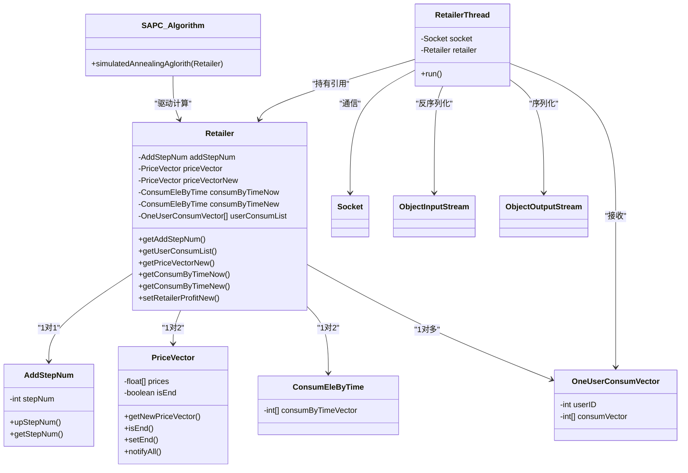

# 服务器端线程（RetailerThread）

<cite>
**本文档引用的文件**  
- [RetailerThread.java](file://src/main/java/io/leavesfly/smartgrid/retailer/RetailerThread.java)
- [RetailerServer.java](file://src/main/java/io/leavesfly/smartgrid/retailer/RetailerServer.java)
- [Retailer.java](file://src/main/java/io/leavesfly/smartgrid/retailer/Retailer.java)
- [SAPC_Algorithm.java](file://src/main/java/io/leavesfly/smartgrid/retailer/SAPC_Algorithm.java)
- [PriceVector.java](file://src/main/java/io/leavesfly/smartgrid/retailer/PriceVector.java)
- [AddStepNum.java](file://src/main/java/io/leavesfly/smartgrid/retailer/AddStepNum.java)
- [UserThread.java](file://src/main/java/io/leavesfly/smartgrid/user/UserThread.java)
- [RetailerInitArgs.java](file://src/main/java/io/leavesfly/smartgrid/retailer/RetailerInitArgs.java)
</cite>

## 目录
1. [简介](#简介)
2. [项目结构](#项目结构)
3. [核心组件](#核心组件)
4. [架构概述](#架构概述)
5. [详细组件分析](#详细组件分析)
6. [依赖分析](#依赖分析)
7. [性能考虑](#性能考虑)
8. [故障排除指南](#故障排除指南)
9. [结论](#结论)

## 简介
本文档深入分析 `RetailerThread` 类的实现机制，重点阐述其作为服务器端多线程处理单元的角色。该类在智能电网系统中负责与多个用户客户端（`UserThread`）进行通信，协调电价广播与用电数据收集流程。通过 `ObjectInputStream` 和 `ObjectOutputStream` 实现基于对象序列化的通信，并利用 `synchronized` 块和 `wait/notify` 机制确保多线程环境下的数据一致性与同步控制。文档将详细说明线程的创建、通信流程、同步机制、聚合计算以及系统整体的并发协调逻辑。

## 项目结构
本项目采用模块化设计，分为 `retailer`（零售商）和 `user`（用户）两大模块，分别位于 `src/main/java/io/leavesfly/smartgrid` 目录下。`retailer` 模块包含服务器端核心逻辑，如线程处理、电价生成、利润计算等；`user` 模块则模拟用户行为，响应电价并上报用电计划。

**图示来源**  
- [RetailerServer.java](file://src/main/java/io/leavesfly/smartgrid/retailer/RetailerServer.java#L1-L42)
- [RetailerThread.java](file://src/main/java/io/leavesfly/smartgrid/retailer/RetailerThread.java#L1-L88)
- [UserThread.java](file://src/main/java/io/leavesfly/smartgrid/user/UserThread.java#L1-L86)

**本节来源**  
- [RetailerServer.java](file://src/main/java/io/leavesfly/smartgrid/retailer/RetailerServer.java#L1-L42)
- [RetailerThread.java](file://src/main/java/io/leavesfly/smartgrid/retailer/RetailerThread.java#L1-L88)
- [UserThread.java](file://src/main/java/io/leavesfly/smartgrid/user/UserThread.java#L1-L86)

## 核心组件
`RetailerThread` 是服务器端处理每个客户端连接的核心单元。当 `RetailerServer` 接收到一个来自 `UserThread` 的套接字连接时，会立即创建一个新的 `RetailerThread` 实例，并为其分配一个独立的线程来执行。该线程的主要职责是：
1.  初始化与客户端的序列化对象流。
2.  参与全局用户连接的计数与同步。
3.  循环接收客户端上报的用电数据。
4.  将最新的电价向量广播给客户端。
5.  在所有用户数据收集完成后，触发服务器端的聚合与利润计算。

**本节来源**  
- [RetailerThread.java](file://src/main/java/io/leavesfly/smartgrid/retailer/RetailerThread.java#L1-L88)
- [RetailerServer.java](file://src/main/java/io/leavesfly/smartgrid/retailer/RetailerServer.java#L1-L42)

## 架构概述
系统采用经典的客户端-服务器（C/S）架构。`RetailerServer` 作为中心服务器，监听指定端口（1234）的连接请求。每个 `UserThread` 作为客户端，主动连接服务器。服务器为每个连接创建一个 `RetailerThread`，形成一对一的通信通道。

核心协调逻辑由 `SAPC_Algorithm`（模拟退火算法）驱动，它通过共享的 `Retailer` 对象与所有 `RetailerThread` 进行交互。`SAPC_Algorithm` 负责生成新的电价方案，并利用 `wait/notify` 机制控制计算流程的节奏，确保在所有用户上报数据后才进行利润评估。

**图示来源**  
- [RetailerServer.java](file://src/main/java/io/leavesfly/smartgrid/retailer/RetailerServer.java#L1-L42)
- [RetailerThread.java](file://src/main/java/io/leavesfly/smartgrid/retailer/RetailerThread.java#L1-L88)
- [SAPC_Algorithm.java](file://src/main/java/io/leavesfly/smartgrid/retailer/SAPC_Algorithm.java#L1-L197)

**本节来源**  
- [RetailerServer.java](file://src/main/java/io/leavesfly/smartgrid/retailer/RetailerServer.java#L1-L42)
- [SAPC_Algorithm.java](file://src/main/java/io/leavesfly/smartgrid/retailer/SAPC_Algorithm.java#L1-L197)

## 详细组件分析

### RetailerThread 分析
`RetailerThread` 实现了 `Runnable` 接口，其 `run()` 方法定义了线程的主执行逻辑。

#### 初始化与连接计数
线程启动后，首先获取与客户端通信的 `ObjectOutputStream` 和 `ObjectInputStream`。紧接着，它进入一个 `synchronized` 块，操作共享的 `AddStepNum` 对象。通过调用 `upStepNum()` 方法递增连接计数。当计数达到预设的用户总数 `UsersArgs.userNum` 时，调用 `notify()` 唤醒在 `addStepNum` 对象上等待的 `SAPC_Algorithm` 线程。这确保了算法在所有用户连接成功后才开始执行。

**图示来源**  
- [RetailerThread.java](file://src/main/java/io/leavesfly/smartgrid/retailer/RetailerThread.java#L15-L30)

#### 主循环与数据交换
主循环的核心是与客户端的双向数据交换。线程首先在 `priceVectorNew` 对象上执行 `wait()`，等待 `SAPC_Algorithm` 通过 `notifyAll()` 发出新电价的信号。

- **广播电价**：一旦被唤醒，线程会检查 `priceVectorNew.isEnd()` 标志。如果为真，则向客户端发送结束信号并退出循环。否则，将当前的 `priceVectorNew` 对象序列化后发送给客户端。
- **接收用电数据**：随后，线程从客户端的输入流中读取 `OneUserConsumVector` 对象。

#### 数据聚合与利润计算
接收到用户数据后，线程将其添加到 `Retailer` 的共享列表 `userConsumList` 中。此操作被 `synchronized` 块保护，防止并发修改。当列表大小等于 `userNum` 时，表明所有用户的数据均已收集完毕。

此时，线程执行关键聚合操作：
1.  调用 `Retailer.fillConsumVectorByTime()` 将所有用户的用电向量按时间槽聚合，生成总的用电量 `consumByTimeNew`。
2.  调用 `RetailerProfitAlgorithm.getRetialProfit()` 计算基于新电价和新用电量的利润 `retailerProfitNew`。
3.  最后，通过 `synchronized(consumByTimeNow).notify()` 唤醒等待在 `consumByTimeNow` 对象上的 `SAPC_Algorithm` 线程，通知其可以进行利润比较和决策。

**图示来源**  
- [RetailerThread.java](file://src/main/java/io/leavesfly/smartgrid/retailer/RetailerThread.java#L30-L88)
- [Retailer.java](file://src/main/java/io/leavesfly/smartgrid/retailer/Retailer.java#L80-L104)

**本节来源**  
- [RetailerThread.java](file://src/main/java/io/leavesfly/smartgrid/retailer/RetailerThread.java#L1-L88)
- [Retailer.java](file://src/main/java/io/leavesfly/smartgrid/retailer/Retailer.java#L1-L105)

## 依赖分析
`RetailerThread` 的正常运行依赖于多个核心类和共享对象。

**图示来源**  
- [RetailerThread.java](file://src/main/java/io/leavesfly/smartgrid/retailer/RetailerThread.java#L1-L88)
- [Retailer.java](file://src/main/java/io/leavesfly/smartgrid/retailer/Retailer.java#L1-L105)
- [AddStepNum.java](file://src/main/java/io/leavesfly/smartgrid/retailer/AddStepNum.java#L1-L20)
- [PriceVector.java](file://src/main/java/io/leavesfly/smartgrid/retailer/PriceVector.java#L1-L106)

**本节来源**  
- [RetailerThread.java](file://src/main/java/io/leavesfly/smartgrid/retailer/RetailerThread.java#L1-L88)
- [Retailer.java](file://src/main/java/io/leavesfly/smartgrid/retailer/Retailer.java#L1-L105)
- [AddStepNum.java](file://src/main/java/io/leavesfly/smartgrid/retailer/AddStepNum.java#L1-L20)
- [PriceVector.java](file://src/main/java/io/leavesfly/smartgrid/retailer/PriceVector.java#L1-L106)

## 性能考虑
该线程模型在高并发场景下存在潜在的性能瓶颈和线程安全考量。

**线程安全保证**：
- **共享资源保护**：所有对共享状态（`addStepNum`, `userConsumList`, `priceVectorNew`, `consumByTimeNow`）的访问都通过 `synchronized` 关键字进行了保护，确保了操作的原子性。
- **可见性保证**：`synchronized` 块不仅保证了原子性，还通过 Java 内存模型的 happens-before 关系，确保了线程间对共享变量修改的可见性。

**性能瓶颈**：
- **串行化瓶颈**：`SAPC_Algorithm` 的主循环是串行执行的。它必须等待所有 `RetailerThread` 完成数据上报并发出 `notify` 信号后，才能进行下一轮迭代。这限制了系统的整体吞吐量。
- **锁竞争**：虽然 `synchronized` 块保护了共享资源，但频繁的锁获取和释放（尤其是在 `userConsumList` 上）可能会导致线程竞争，影响性能。
- **阻塞I/O**：`ObjectInputStream.readObject()` 是一个阻塞调用。如果某个客户端响应缓慢，对应的 `RetailerThread` 将一直阻塞，但这不会影响其他线程或主算法，因为每个连接是独立处理的。

**优化建议**：
- 考虑使用 `java.util.concurrent` 包中的 `CountDownLatch` 或 `CyclicBarrier` 来替代 `wait/notify` 机制，代码会更清晰且不易出错。
- 对于 `userConsumList`，可以考虑使用 `ConcurrentHashMap` 或 `CopyOnWriteArrayList` 等并发集合，减少锁粒度。

## 故障排除指南
在调试此系统时，可能会遇到以下常见问题：

**问题1：SAPC_Algorithm 无法启动**
- **原因**：`SAPC_Algorithm` 在 `addStepNum` 上执行 `wait()`，但没有足够的 `RetailerThread` 调用 `notify()`。
- **排查**：检查 `UsersArgs.userNum` 的值是否正确，并确保启动了相应数量的 `UserThread` 客户端。

**问题2：程序在数据收集阶段卡住**
- **原因**：`RetailerThread` 在 `priceVectorNew` 上 `wait()`，但 `SAPC_Algorithm` 未调用 `notifyAll()`。
- **排查**：检查 `SAPC_Algorithm` 是否已正确启动并进入了主循环。确认 `Retailer` 对象在 `RetailerServer` 和 `SAPC_Algorithm` 之间是同一个实例。

**问题3：数据聚合失败或利润计算异常**
- **原因**：`userConsumList` 的大小未达到 `userNum`，但聚合操作已被触发。
- **排查**：检查 `RetailerThread` 中 `userConsumList.size() == UsersArgs.userNum` 的判断逻辑，确保 `UsersArgs.userNum` 在所有模块中定义一致。

**问题4：客户端连接失败**
- **原因**：端口不匹配或服务器未启动。
- **排查**：核对 `RetailerInitArgs.ListenPort` 和 `UsersArgs.port` 的值是否一致。

**本节来源**  
- [RetailerThread.java](file://src/main/java/io/leavesfly/smartgrid/retailer/RetailerThread.java#L1-L88)
- [SAPC_Algorithm.java](file://src/main/java/io/leavesfly/smartgrid/retailer/SAPC_Algorithm.java#L1-L197)
- [RetailerInitArgs.java](file://src/main/java/io/leavesfly/smartgrid/retailer/RetailerInitArgs.java#L1-L15)

## 结论
`RetailerThread` 是智能电网模拟系统中服务器端的关键多线程组件。它成功地实现了与多个客户端的并发通信，利用对象序列化进行高效的数据交换。通过精心设计的 `synchronized` 块和 `wait/notify` 机制，系统在 `Retailer` 共享对象的协调下，实现了复杂的同步逻辑：既保证了所有用户连接完成后的算法启动，又实现了电价广播与用电数据收集的周期性同步。尽管存在串行化瓶颈，但该设计清晰地分离了通信、聚合和决策逻辑，为系统的可维护性和可理解性提供了保障。通过本文档的分析，开发者可以深入理解其工作机制，并针对潜在的性能问题进行优化。