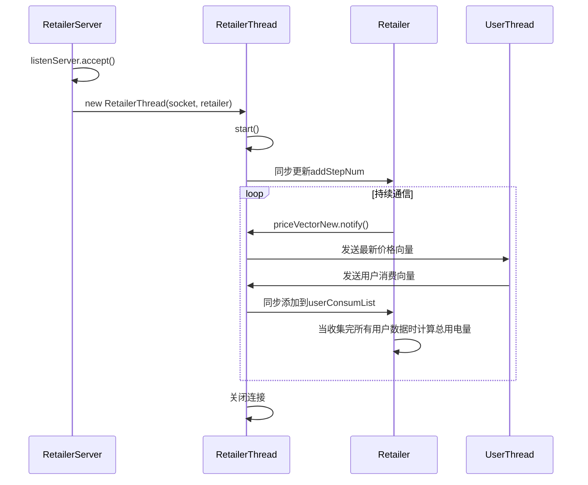
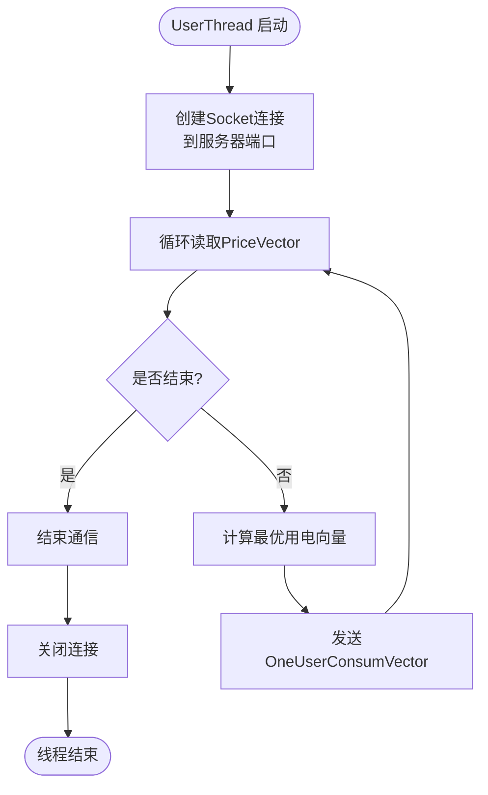
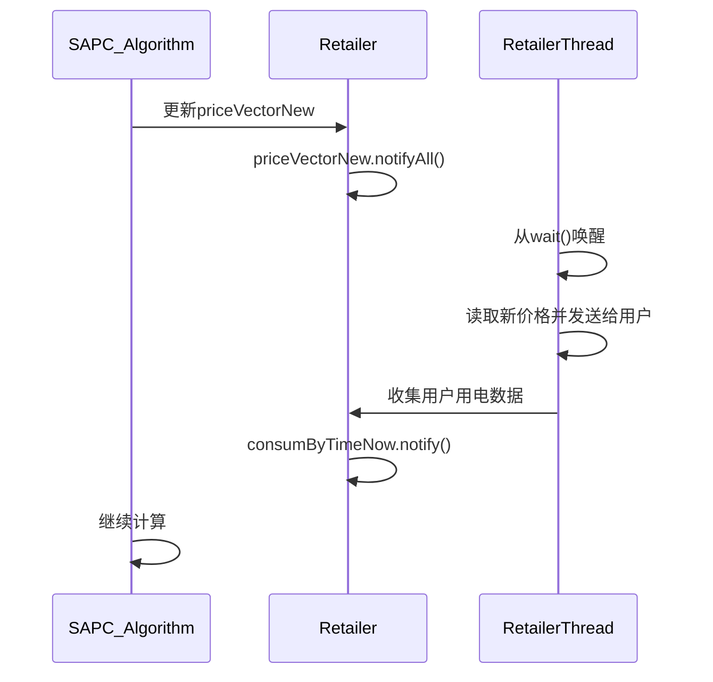
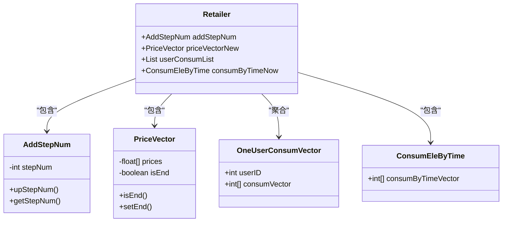
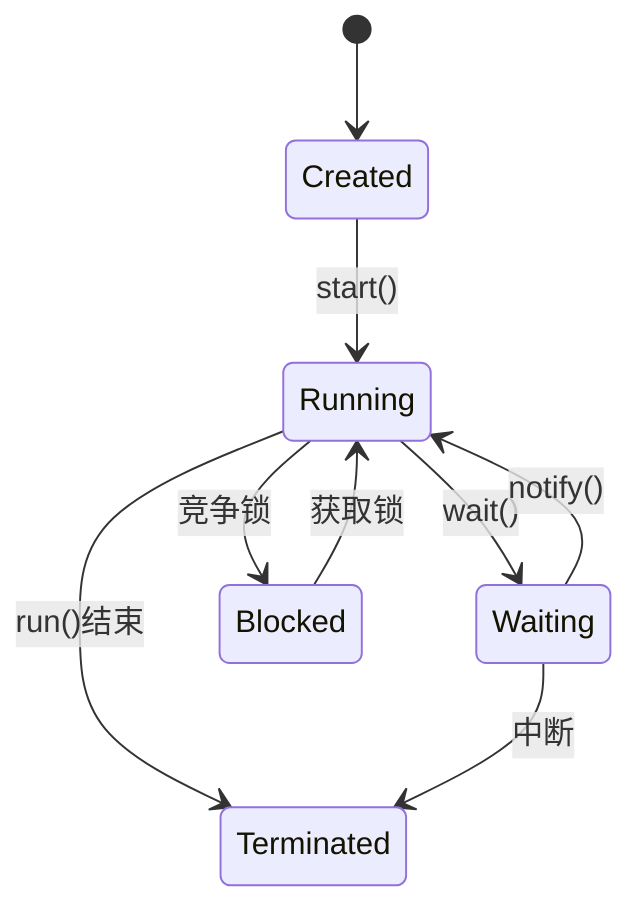

# 线程模型

<cite>
**本文档引用的文件**  
- [RetailerThread.java](file://src/main/java/io/leavesfly/smartgrid/retailer/RetailerThread.java)
- [UserThread.java](file://src/main/java/io/leavesfly/smartgrid/user/UserThread.java)
- [RetailerServer.java](file://src/main/java/io/leavesfly/smartgrid/retailer/RetailerServer.java)
- [Retailer.java](file://src/main/java/io/leavesfly/smartgrid/retailer/Retailer.java)
- [PriceVector.java](file://src/main/java/io/leavesfly/smartgrid/retailer/PriceVector.java)
- [AddStepNum.java](file://src/main/java/io/leavesfly/smartgrid/retailer/AddStepNum.java)
- [UsersArgs.java](file://src/main/java/io/leavesfly/smartgrid/user/UsersArgs.java)
</cite>

## 目录
1. [引言](#引言)
2. [系统线程架构概览](#系统线程架构概览)
3. [RetailerThread 实现机制分析](#retailerthread-实现机制分析)
4. [UserThread 并发模型分析](#userthread-并发模型分析)
5. [线程同步机制详解](#线程同步机制详解)
6. [共享对象锁与数据一致性](#共享对象锁与数据一致性)
7. [线程安全问题与死锁预防](#线程安全问题与死锁预防)
8. [性能瓶颈分析](#性能瓶颈分析)
9. [线程状态监控与调试建议](#线程状态监控与调试建议)
10. [结论](#结论)

## 引言
本文深入分析智能电网系统中的多线程设计模型，重点对比服务器端 RetailerThread 与客户端 UserThread 的实现机制。通过代码级分析，揭示系统如何利用 Java 多线程技术实现高效的电力消费调度与价格协商机制。文档将详细阐述线程创建、同步控制、数据一致性保障等关键技术点，并提供性能优化与调试建议。

## 系统线程架构概览
系统采用典型的客户端-服务器（C/S）多线程架构。服务器端（Retailer）为每个客户端连接创建独立的 RetailerThread，实现并发处理；客户端（User）则通过多个 UserThread 实例模拟多用户并发行为。整个系统通过对象序列化进行网络通信，使用 synchronized 关键字和 wait/notify 机制协调线程间同步。

```mermaid
graph TB
subgraph "服务器端"
RetailerServer["RetailerServer<br/>主服务监听"]
Retailer["Retailer<br/>核心数据管理"]
RetailerThread["RetailerThread<br/>用户连接处理器"]
end
subgraph "客户端"
UserThread["UserThread<br/>用户消费模拟器"]
UsersArgs["UsersArgs<br/>用户配置"]
end
RetailerServer --> RetailerThread : "为每个连接创建"
RetailerThread --> Retailer : "共享数据访问"
UserThread --> RetailerThread : "TCP连接通信"
Retailer --> PriceVector : "价格向量管理"
Retailer --> AddStepNum : "步骤计数器"
```

**图示来源**  
- [RetailerServer.java](file://src/main/java/io/leavesfly/smartgrid/retailer/RetailerServer.java#L1-L42)
- [RetailerThread.java](file://src/main/java/io/leavesfly/smartgrid/retailer/RetailerThread.java#L1-L88)
- [UserThread.java](file://src/main/java/io/leavesfly/smartgrid/user/UserThread.java#L1-L86)

## RetailerThread 实现机制分析
RetailerThread 是服务器端的核心处理单元，负责与单个用户客户端进行通信。当客户端连接时，RetailerServer 会为该连接创建一个新的 RetailerThread 实例并启动独立线程。



**图示来源**  
- [RetailerServer.java](file://src/main/java/io/leavesfly/smartgrid/retailer/RetailerServer.java#L20-L40)
- [RetailerThread.java](file://src/main/java/io/leavesfly/smartgrid/retailer/RetailerThread.java#L15-L88)

**本节来源**  
- [RetailerThread.java](file://src/main/java/io/leavesfly/smartgrid/retailer/RetailerThread.java#L1-L88)
- [RetailerServer.java](file://src/main/java/io/leavesfly/smartgrid/retailer/RetailerServer.java#L1-L42)

## UserThread 并发模型分析
UserThread 类实现了 Runnable 接口，用于在客户端并发运行多个用户实例。每个 UserThread 代表一个独立的电力消费者，通过 TCP 连接与服务器通信，获取电价信息并返回其用电计划。



**图示来源**  
- [UserThread.java](file://src/main/java/io/leavesfly/smartgrid/user/UserThread.java#L15-L86)
- [UsersArgs.java](file://src/main/java/io/leavesfly/smartgrid/user/UsersArgs.java#L1-L45)

**本节来源**  
- [UserThread.java](file://src/main/java/io/leavesfly/smartgrid/user/UserThread.java#L1-L86)
- [UsersArgs.java](file://src/main/java/io/leavesfly/smartgrid/user/UsersArgs.java#L1-L45)

## 线程同步机制详解
系统采用 synchronized 关键字和 wait/notify 机制实现线程间同步，确保数据一致性和协调操作时序。

### RetailerThread 中的同步机制
- **addStepNum 同步块**：确保所有用户连接建立后才开始计算
- **priceVectorNew 同步块**：使用 wait() 等待价格更新，由外部线程通过 notify() 唤醒
- **userConsumList 同步块**：安全地收集所有用户的用电数据
- **consumByTimeNow 同步块**：通知数据已更新，唤醒等待线程

### 同步流程分析


**图示来源**  
- [RetailerThread.java](file://src/main/java/io/leavesfly/smartgrid/retailer/RetailerThread.java#L25-L65)
- [PriceVector.java](file://src/main/java/io/leavesfly/smartgrid/retailer/PriceVector.java#L1-L107)

**本节来源**  
- [RetailerThread.java](file://src/main/java/io/leavesfly/smartgrid/retailer/RetailerThread.java#L25-L88)
- [AddStepNum.java](file://src/main/java/io/leavesfly/smartgrid/retailer/AddStepNum.java#L1-L20)

## 共享对象锁与数据一致性
系统通过多个共享对象的锁机制来协调多线程环境下的数据一致性。

### 核心共享对象分析
| 共享对象 | 作用 | 锁机制 | 线程安全保障 |
|--------|------|--------|------------|
| `priceVectorNew` | 存储最新电价向量 | synchronized | 确保价格更新的原子性 |
| `addStepNum` | 记录连接用户数量 | synchronized | 防止竞态条件 |
| `userConsumList` | 收集用户用电数据 | synchronized | 安全添加用户数据 |
| `consumByTimeNow` | 存储总用电量 | synchronized | 通知数据更新 |

### 对象锁使用模式


**图示来源**  
- [Retailer.java](file://src/main/java/io/leavesfly/smartgrid/retailer/Retailer.java#L1-L104)
- [PriceVector.java](file://src/main/java/io/leavesfly/smartgrid/retailer/PriceVector.java#L1-L107)
- [AddStepNum.java](file://src/main/java/io/leavesfly/smartgrid/retailer/AddStepNum.java#L1-L20)

**本节来源**  
- [Retailer.java](file://src/main/java/io/leavesfly/smartgrid/retailer/Retailer.java#L1-L104)
- [PriceVector.java](file://src/main/java/io/leavesfly/smartgrid/retailer/PriceVector.java#L1-L107)

## 线程安全问题与死锁预防
系统设计中存在潜在的线程安全问题，但通过合理的同步策略避免了死锁。

### 潜在风险分析
- **竞态条件**：多个 RetailerThread 同时访问 userConsumList
- **资源饥饿**：长时间运行的算法可能阻塞 notify 操作
- **不完整通知**：异常情况下可能遗漏 notify 调用

### 死锁预防措施
1. **单一锁顺序**：所有线程按固定顺序获取锁（先 addStepNum，再 priceVectorNew，最后 userConsumList）
2. **避免嵌套同步**：未出现跨对象的嵌套 synchronized 块
3. **及时释放锁**：synchronized 块范围最小化，快速完成操作
4. **异常处理**：try-catch 包裹关键代码，确保异常时资源正常释放

### 改进建议
- 使用 ReentrantLock 替代 synchronized，支持超时机制
- 添加线程池管理，避免无限制创建线程
- 实现连接超时机制，防止僵尸线程

**本节来源**  
- [RetailerThread.java](file://src/main/java/io/leavesfly/smartgrid/retailer/RetailerThread.java#L25-L88)
- [Retailer.java](file://src/main/java/io/leavesfly/smartgrid/retailer/Retailer.java#L1-L104)

## 性能瓶颈分析
系统在高并发场景下可能存在以下性能瓶颈：

### 瓶颈点识别
1. **串行化数据收集**：必须等待所有用户响应才能继续
2. **全局同步锁**：priceVectorNew 和 userConsumList 的竞争
3. **频繁对象创建**：每个循环都创建新的 PriceVector 实例
4. **阻塞式通信**：同步 wait/notify 可能导致线程长时间等待

### 性能优化建议
| 问题 | 优化方案 | 预期效果 |
|------|----------|---------|
| 数据收集串行化 | 使用 CountDownLatch 替代手动计数 | 提高等待效率 |
| 全局锁竞争 | 采用读写锁（ReadWriteLock） | 提升并发读取性能 |
| 对象频繁创建 | 实现对象池或缓存机制 | 减少GC压力 |
| 阻塞通信 | 考虑非阻塞IO或异步通信 | 提高响应速度 |

### 并发度分析
系统最大并发用户数由 UsersArgs.userNum 静态定义（当前为2），服务器端线程数与客户端用户数呈 1:1 关系，存在线程资源浪费风险。

**本节来源**  
- [RetailerThread.java](file://src/main/java/io/leavesfly/smartgrid/retailer/RetailerThread.java#L40-L60)
- [UsersArgs.java](file://src/main/java/io/leavesfly/smartgrid/user/UsersArgs.java#L1-L45)

## 线程状态监控与调试建议
为确保系统稳定运行，建议实施以下监控与调试策略。

### 线程状态监控


### 调试日志建议
1. **连接日志**：记录每个 RetailerThread 的创建和销毁
2. **同步点日志**：在 synchronized 块前后添加日志
3. **等待超时**：为 wait() 操作添加超时机制和日志
4. **性能计时**：记录关键操作的执行时间

### 监控指标
- 活跃线程数
- 同步等待时间
- 用户响应延迟
- 数据收集完整率

**图示来源**  
- [RetailerThread.java](file://src/main/java/io/leavesfly/smartgrid/retailer/RetailerThread.java#L15-L88)
- [LogToTxtFile.java](file://src/main/java/io/leavesfly/smartgrid/retailer/LogToTxtFile.java)

**本节来源**  
- [RetailerThread.java](file://src/main/java/io/leavesfly/smartgrid/retailer/RetailerThread.java#L15-L88)
- [UserThread.java](file://src/main/java/io/leavesfly/smartgrid/user/UserThread.java#L15-L86)

## 结论
本文档深入分析了智能电网系统的多线程设计模型，揭示了 RetailerThread 和 UserThread 的实现机制。系统通过 synchronized 关键字和 wait/notify 机制有效实现了线程间同步，确保了多线程环境下的数据一致性。尽管当前设计能够满足基本功能需求，但在高并发场景下存在性能瓶颈。建议采用更高级的并发工具类（如 CountDownLatch、ReentrantLock）进行优化，并引入线程池管理机制以提高系统可扩展性和稳定性。