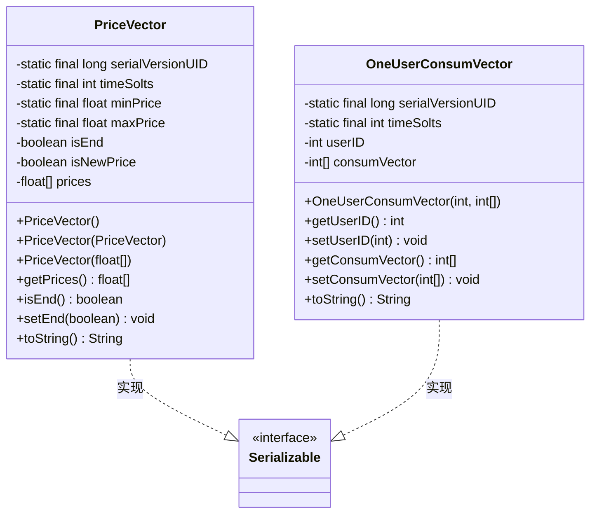
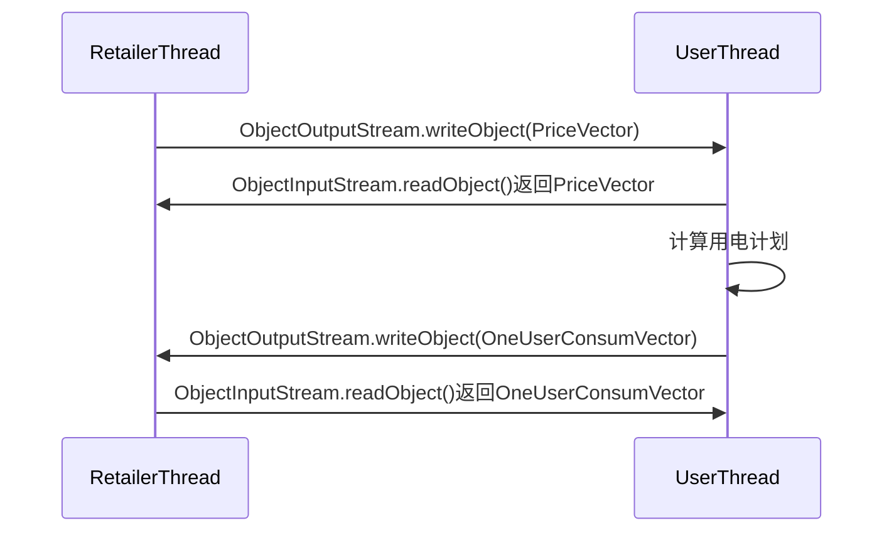
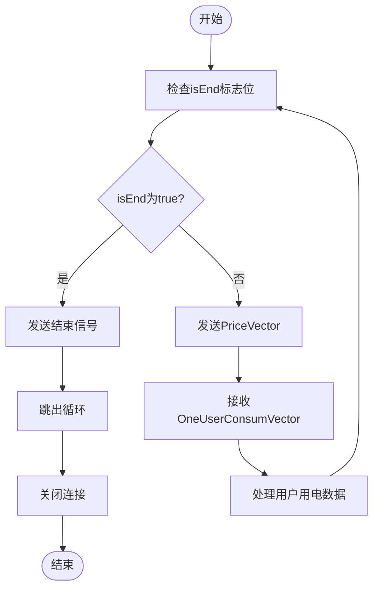
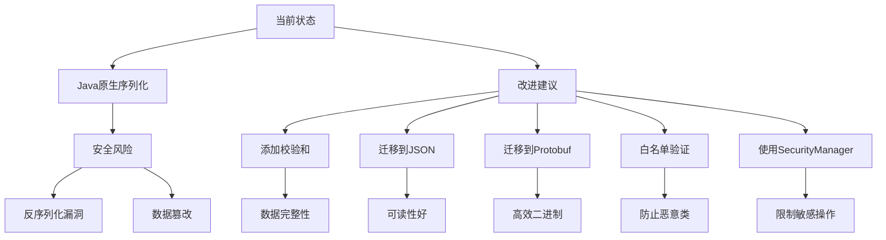

# 数据序列化

<cite>
**本文档中引用的文件**   
- [PriceVector.java](file://src/main/java/io/leavesfly/smartgrid/retailer/PriceVector.java)
- [OneUserConsumVector.java](file://src/main/java/io/leavesfly/smartgrid/user/OneUserConsumVector.java)
- [RetailerThread.java](file://src/main/java/io/leavesfly/smartgrid/retailer/RetailerThread.java)
- [UserThread.java](file://src/main/java/io/leavesfly/smartgrid/user/UserThread.java)
- [SAPC_Algorithm.java](file://src/main/java/io/leavesfly/smartgrid/retailer/SAPC_Algorithm.java)
- [Retailer.java](file://src/main/java/io/leavesfly/smartgrid/retailer/Retailer.java)
- [RetailerServer.java](file://src/main/java/io/leavesfly/smartgrid/retailer/RetailerServer.java)
</cite>

## 目录
1. [引言](#引言)
2. [核心数据模型](#核心数据模型)
3. [Java原生序列化机制](#java原生序列化机制)
4. [Socket通信中的对象传输](#socket通信中的对象传输)
5. [通信流程控制](#通信流程控制)
6. [安全风险与改进建议](#安全风险与改进建议)
7. [性能优化建议](#性能优化建议)
8. [系统架构与组件交互](#系统架构与组件交互)
9. [结论](#结论)

## 引言
本文档详细分析智能电网系统中PriceVector和OneUserConsumVector两个核心数据模型如何通过Java原生序列化机制在Socket通信中进行传输。文档深入探讨了Serializable接口的实现方式，分析了ObjectInputStream和ObjectOutputStream在RetailerThread和UserThread中的具体应用。同时，文档还讨论了序列化过程中的安全风险，并提出了相应的改进建议和性能优化策略。

## 核心数据模型

### PriceVector数据模型
PriceVector类表示电价向量，封装了在不同时间段的电价信息。该类实现了Serializable接口，使其能够通过网络进行序列化传输。PriceVector包含一个固定长度为4的时间槽数组，存储每个时间段的电价，以及一个isEnd标志位用于控制通信流程的结束。

**Section sources**
- [PriceVector.java](file://src/main/java/io/leavesfly/smartgrid/retailer/PriceVector.java#L4-L105)

### OneUserConsumVector数据模型
OneUserConsumVector类表示单个用户的用电向量，同样实现了Serializable接口。该类封装了用户ID和在不同时间段的用电量数组，用于在零售商和用户之间传输用户的用电计划信息。

**Section sources**
- [OneUserConsumVector.java](file://src/main/java/io/leavesfly/smartgrid/user/OneUserConsumVector.java#L4-L51)

## Java原生序列化机制

### Serializable接口实现
PriceVector和OneUserConsumVector两个类都实现了java.io.Serializable接口，这是Java原生序列化机制的基础。通过实现该接口，对象可以被转换为字节流，从而能够在网络上传输或在磁盘上存储。

每个类都定义了serialVersionUID字段，这是一个版本控制标识符，确保序列化和反序列化过程中的兼容性。当对象结构发生变化时，更新该ID可以避免反序列化时的InvalidClassException异常。



**Diagram sources**
- [PriceVector.java](file://src/main/java/io/leavesfly/smartgrid/retailer/PriceVector.java#L4-L105)
- [OneUserConsumVector.java](file://src/main/java/io/leavesfly/smartgrid/user/OneUserConsumVector.java#L4-L51)

## Socket通信中的对象传输

### RetailerThread中的对象流应用
RetailerThread类作为服务器端线程，负责与多个用户客户端进行通信。它使用ObjectOutputStream将PriceVector对象发送给客户端，并使用ObjectInputStream接收来自客户端的OneUserConsumVector对象。

在通信过程中，RetailerThread首先创建ObjectOutputStream和ObjectInputStream对象，分别包装Socket的输出流和输入流。然后，在循环中等待价格向量更新，将最新的PriceVector对象写入输出流发送给用户。

**Section sources**
- [RetailerThread.java](file://src/main/java/io/leavesfly/smartgrid/retailer/RetailerThread.java#L0-L88)

### UserThread中的对象流应用
UserThread类作为客户端线程，负责与零售商服务器进行通信。它同样使用ObjectOutputStream和ObjectInputStream进行对象传输。UserThread首先建立与服务器的Socket连接，然后创建相应的对象流。

在通信循环中，UserThread从输入流读取PriceVector对象，根据电价计算用户的用电计划，然后将包含用电量的OneUserConsumVector对象写入输出流返回给服务器。

**Section sources**
- [UserThread.java](file://src/main/java/io/leavesfly/smartgrid/user/UserThread.java#L0-L86)



**Diagram sources**
- [RetailerThread.java](file://src/main/java/io/leavesfly/smartgrid/retailer/RetailerThread.java#L0-L88)
- [UserThread.java](file://src/main/java/io/leavesfly/smartgrid/user/UserThread.java#L0-L86)

## 通信流程控制

### isEnd标志位的作用
PriceVector类中的isEnd标志位是控制通信流程的关键机制。当模拟退火算法完成计算后，SAPC_Algorithm类会将PriceVectorNew的isEnd标志位设置为true，并通知所有等待的线程。

在RetailerThread中，每次发送PriceVector对象前都会检查isEnd标志位。如果为true，则发送结束信号并终止通信循环。同样，在UserThread中，接收到PriceVector对象后也会检查isEnd标志位，如果为true则打印最终价格并退出循环。



**Diagram sources**
- [SAPC_Algorithm.java](file://src/main/java/io/leavesfly/smartgrid/retailer/SAPC_Algorithm.java#L0-L197)
- [RetailerThread.java](file://src/main/java/io/leavesfly/smartgrid/retailer/RetailerThread.java#L0-L88)
- [UserThread.java](file://src/main/java/io/leavesfly/smartgrid/user/UserThread.java#L0-L86)

**Section sources**
- [PriceVector.java](file://src/main/java/io/leavesfly/smartgrid/retailer/PriceVector.java#L4-L105)
- [SAPC_Algorithm.java](file://src/main/java/io/leavesfly/smartgrid/retailer/SAPC_Algorithm.java#L0-L197)

## 安全风险与改进建议

### 反序列化漏洞风险
Java原生序列化机制存在严重的安全风险，特别是反序列化漏洞。攻击者可以构造恶意的序列化数据，在反序列化过程中执行任意代码。由于PriceVector和OneUserConsumVector都实现了Serializable接口，系统面临潜在的反序列化攻击风险。

### 改进建议
1. **使用校验和机制**：在序列化对象时添加校验和，在反序列化前验证数据完整性，防止数据篡改。
2. **迁移到更安全的格式**：
   - **JSON格式**：使用Jackson或Gson等库将对象序列化为JSON字符串，具有更好的可读性和安全性。
   - **Protobuf格式**：使用Google的Protocol Buffers，提供高效的二进制序列化，具有严格的类型检查和向后兼容性。
3. **白名单验证**：在反序列化前验证类名，只允许已知的安全类进行反序列化。
4. **使用SecurityManager**：配置安全管理器限制反序列化过程中的敏感操作。



**Diagram sources**
- [PriceVector.java](file://src/main/java/io/leavesfly/smartgrid/retailer/PriceVector.java#L4-L105)
- [OneUserConsumVector.java](file://src/main/java/io/leavesfly/smartgrid/user/OneUserConsumVector.java#L4-L51)

## 性能优化建议

### 对象复用
在当前实现中，每次通信都会创建新的PriceVector和OneUserConsumVector对象。建议实现对象池模式，复用对象实例，减少垃圾回收压力。

### 缓冲区配置
ObjectOutputStream和ObjectInputStream默认使用较小的缓冲区。建议配置更大的缓冲区以提高I/O性能：

```java
// 优化示例
BufferedOutputStream bos = new BufferedOutputStream(socket.getOutputStream(), 8192);
ObjectOutputStream oos = new ObjectOutputStream(bos);
```

### 批量处理
当前系统逐个处理用户请求。可以考虑批量处理多个用户的用电向量，减少网络往返次数，提高整体吞吐量。

## 系统架构与组件交互

```mermaid
graph TD
subgraph "服务器端"
RetailerServer[RetailerServer]
Retailer[Retailer]
SAPC_Algorithm[SAPC_Algorithm]
RetailerThread[RetailerThread]
end
subgraph "客户端"
UserThread[UserThread]
end
RetailerServer --> RetailerThread : 创建线程
Retailer --> RetailerThread : 传递引用
SAPC_Algorithm --> Retailer : 更新价格
RetailerThread < --> UserThread : Socket通信
UserThread --> UserMaxSatisfaConsumVector : 计算用电量
UserMaxSatisfaConsumVector --> PriceVector : 获取电价
```

**Diagram sources**
- [RetailerServer.java](file://src/main/java/io/leavesfly/smartgrid/retailer/RetailerServer.java#L0-L42)
- [Retailer.java](file://src/main/java/io/leavesfly/smartgrid/retailer/Retailer.java#L0-L104)
- [SAPC_Algorithm.java](file://src/main/java/io/leavesfly/smartgrid/retailer/SAPC_Algorithm.java#L0-L197)
- [RetailerThread.java](file://src/main/java/io/leavesfly/smartgrid/retailer/RetailerThread.java#L0-L88)
- [UserThread.java](file://src/main/java/io/leavesfly/smartgrid/user/UserThread.java#L0-L86)

**Section sources**
- [RetailerServer.java](file://src/main/java/io/leavesfly/smartgrid/retailer/RetailerServer.java#L0-L42)
- [Retailer.java](file://src/main/java/io/leavesfly/smartgrid/retailer/Retailer.java#L0-L104)

## 结论
本文档详细分析了智能电网系统中基于Java原生序列化的数据传输机制。PriceVector和OneUserConsumVector两个数据模型通过实现Serializable接口，能够在RetailerThread和UserThread之间通过Socket进行高效传输。isEnd标志位巧妙地控制了通信流程的结束条件。然而，Java原生序列化机制存在安全风险，建议采用校验和机制或迁移到JSON/Protobuf等更安全的格式。通过对象复用、缓冲区优化和批量处理等策略，可以进一步提升系统的性能和可靠性。