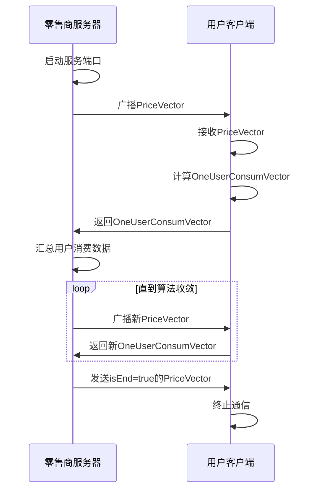
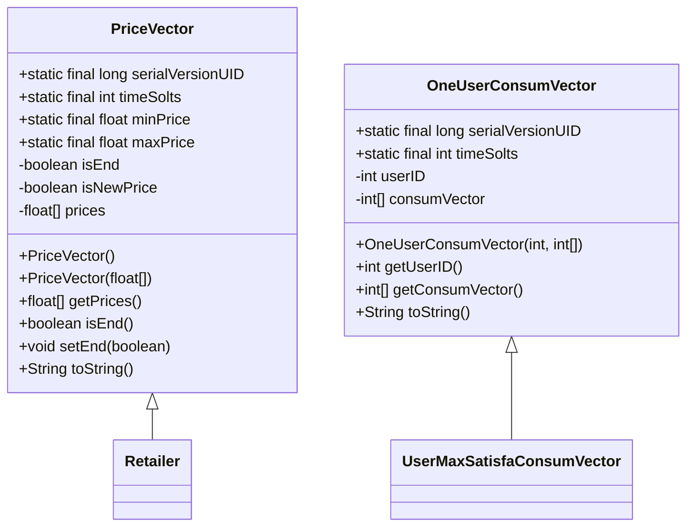
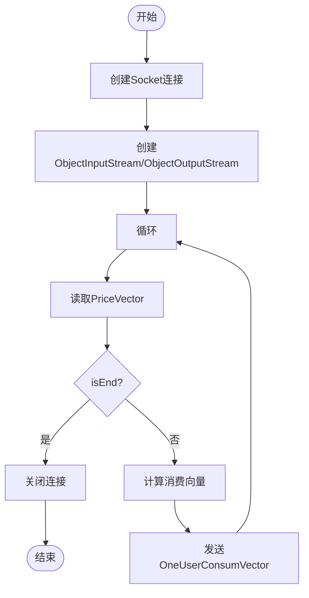
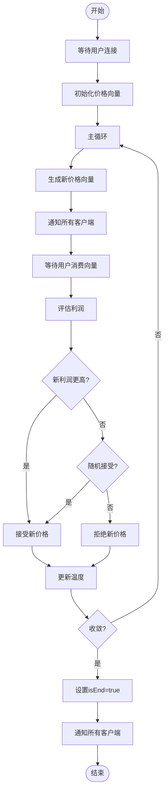
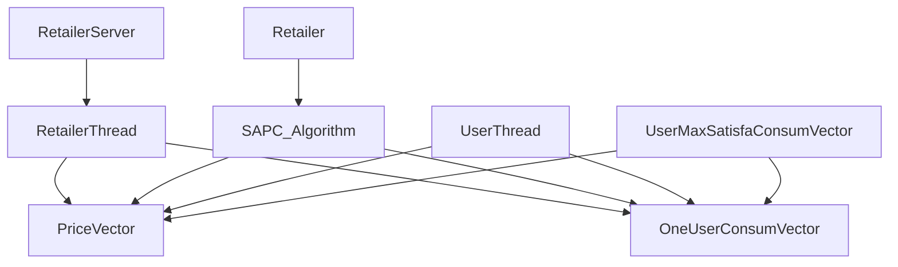

# 通信协议

<cite>
**本文档引用的文件**
- [RetailerServer.java](file://src/main/java/io/leavesfly/smartgrid/retailer/RetailerServer.java)
- [RetailerThread.java](file://src/main/java/io/leavesfly/smartgrid/retailer/RetailerThread.java)
- [UserThread.java](file://src/main/java/io/leavesfly/smartgrid/user/UserThread.java)
- [PriceVector.java](file://src/main/java/io/leavesfly/smartgrid/retailer/PriceVector.java)
- [OneUserConsumVector.java](file://src/main/java/io/leavesfly/smartgrid/user/OneUserConsumVector.java)
- [SAPC_Algorithm.java](file://src/main/java/io/leavesfly/smartgrid/retailer/SAPC_Algorithm.java)
- [Retailer.java](file://src/main/java/io/leavesfly/smartgrid/retailer/Retailer.java)
- [UserMaxSatisfaConsumVector.java](file://src/main/java/io/leavesfly/smartgrid/user/UserMaxSatisfaConsumVector.java)
- [RetailerInitArgs.java](file://src/main/java/io/leavesfly/smartgrid/retailer/RetailerInitArgs.java)
- [UsersArgs.java](file://src/main/java/io/leavesfly/smartgrid/user/UsersArgs.java)
</cite>

## 目录
1. [引言](#引言)
2. [项目结构](#项目结构)
3. [核心组件](#核心组件)
4. [通信架构概述](#通信架构概述)
5. [详细组件分析](#详细组件分析)
6. [依赖关系分析](#依赖关系分析)
7. [性能与异常处理](#性能与异常处理)
8. [协议扩展建议](#协议扩展建议)
9. [结论](#结论)

## 引言
本文档详细描述基于Java原生Socket的TCP通信机制，重点分析智能电网系统中零售商与用户之间的通信协议。文档涵盖对象序列化传输、消息交换流程、通信终止控制、异常处理机制及安全建议，旨在为系统维护和扩展提供完整的技术参考。

## 项目结构
系统采用分层架构，分为零售商（retailer）和用户（user）两大模块。零售商模块负责价格策略计算与广播，用户模块负责消费向量计算与反馈。通过Socket通信实现双向数据交换，使用Java原生序列化机制传输自定义对象。

```mermaid
graph TB
subgraph "零售商模块"
RetailerServer[零售商服务器]
RetailerThread[零售商线程]
PriceVector[价格向量]
SAPC_Algorithm[SAPC算法]
Retailer[零售商]
end
subgraph "用户模块"
UserThread[用户线程]
OneUserConsumVector[用户消费向量]
UserMaxSatisfaConsumVector[用户最大满意度计算]
UsersArgs[用户参数]
end
RetailerServer --> RetailerThread
RetailerThread --> PriceVector
Retailer --> SAPC_Algorithm
UserThread --> OneUserConsumVector
UserThread --> UserMaxSatisfaConsumVector
RetailerServer < --> UserThread : TCP通信
```

**图示来源**
- [RetailerServer.java](file://src/main/java/io/leavesfly/smartgrid/retailer/RetailerServer.java#L1-L42)
- [UserThread.java](file://src/main/java/io/leavesfly/smartgrid/user/UserThread.java#L1-L86)
- [PriceVector.java](file://src/main/java/io/leavesfly/smartgrid/retailer/PriceVector.java#L1-L106)
- [OneUserConsumVector.java](file://src/main/java/io/leavesfly/smartgrid/user/OneUserConsumVector.java#L1-L52)

**本节来源**
- [RetailerServer.java](file://src/main/java/io/leavesfly/smartgrid/retailer/RetailerServer.java#L1-L42)
- [UserThread.java](file://src/main/java/io/leavesfly/smartgrid/user/UserThread.java#L1-L86)

## 核心组件
系统核心组件包括价格向量（PriceVector）、用户消费向量（OneUserConsumVector）、零售商线程（RetailerThread）和用户线程（UserThread）。这些组件通过ObjectInputStream和ObjectOutputStream实现对象的序列化传输，完成价格策略与消费反馈的交互。

**本节来源**
- [PriceVector.java](file://src/main/java/io/leavesfly/smartgrid/retailer/PriceVector.java#L1-L106)
- [OneUserConsumVector.java](file://src/main/java/io/leavesfly/smartgrid/user/OneUserConsumVector.java#L1-L52)
- [RetailerThread.java](file://src/main/java/io/leavesfly/smartgrid/retailer/RetailerThread.java#L1-L88)
- [UserThread.java](file://src/main/java/io/leavesfly/smartgrid/user/UserThread.java#L1-L86)

## 通信架构概述
系统采用客户端-服务器架构，零售商作为服务器端，用户作为客户端。通信流程为：服务器广播价格向量 → 客户端接收并计算用电策略 → 客户端返回消费向量。整个过程基于TCP协议，确保数据传输的可靠性。



**图示来源**
- [RetailerServer.java](file://src/main/java/io/leavesfly/smartgrid/retailer/RetailerServer.java#L1-L42)
- [RetailerThread.java](file://src/main/java/io/leavesfly/smartgrid/retailer/RetailerThread.java#L1-L88)
- [UserThread.java](file://src/main/java/io/leavesfly/smartgrid/user/UserThread.java#L1-L86)

## 详细组件分析

### 价格向量与消费向量分析
PriceVector和OneUserConsumVector类均实现Serializable接口，支持Java原生序列化。PriceVector包含价格数组和isEnd标志位，OneUserConsumVector包含用户ID和消费向量数组。



**图示来源**
- [PriceVector.java](file://src/main/java/io/leavesfly/smartgrid/retailer/PriceVector.java#L1-L106)
- [OneUserConsumVector.java](file://src/main/java/io/leavesfly/smartgrid/user/OneUserConsumVector.java#L1-L52)

**本节来源**
- [PriceVector.java](file://src/main/java/io/leavesfly/smartgrid/retailer/PriceVector.java#L1-L106)
- [OneUserConsumVector.java](file://src/main/java/io/leavesfly/smartgrid/user/OneUserConsumVector.java#L1-L52)

### 通信流程分析
零售商服务器通过RetailerThread处理多个用户连接，使用synchronized关键字确保线程安全。用户客户端通过UserThread连接服务器，循环接收价格向量并返回消费向量。



**图示来源**
- [RetailerThread.java](file://src/main/java/io/leavesfly/smartgrid/retailer/RetailerThread.java#L1-L88)
- [UserThread.java](file://src/main/java/io/leavesfly/smartgrid/user/UserThread.java#L1-L86)

**本节来源**
- [RetailerThread.java](file://src/main/java/io/leavesfly/smartgrid/retailer/RetailerThread.java#L1-L88)
- [UserThread.java](file://src/main/java/io/leavesfly/smartgrid/user/UserThread.java#L1-L86)

### 算法控制流程分析
SAPC_Algorithm类实现模拟退火算法，通过isEnd标志位控制通信终止。当算法收敛时，设置isEnd=true并通知所有客户端终止通信。



**图示来源**
- [SAPC_Algorithm.java](file://src/main/java/io/leavesfly/smartgrid/retailer/SAPC_Algorithm.java#L1-L197)
- [PriceVector.java](file://src/main/java/io/leavesfly/smartgrid/retailer/PriceVector.java#L1-L106)

**本节来源**
- [SAPC_Algorithm.java](file://src/main/java/io/leavesfly/smartgrid/retailer/SAPC_Algorithm.java#L1-L197)

## 依赖关系分析
系统组件间存在明确的依赖关系。零售商模块依赖于价格向量和用户消费向量进行计算，用户模块依赖于价格向量进行消费策略计算。通信层依赖于Java原生序列化机制。



**图示来源**
- [RetailerServer.java](file://src/main/java/io/leavesfly/smartgrid/retailer/RetailerServer.java#L1-L42)
- [RetailerThread.java](file://src/main/java/io/leavesfly/smartgrid/retailer/RetailerThread.java#L1-L88)
- [SAPC_Algorithm.java](file://src/main/java/io/leavesfly/smartgrid/retailer/SAPC_Algorithm.java#L1-L197)
- [UserThread.java](file://src/main/java/io/leavesfly/smartgrid/user/UserThread.java#L1-L86)
- [UserMaxSatisfaConsumVector.java](file://src/main/java/io/leavesfly/smartgrid/user/UserMaxSatisfaConsumVector.java#L1-L49)

**本节来源**
- [Retailer.java](file://src/main/java/io/leavesfly/smartgrid/retailer/Retailer.java#L1-L104)
- [SAPC_Algorithm.java](file://src/main/java/io/leavesfly/smartgrid/retailer/SAPC_Algorithm.java#L1-L197)

## 性能与异常处理
系统通过synchronized关键字确保线程安全，使用try-catch块处理网络异常。连接超时由Socket底层机制处理，异常发生时线程会打印堆栈信息并终止。

**本节来源**
- [RetailerThread.java](file://src/main/java/io/leavesfly/smartgrid/retailer/RetailerThread.java#L1-L88)
- [UserThread.java](file://src/main/java/io/leavesfly/smartgrid/user/UserThread.java#L1-L86)

## 协议扩展建议
1. **序列化安全**：Java原生序列化存在安全风险，建议引入校验机制或使用更安全的序列化框架。
2. **JSON替代方案**：可使用JSON替代Java序列化，提高跨平台兼容性。
3. **消息校验**：增加消息校验码，确保数据完整性。
4. **超时机制**：显式设置Socket读写超时，避免连接挂起。
5. **连接复用**：考虑使用连接池复用Socket连接，减少创建开销。

**本节来源**
- [PriceVector.java](file://src/main/java/io/leavesfly/smartgrid/retailer/PriceVector.java#L1-L106)
- [OneUserConsumVector.java](file://src/main/java/io/leavesfly/smartgrid/user/OneUserConsumVector.java#L1-L52)

## 结论
本文档详细分析了基于Java原生Socket的TCP通信协议，涵盖了对象序列化传输、消息交换流程、线程同步控制和异常处理机制。系统通过isEnd标志位优雅地终止通信，使用模拟退火算法优化价格策略。建议在生产环境中增强序列化安全性和连接管理机制。