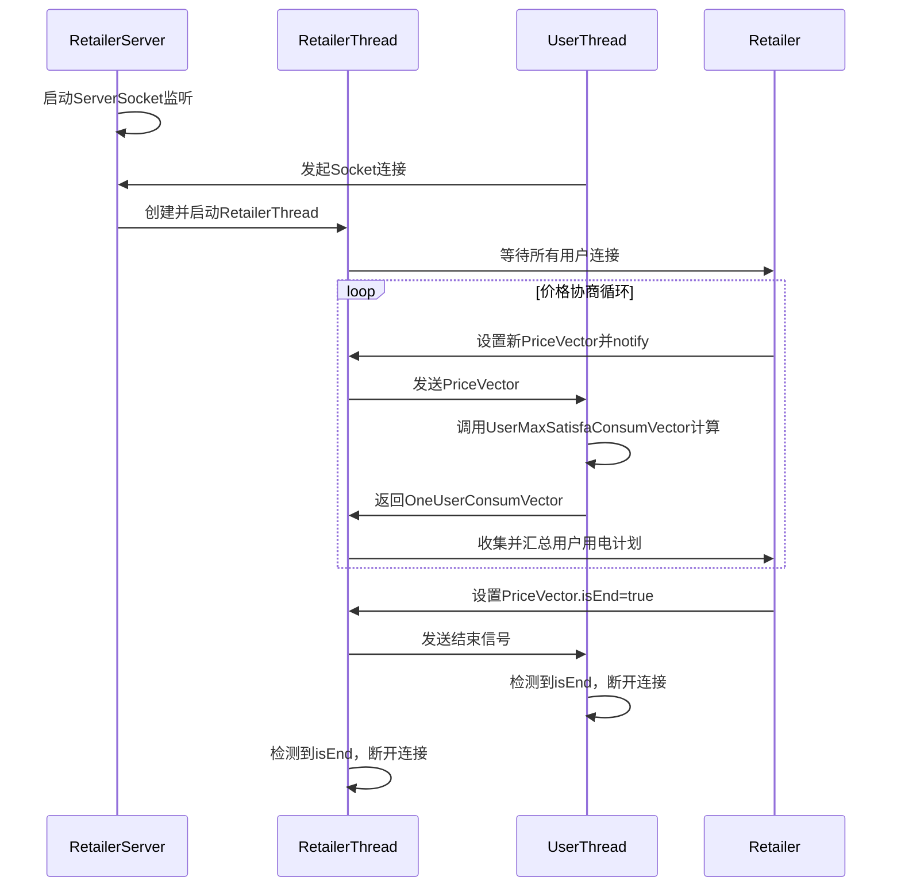
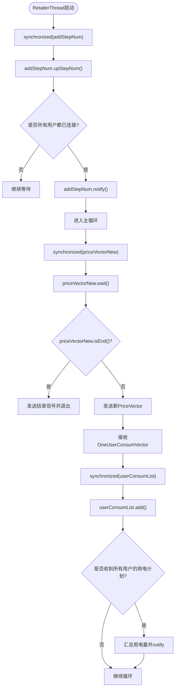
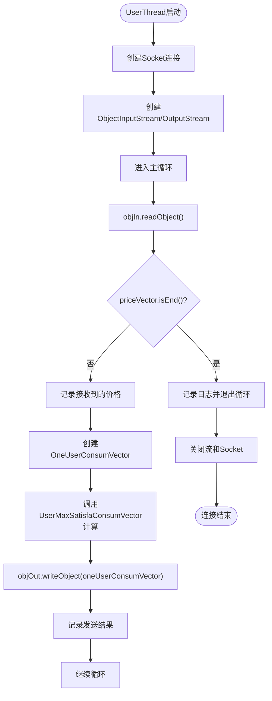

# 通信流程

<cite>
**本文档引用的文件**
- [RetailerThread.java](file://src/main/java/io/leavesfly/smartgrid/retailer/RetailerThread.java)
- [UserThread.java](file://src/main/java/io/leavesfly/smartgrid/user/UserThread.java)
- [PriceVector.java](file://src/main/java/io/leavesfly/smartgrid/retailer/PriceVector.java)
- [OneUserConsumVector.java](file://src/main/java/io/leavesfly/smartgrid/user/OneUserConsumVector.java)
- [UserMaxSatisfaConsumVector.java](file://src/main/java/io/leavesfly/smartgrid/user/UserMaxSatisfaConsumVector.java)
- [Retailer.java](file://src/main/java/io/leavesfly/smartgrid/retailer/Retailer.java)
- [UsersArgs.java](file://src/main/java/io/leavesfly/smartgrid/user/UsersArgs.java)
</cite>

## 目录
1. [通信流程概述](#通信流程概述)
2. [客户端-服务器通信核心机制](#客户端-服务器通信核心机制)
3. [RetailerThread中的等待与通知机制](#retailerthread中的等待与通知机制)
4. [UserThread的价格接收与用电策略计算](#userthread的价格接收与用电策略计算)
5. [isEnd()标志位在通信终止中的协同作用](#isend标志位在通信终止中的协同作用)
6. [多线程环境下的同步块与数据一致性保障](#多线程环境下的同步块与数据一致性保障)
7. [通信异常处理指南](#通信异常处理指南)
8. [完整通信时序图](#完整通信时序图)
9. [结论](#结论)

## 通信流程概述

本系统采用客户端-服务器架构，实现电力零售商（Retailer）与多个用户（User）之间的动态电价协商与用电策略反馈。服务器端通过`RetailerServer`启动监听，为每个连接的用户创建独立的`RetailerThread`处理线程。客户端`UserThread`主动连接服务器，接收广播的价格向量（PriceVector），计算最优用电策略，并将用电计划（OneUserConsumVector）返回给服务器。整个通信过程由`isEnd()`标志位协调终止，确保双方安全断开连接。

**Section sources**
- [RetailerServer.java](file://src/main/java/io/leavesfly/smartgrid/retailer/RetailerServer.java#L1-L42)
- [RetailerThread.java](file://src/main/java/io/leavesfly/smartgrid/retailer/RetailerThread.java#L1-L88)
- [UserThread.java](file://src/main/java/io/leavesfly/smartgrid/user/UserThread.java#L1-L86)

## 客户端-服务器通信核心机制

系统通信基于TCP协议，使用Java对象序列化进行数据传输。服务器端`RetailerServer`监听指定端口，接受客户端连接并启动`RetailerThread`。每个`UserThread`作为客户端，根据`UsersArgs`中的IP和端口配置连接服务器。通信双方通过`ObjectOutputStream`和`ObjectInputStream`交换`PriceVector`和`OneUserConsumVector`对象，实现价格广播与用电计划上报。



**Diagram sources**
- [RetailerServer.java](file://src/main/java/io/leavesfly/smartgrid/retailer/RetailerServer.java#L1-L42)
- [RetailerThread.java](file://src/main/java/io/leavesfly/smartgrid/retailer/RetailerThread.java#L1-L88)
- [UserThread.java](file://src/main/java/io/leavesfly/smartgrid/user/UserThread.java#L1-L86)

## RetailerThread中的等待与通知机制

`RetailerThread`在启动时，首先通过`synchronized`块对`AddStepNum`对象进行同步，递增连接用户计数。当所有用户（`UsersArgs.userNum`）都连接成功后，调用`notify()`唤醒等待在`Retailer`主逻辑中的线程，触发价格优化算法的执行。

在主通信循环中，`RetailerThread`通过`synchronized(retailer.getPriceVectorNew())`获取价格向量锁，并调用`wait()`进入等待状态。该机制确保了只有当服务器端通过`notify()`明确通知有新价格产生时，`RetailerThread`才会被唤醒并继续执行，从而实现了高效的线程间同步，避免了轮询带来的资源浪费。



**Diagram sources**
- [RetailerThread.java](file://src/main/java/io/leavesfly/smartgrid/retailer/RetailerThread.java#L1-L88)
- [Retailer.java](file://src/main/java/io/leavesfly/smartgrid/retailer/Retailer.java#L1-L104)

**Section sources**
- [RetailerThread.java](file://src/main/java/io/leavesfly/smartgrid/retailer/RetailerThread.java#L1-L88)

## UserThread的价格接收与用电策略计算

`UserThread`在连接服务器后，进入一个无限循环，通过`ObjectInputStream.readObject()`阻塞等待接收`PriceVector`对象。一旦接收到价格向量，首先检查其`isEnd()`标志位。若为`true`，则立即退出循环，准备断开连接。

若为正常价格向量，`UserThread`将调用`UserMaxSatisfaConsumVector.getConsumVectorByPriceVector()`方法，结合用户自身的用电偏好和约束（定义在`UsersArgs`中），计算出在当前电价下的最优用电策略。计算结果封装在`OneUserConsumVector`对象中，并通过`ObjectOutputStream`发送回服务器。



**Diagram sources**
- [UserThread.java](file://src/main/java/io/leavesfly/smartgrid/user/UserThread.java#L1-L86)
- [UserMaxSatisfaConsumVector.java](file://src/main/java/io/leavesfly/smartgrid/user/UserMaxSatisfaConsumVector.java#L1-L49)

**Section sources**
- [UserThread.java](file://src/main/java/io/leavesfly/smartgrid/user/UserThread.java#L1-L86)
- [UserMaxSatisfaConsumVector.java](file://src/main/java/io/leavesfly/smartgrid/user/UserMaxSatisfaConsumVector.java#L1-L49)

## isEnd()标志位在通信终止中的协同作用

`isEnd()`标志位是协调客户端与服务器安全终止通信的核心机制。当服务器端的优化算法（如`SAPC_Algorithm`）完成所有迭代后，会将`Retailer`实例中的`priceVectorNew`的`isEnd`字段设置为`true`，并通过`synchronized`块调用`notifyAll()`唤醒所有等待的`RetailerThread`。

被唤醒的`RetailerThread`在下一次循环中检测到`isEnd()`为`true`，会将这个结束信号作为最后一个`PriceVector`广播给所有连接的`UserThread`。`UserThread`在接收到此对象后，通过`priceVector.isEnd()`判断出这是结束信号，立即跳出主循环，执行资源清理并断开连接。`RetailerThread`在发送完结束信号后，同样会跳出循环，关闭自身资源。这种基于共享状态标志的协同机制，确保了通信双方能够有序、同步地结束会话，避免了资源泄漏和连接挂起。

**Section sources**
- [PriceVector.java](file://src/main/java/io/leavesfly/smartgrid/retailer/PriceVector.java#L1-L107)
- [RetailerThread.java](file://src/main/java/io/leavesfly/smartgrid/retailer/RetailerThread.java#L1-L88)
- [UserThread.java](file://src/main/java/io/leavesfly/smartgrid/user/UserThread.java#L1-L86)

## 多线程环境下的同步块与数据一致性保障

系统在多线程环境下通过`synchronized`关键字和`wait()/notify()`机制保障了关键数据的一致性。

1.  **`AddStepNum`同步**：多个`RetailerThread`在初始化时会并发修改`AddStepNum.stepNum`。通过`synchronized(addStepNum)`确保了计数的原子性，防止竞态条件。
2.  **`PriceVector`同步**：`RetailerThread`通过`synchronized(retailer.getPriceVectorNew())`和`wait()`等待新价格。当服务器端更新价格并调用`notify()`时，所有等待的线程被唤醒，保证了价格更新的可见性和及时性。
3.  **`userConsumList`同步**：多个`RetailerThread`会并发地将`OneUserConsumVector`添加到`Retailer`的`userConsumList`中。通过`synchronized(retailer.getUserConsumList())`确保了列表操作的线程安全，防止了`ConcurrentModificationException`。
4.  **`consumByTimeNow`同步**：当所有用户的用电计划收集完毕后，`RetailerThread`会唤醒等待在`consumByTimeNow`上的主计算线程，通知其可以使用最新的汇总用电数据进行下一轮利润计算。

这些同步机制共同构建了一个可靠的生产者-消费者模型，确保了在高并发场景下数据的完整性和程序的正确执行。

**Section sources**
- [RetailerThread.java](file://src/main/java/io/leavesfly/smartgrid/retailer/RetailerThread.java#L1-L88)
- [Retailer.java](file://src/main/java/io/leavesfly/smartgrid/retailer/Retailer.java#L1-L104)

## 通信异常处理指南

尽管代码中使用了`try-catch`捕获异常，但其处理较为简单（仅打印堆栈）。以下是针对常见通信异常的最佳实践建议：

1.  **网络中断**：
    *   **客户端**：在`catch`块中应尝试重连，可设置最大重试次数和指数退避策略。
    *   **服务器端**：`RetailerThread`的`catch`块应确保`userConsumList`的完整性。如果某个客户端连接中断，应将其视为未响应，避免因缺少一个用户的反馈而阻塞整个系统。可引入超时机制。

2.  **超时重连**：
    *   为`Socket`连接和`readObject()`操作设置合理的超时时间（`setSoTimeout`）。
    *   实现心跳机制，定期发送空对象或ping消息，以检测连接是否存活。

3.  **资源释放**：
    *   必须在`finally`块中关闭`Socket`、`ObjectInputStream`和`ObjectOutputStream`，确保即使发生异常，资源也能被正确释放，防止文件描述符泄漏。
    *   当前代码将`close()`操作放在`try`块末尾，存在风险。应重构为`try-with-resources`语句或使用`finally`块。

4.  **数据序列化异常**：
    *   确保`PriceVector`和`OneUserConsumVector`的`serialVersionUID`在客户端和服务器端保持一致，否则会抛出`InvalidClassException`。
    *   在传输前进行数据校验，避免发送`null`或不完整对象。

**Section sources**
- [RetailerThread.java](file://src/main/java/io/leavesfly/smartgrid/retailer/RetailerThread.java#L1-L88)
- [UserThread.java](file://src/main/java/io/leavesfly/smartgrid/user/UserThread.java#L1-L86)

## 完整通信时序图

```mermaid
sequenceDiagram
participant Main as 主程序
participant Server as RetailerServer
participant Retailer as Retailer
participant RT1 as RetailerThread(User1)
participant RT2 as RetailerThread(User2)
participant UT1 as UserThread(User1)
participant UT2 as UserThread(User2)
Main->>Server : 启动服务器
Server->>Server : new ServerSocket()
Server->>Server : new Retailer()
Server->>Server : 启动监听线程
UT1->>Server : connect()
Server->>RT1 : new RetailerThread(socket, retailer)
RT1->>Retailer : synchronized(addStepNum); upStepNum()
RT1->>Retailer : stepNum == userNum? 是 -> notify()
UT2->>Server : connect()
Server->>RT2 : new RetailerThread(socket, retailer)
RT2->>Retailer : synchronized(addStepNum); upStepNum()
RT2->>Retailer : stepNum == userNum? 是 -> notify()
Main->>Retailer : SAPC_Algorithm开始计算
loop 迭代1
Retailer->>Retailer : 计算新PriceVector
Retailer->>Retailer : priceVectorNew.setEnd(false)
Retailer->>Retailer : synchronized(priceVectorNew); notifyAll()
RT1->>UT1 : 发送PriceVector
RT2->>UT2 : 发送PriceVector
UT1->>UT1 : 接收PriceVector
UT1->>UT1 : 调用UserMaxSatisfaConsumVector计算
UT1->>RT1 : 发送OneUserConsumVector
UT2->>UT2 : 接收PriceVector
UT2->>UT2 : 调用UserMaxSatisfaConsumVector计算
UT2->>RT2 : 发送OneUserConsumVector
RT1->>Retailer : synchronized(userConsumList); add(); size==2? 是 -> fillConsumVectorByTime()
RT1->>Retailer : synchronized(consumByTimeNow); notify()
RT2->>Retailer : synchronized(userConsumList); add(); size==2? 是 -> fillConsumVectorByTime()
RT2->>Retailer : synchronized(consumByTimeNow); notify()
end
loop 迭代n (最后一次)
Retailer->>Retailer : 计算最终PriceVector
Retailer->>Retailer : priceVectorNew.setEnd(true)
Retailer->>Retailer : synchronized(priceVectorNew); notifyAll()
RT1->>UT1 : 发送PriceVector (isEnd=true)
RT2->>UT2 : 发送PriceVector (isEnd=true)
UT1->>UT1 : 检测到isEnd=true, break循环
UT1->>UT1 : 关闭资源
UT2->>UT2 : 检测到isEnd=true, break循环
UT2->>UT2 : 关闭资源
RT1->>RT1 : 检测到isEnd=true, break循环
RT1->>RT1 : 关闭资源
RT2->>RT2 : 检测到isEnd=true, break循环
RT2->>RT2 : 关闭资源
end
```

**Diagram sources**
- [RetailerServer.java](file://src/main/java/io/leavesfly/smartgrid/retailer/RetailerServer.java#L1-L42)
- [RetailerThread.java](file://src/main/java/io/leavesfly/smartgrid/retailer/RetailerThread.java#L1-L88)
- [UserThread.java](file://src/main/java/io/leavesfly/smartgrid/user/UserThread.java#L1-L86)
- [PriceVector.java](file://src/main/java/io/leavesfly/smartgrid/retailer/PriceVector.java#L1-L107)

## 结论

本系统通过精心设计的客户端-服务器通信模型，实现了零售商与用户之间的动态交互。`wait/notify`机制高效地协调了线程间的等待与唤醒，`isEnd()`标志位优雅地解决了通信终止的同步问题。`synchronized`块确保了在多线程环境下对共享数据（如`userConsumList`和`priceVectorNew`）操作的原子性和可见性。尽管异常处理有待加强，但其核心通信流程清晰、可靠，为智能电网中的需求响应研究提供了一个有效的模拟框架。