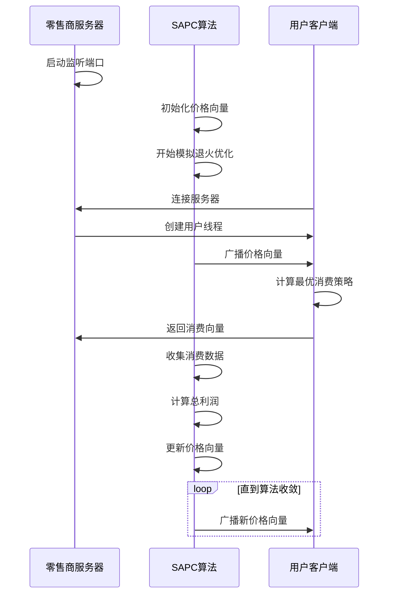
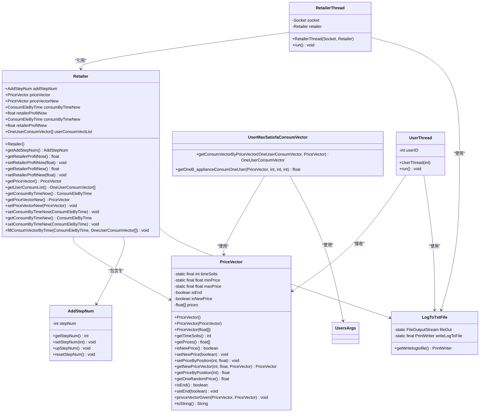
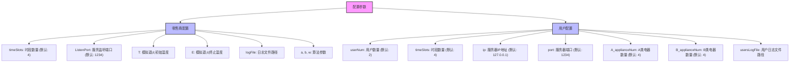

# 贡献指南

<cite>
**本文档中引用的文件**   
- [README.md](file://README.md)
- [RetailerServer.java](file://src/main/java/io/leavesfly/smartgrid/retailer/RetailerServer.java)
- [Retailer.java](file://src/main/java/io/leavesfly/smartgrid/retailer/Retailer.java)
- [SAPC_Algorithm.java](file://src/main/java/io/leavesfly/smartgrid/retailer/SAPC_Algorithm.java)
- [PriceVector.java](file://src/main/java/io/leavesfly/smartgrid/retailer/PriceVector.java)
- [RetailerThread.java](file://src/main/java/io/leavesfly/smartgrid/retailer/RetailerThread.java)
- [RetailerInitArgs.java](file://src/main/java/io/leavesfly/smartgrid/retailer/RetailerInitArgs.java)
- [Users.java](file://src/main/java/io/leavesfly/smartgrid/user/Users.java)
- [UserThread.java](file://src/main/java/io/leavesfly/smartgrid/user/UserThread.java)
- [UsersArgs.java](file://src/main/java/io/leavesfly/smartgrid/user/UsersArgs.java)
- [pom.xml](file://pom.xml)
</cite>

## 目录
1. [简介](#简介)
2. [贡献流程](#贡献流程)
3. [代码风格规范](#代码风格规范)
4. [提交消息格式](#提交消息格式)
5. [代码审查流程](#代码审查流程)
6. [文档更新要求](#文档更新要求)
7. [新贡献者入门建议](#新贡献者入门建议)
8. [技术细节说明](#技术细节说明)

## 简介

本贡献指南旨在为开发者提供清晰的代码贡献指导，确保代码质量和项目一致性。智能电网需求响应管理系统是一个基于实时电价控制的模拟系统，通过模拟退火算法优化电力资源分配。我们欢迎所有开发者参与项目改进，共同推动智能电网技术的发展。

**Section sources**
- [README.md](file://README.md#L1-L184)

## 贡献流程

为了确保代码质量和项目稳定性，我们制定了标准化的贡献流程。所有贡献者都应遵循以下步骤：

1. **Fork 仓库**: 在 GitHub 上点击 "Fork" 按钮，创建您自己的项目副本
2. **克隆项目**: 将您的 fork 克隆到本地开发环境
   ```bash
   git clone https://github.com/your-username/smartgrid.git
   cd smartgrid
   ```
3. **创建特性分支**: 基于主分支创建新的特性分支
   ```bash
   git checkout -b feature/YourFeatureName
   ```
4. **实现功能或修复**: 在本地进行代码修改和测试
5. **提交更改**: 按照规定的提交消息格式提交代码
   ```bash
   git add .
   git commit -m 'feat: 添加新的功能描述'
   ```
6. **推送分支**: 将本地分支推送到您的 fork
   ```bash
   git push origin feature/YourFeatureName
   ```
7. **发起 Pull Request**: 在 GitHub 上创建 Pull Request，描述您的更改和目的

**Section sources**
- [README.md](file://README.md#L130-L135)

## 代码风格规范

### 命名约定

#### 类名
- 使用大驼峰命名法 (PascalCase)
- 类名应具有描述性，反映其职责
- 示例: `RetailerServer`, `UserMaxSatisfaConsumVector`

#### 方法名
- 使用小驼峰命名法 (camelCase)
- 方法名应以动词开头，描述其行为
- 示例: `getConsumVectorByPriceVector`, `simulateAnnealingAlgorithm`

#### 变量名
- 使用小驼峰命名法 (camelCase)
- 变量名应具有语义，避免使用单字母命名
- 示例: `priceVectorNow`, `retailerProfitNew`

#### 常量
- 使用全大写字母，单词间用下划线分隔
- 示例: `public static final int TIME_SLOTS = 4;`

### 注释要求

#### 类注释
每个类都应包含 Javadoc 注释，说明类的职责、作者和创建日期：
```java
/**
 * 零售商核心类，管理价格向量和利润计算
 * 负责与用户客户端通信并优化电价策略
 * 
 * @author YourName
 * @version 1.0
 * @since 2024
 */
```

#### 方法注释
重要方法应包含详细的 Javadoc 注释：
```java
/**
 * 根据价格向量计算用户的最优消费策略
 * 使用满意度最大化算法确定各时段的用电量
 * 
 * @param oneUserConsumVector 用户消费向量对象
 * @param priceVector 当前价格向量
 * @return 优化后的用户消费向量
 * @throws IllegalArgumentException 当输入参数无效时抛出
 */
```

#### 行内注释
在复杂逻辑处添加行内注释，解释算法原理或特殊处理：
```java
// 使用Metropolis准则决定是否接受新解
// 即使新解利润较低，也有一定概率接受以避免陷入局部最优
if ((float) Math.random() < (float) (Math.exp((profitNew - profitNow) / T))) {
```

### 设计模式使用

#### 单例模式
日志工具类 `LogToTxtFile` 采用了静态单例模式，确保全局只有一个日志写入实例：
```java
public synchronized static PrintWriter getWritelogtofile() {
    return writeLogToFile;
}
```

#### 观察者模式
通过 `synchronized` 和 `wait()/notify()` 机制实现线程间的观察者模式，零售商线程等待价格更新通知：
```java
synchronized (retailer.getPriceVectorNew()) {
    retailer.getPriceVectorNew().wait();
}
```

#### 策略模式
`UserMaxSatisfaConsumVector` 类实现了用户消费策略，可根据不同算法进行替换：
```java
oneUserConsumVector = UserMaxSatisfaConsumVector
    .getConsumVectorByPriceVector(oneUserConsumVector, priceVector);
```

#### 工厂模式
`PriceVector` 类提供了多种构造方法，作为价格向量的工厂：
```java
public PriceVector() { /* 随机初始化 */ }
public PriceVector(PriceVector priceVector) { /* 复制构造 */ }
public PriceVector(float[] prices) { /* 数组初始化 */ }
```

**Section sources**
- [LogToTxtFile.java](file://src/main/java/io/leavesfly/smartgrid/retailer/LogToTxtFile.java#L0-L31)
- [PriceVector.java](file://src/main/java/io/leavesfly/smartgrid/retailer/PriceVector.java#L0-L105)
- [UserMaxSatisfaConsumVector.java](file://src/main/java/io/leavesfly/smartgrid/user/UserMaxSatisfaConsumVector.java#L0-L48)

## 提交消息格式

我们采用标准化的提交消息格式，便于生成变更日志和理解代码历史。提交消息应遵循以下格式：

```
<类型>: <简短描述>

<详细描述>

<关联的Issue>
```

### 类型说明

- **feat**: 新功能添加
- **fix**: bug 修复
- **docs**: 文档更新
- **style**: 代码格式调整（不影响逻辑）
- **refactor**: 代码重构
- **test**: 测试相关更改
- **chore**: 构建过程或辅助工具的更改

### 示例

```
feat: 添加用户满意度权重配置

新增用户配置参数，允许为不同电器设置满意度权重
优化了B类电器的消费计算算法，考虑用户偏好因素
提高了系统对用户行为的模拟精度

Closes #123
```

```
fix: 修复多线程同步问题

修复了零售商线程在高并发情况下的竞态条件
使用synchronized关键字保护共享资源访问
添加了线程安全的计数器机制

Closes #124
```

**Section sources**
- [README.md](file://README.md#L133-L134)

## 代码审查流程

### 审查标准

#### 功能正确性
- 代码实现符合需求规格
- 边界条件和异常情况得到妥善处理
- 算法逻辑正确，无明显缺陷

#### 代码质量
- 遵循项目代码风格规范
- 代码结构清晰，模块化良好
- 适当的注释和文档说明
- 无重复代码，遵循DRY原则

#### 性能考虑
- 时间复杂度和空间复杂度合理
- 避免不必要的对象创建和内存消耗
- I/O操作和网络通信优化

#### 测试覆盖
- 包含相应的单元测试
- 测试用例覆盖主要功能路径
- 边界条件和异常情况有测试验证

#### 安全性
- 无明显的安全漏洞
- 输入验证和错误处理完善
- 敏感信息保护得当

### 审查流程

1. **自动检查**: Pull Request 触发CI/CD流水线，运行代码格式检查和单元测试
2. **初步审查**: 至少一名核心开发者进行代码审查，重点关注架构设计和关键逻辑
3. **详细审查**: 相关模块负责人进行详细审查，检查实现细节和边界情况
4. **测试验证**: 审查者在本地环境测试功能，验证实际效果
5. **反馈沟通**: 通过评论方式提出修改建议，与贡献者讨论改进方案
6. **最终批准**: 所有审查意见解决后，获得至少两个批准
7. **合并**: 核心维护者将代码合并到主分支

**Section sources**
- [README.md](file://README.md#L130-L135)

## 文档更新要求

我们强调代码变更与文档更新的同步性，确保项目文档始终保持最新状态。

### 必须更新文档的情况

- **新增功能**: 添加新功能时，必须在README中更新功能说明
- **API变更**: 修改公共接口时，必须更新相关文档和使用示例
- **配置变更**: 添加或修改配置参数时，必须更新配置说明部分
- **算法改进**: 优化核心算法时，必须更新算法说明文档
- **依赖变更**: 修改项目依赖时，必须更新技术栈和系统要求

### 文档更新位置

#### README.md
- 项目简介和核心目标
- 系统架构和主要组件
- 快速开始指南
- 配置说明
- 算法说明

#### JavaDoc
- 类和方法的详细说明
- 参数和返回值描述
- 异常情况说明
- 使用示例

#### 内联注释
- 复杂算法的原理说明
- 特殊处理的业务逻辑
- 性能优化的关键点

**Section sources**
- [README.md](file://README.md#L1-L184)

## 新贡献者入门建议

欢迎新贡献者加入智能电网需求响应管理系统的开发！以下是一些建议，帮助您快速上手：

### 环境准备

1. **安装Java 8+**: 确保系统已安装Java 8或更高版本
2. **安装Maven**: 用于项目构建和依赖管理
3. **克隆项目**: 获取项目源码
4. **编译项目**: 运行 `mvn clean package` 编译代码

### 项目理解

1. **阅读README**: 了解项目整体架构和功能
2. **运行系统**: 按照快速开始指南启动零售商和用户
3. **分析代码**: 重点关注核心类的交互关系
4. **查看日志**: 分析系统运行时的日志输出

### 从小处着手

- **修复文档**: 改进README中的描述或添加注释
- **修复简单bug**: 处理标记为"good first issue"的问题
- **添加测试**: 为现有功能补充单元测试
- **优化注释**: 改进代码中的注释质量

### 有效沟通

- **提交Issue**: 在实现复杂功能前，先提交Issue讨论设计方案
- **寻求帮助**: 遇到问题时，通过Issue或邮件联系维护者
- **参与讨论**: 关注项目中的技术讨论，学习最佳实践

### 调试技巧

1. **使用日志**: 系统提供了详细的日志记录功能
2. **断点调试**: 在关键方法设置断点，观察变量变化
3. **单元测试**: 编写测试用例验证功能正确性
4. **性能分析**: 监控系统资源使用情况

**Section sources**
- [README.md](file://README.md#L1-L184)

## 技术细节说明

### 系统架构流程



**Diagram sources**
- [RetailerServer.java](file://src/main/java/io/leavesfly/smartgrid/retailer/RetailerServer.java#L0-L41)
- [SAPC_Algorithm.java](file://src/main/java/io/leavesfly/smartgrid/retailer/SAPC_Algorithm.java#L0-L196)
- [UserThread.java](file://src/main/java/io/leavesfly/smartgrid/user/UserThread.java#L0-L85)

### 核心组件关系



**Diagram sources**
- [Retailer.java](file://src/main/java/io/leavesfly/smartgrid/retailer/Retailer.java#L0-L104)
- [PriceVector.java](file://src/main/java/io/leavesfly/smartgrid/retailer/PriceVector.java#L0-L105)
- [UserMaxSatisfaConsumVector.java](file://src/main/java/io/leavesfly/smartgrid/user/UserMaxSatisfaConsumVector.java#L0-L48)
- [RetailerThread.java](file://src/main/java/io/leavesfly/smartgrid/retailer/RetailerThread.java#L0-L88)
- [UserThread.java](file://src/main/java/io/leavesfly/smartgrid/user/UserThread.java#L0-L85)
- [AddStepNum.java](file://src/main/java/io/leavesfly/smartgrid/retailer/AddStepNum.java#L0-L19)
- [LogToTxtFile.java](file://src/main/java/io/leavesfly/smartgrid/retailer/LogToTxtFile.java#L0-L31)

### 配置参数说明



**Diagram sources**
- [RetailerInitArgs.java](file://src/main/java/io/leavesfly/smartgrid/retailer/RetailerInitArgs.java)
- [UsersArgs.java](file://src/main/java/io/leavesfly/smartgrid/user/UsersArgs.java#L0-L44)