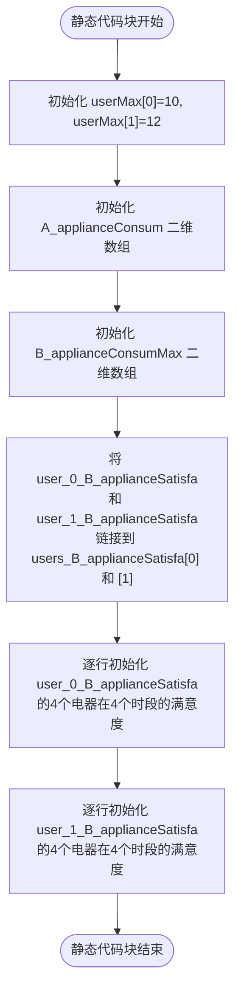
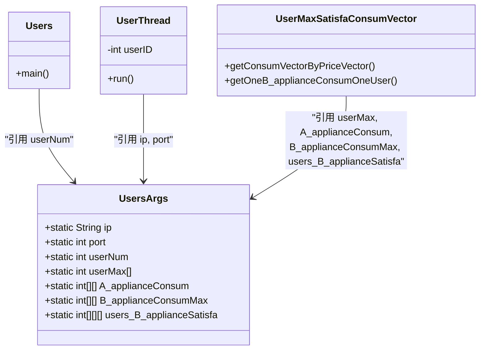

# 用户配置

<cite>
**Referenced Files in This Document**   
- [UsersArgs.java](file://src/main/java/io/leavesfly/smartgrid/user/UsersArgs.java)
- [Users.java](file://src/main/java/io/leavesfly/smartgrid/user/Users.java)
- [UserMaxSatisfaConsumVector.java](file://src/main/java/io/leavesfly/smartgrid/user/UserMaxSatisfaConsumVector.java)
- [UserThread.java](file://src/main/java/io/leavesfly/smartgrid/user/UserThread.java)
</cite>

## 目录
1. [用户配置参数总览](#用户配置参数总览)
2. [核心参数详解](#核心参数详解)
3. [满意度矩阵初始化逻辑](#满意度矩阵初始化逻辑)
4. [用户数量扩展指南](#用户数量扩展指南)
5. [典型配置示例](#典型配置示例)
6. [参数影响与系统集成](#参数影响与系统集成)

## 用户配置参数总览

`UsersArgs` 类是智能电网模拟系统中用户行为模型的核心配置中心，通过一系列静态常量和数组定义了所有用户的用电特征和系统连接参数。这些参数共同构建了一个可配置的用户用电行为模拟框架，直接影响用电策略的计算结果和零售商的利润分析。

该类位于 `io.leavesfly.smartgrid.user` 包中，其定义的参数被 `Users`、`UserThread` 和 `UserMaxSatisfaConsumVector` 等多个组件广泛引用，形成了用户模拟的配置基础。

**Section sources**
- [UsersArgs.java](file://src/main/java/io/leavesfly/smartgrid/user/UsersArgs.java#L1-L45)

## 核心参数详解

`UsersArgs` 类中的参数可分为连接配置、用户规模、电器配置和用电限制四大类，共同定义了模拟环境。

### 服务器连接参数
- **ip**: `127.0.0.1` - 定义了用户客户端连接的零售商服务器IP地址。
- **port**: `1234` - 定义了用户客户端连接的零售商服务器端口号。

### 用户与电器规模参数
- **userNum**: `2` - 静态定义了系统中模拟的用户总数。此数值直接控制用户线程的启动数量。
- **A_applianceNum**: `4` - 定义了每个用户拥有的A类电器（固定用电）的数量。
- **B_applianceNum**: `4` - 定义了每个用户拥有的B类电器（可变用电）的数量。
- **timeSlots**: `4` - 定义了一天中划分的用电时段数量。

### 用电量与限制参数
- **userMax**: `int[userNum]` - 一个数组，存储每个用户的最大用电量限制。在静态代码块中初始化为 `userMax[0] = 10` 和 `userMax[1] = 12`。
- **A_applianceConsum**: `int[userNum][A_applianceNum]` - 二维数组，存储每个用户在每个时段对A类电器的固定用电量。
- **B_applianceConsumMax**: `int[userNum][B_applianceNum]` - 二维数组，存储每个用户对每种B类电器的最大用电量限制。

**Section sources**
- [UsersArgs.java](file://src/main/java/io/leavesfly/smartgrid/user/UsersArgs.java#L3-L20)

## 满意度矩阵初始化逻辑

`users_B_applianceSatisfa` 是一个三维数组，用于存储所有用户对所有B类电器在所有时段的满意度评分。其初始化逻辑在静态代码块中实现，采用了分层引用的策略以提高可读性。



**Diagram sources**
- [UsersArgs.java](file://src/main/java/io/leavesfly/smartgrid/user/UsersArgs.java#L21-L44)

**Section sources**
- [UsersArgs.java](file://src/main/java/io/leavesfly/smartgrid/user/UsersArgs.java#L21-L44)

## 用户数量扩展指南

安全地扩展 `userNum` 是配置系统的关键操作，必须遵循严格的步骤以避免数组越界异常。

### 扩展步骤
1.  **修改 `userNum`**: 将 `public final static int userNum = 2;` 修改为所需的新值，例如 `3`。
2.  **调整 `users_B_applianceSatisfa` 维度**: 将 `public final static int[][][] users_B_applianceSatisfa = new int[2][][];` 中的 `[2]` 改为与 `userNum` 相同的值，例如 `[3]`。
3.  **扩展静态代码块中的初始化**:
    -   为新用户添加 `userMax` 的赋值。
    -   为新用户添加 `A_applianceConsum` 和 `B_applianceConsumMax` 的数组初始化。
    -   声明新的二维满意度数组（如 `user_2_B_applianceSatisfa`）并将其链接到 `users_B_applianceSatisfa` 的新索引。
    -   为新用户初始化其满意度矩阵的每一行。

### 风险规避
- **数组越界**: 如果 `userNum` 增加但 `users_B_applianceSatisfa` 的第一维大小未同步更新，当系统尝试访问新用户的满意度数据时，会抛出 `ArrayIndexOutOfBoundsException`。
- **空指针异常**: 如果为新用户分配了 `users_B_applianceSatisfa` 的索引，但未将具体的二维数组（如 `user_2_B_applianceSatisfa`）链接进去，该索引将为 `null`，后续访问会导致 `NullPointerException`。

**Section sources**
- [UsersArgs.java](file://src/main/java/io/leavesfly/smartgrid/user/UsersArgs.java#L17-L18)
- [UsersArgs.java](file://src/main/java/io/leavesfly/smartgrid/user/UsersArgs.java#L21-L44)

## 典型配置示例

### 增加用户数量至3
```java
public final static int userNum = 3;
// ... 其他参数保持不变 ...
public final static int[][][] users_B_applianceSatisfa = new int[3][][]; // 同步更新为3
public final static int[][] user_2_B_applianceSatisfa = new int[B_applianceNum][timeSlots]; // 新增用户2的满意度数组

static {
    // ... 原有用户0和用户1的初始化 ...
    
    // 为用户2添加初始化
    userMax[2] = 15;
    A_applianceConsum[2] = new int[] { 2, 2, 2, 2 };
    B_applianceConsumMax[2] = new int[] { 3, 3, 3, 3 };
    users_B_applianceSatisfa[2] = user_2_B_applianceSatisfa; // 链接新数组
    
    // 初始化用户2的满意度矩阵
    user_2_B_applianceSatisfa[0] = new int[] { 3, 3, 3, 3 };
    user_2_B_applianceSatisfa[1] = new int[] { 4, 4, 4, 4 };
    user_2_B_applianceSatisfa[2] = new int[] { 5, 5, 5, 5 };
    user_2_B_applianceSatisfa[3] = new int[] { 6, 6, 6, 6 };
}
```

### 调整用户用电偏好
```java
// 修改用户0对第1个B类电器在第2个时段的满意度，从6提高到8，表示更偏好在该时段使用该电器。
user_0_B_applianceSatisfa[1] = new int[] { 1, 3, 8, 3 }; // 原为 {1, 3, 6, 3}
```

**Section sources**
- [UsersArgs.java](file://src/main/java/io/leavesfly/smartgrid/user/UsersArgs.java#L17-L44)

## 参数影响与系统集成

`UsersArgs` 中的参数不仅定义了用户模型，还深度集成到系统的计算逻辑中。

### 用电策略计算
`UserMaxSatisfaConsumVector` 类中的 `getOneB_applianceConsumOneUser` 方法直接使用 `users_B_applianceSatisfa` 数组来计算单个B类电器的用电量。公式为：
`用电量 = (1.5 * (时段+1)) / (满意度 + 当前电价)`
这表明，**满意度越高，用电量越大**，体现了用户对电器使用的偏好。

### 系统启动与同步
`Users` 类的 `main` 方法通过 `UsersArgs.userNum` 来循环启动相应数量的 `UserThread`。零售商端的 `Retailer` 类在聚合用户用电数据时，也通过 `if (userConsumVectList.size() != UsersArgs.userNum)` 来判断是否已收齐所有用户的用电向量，确保了系统同步的准确性。



**Diagram sources**
- [UsersArgs.java](file://src/main/java/io/leavesfly/smartgrid/user/UsersArgs.java#L3-L45)
- [Users.java](file://src/main/java/io/leavesfly/smartgrid/user/Users.java#L7-L10)
- [UserThread.java](file://src/main/java/io/leavesfly/smartgrid/user/UserThread.java#L15-L18)
- [UserMaxSatisfaConsumVector.java](file://src/main/java/io/leavesfly/smartgrid/user/UserMaxSatisfaConsumVector.java#L15-L35)

**Section sources**
- [Users.java](file://src/main/java/io/leavesfly/smartgrid/user/Users.java#L7-L10)
- [UserMaxSatisfaConsumVector.java](file://src/main/java/io/leavesfly/smartgrid/user/UserMaxSatisfaConsumVector.java#L15-L35)