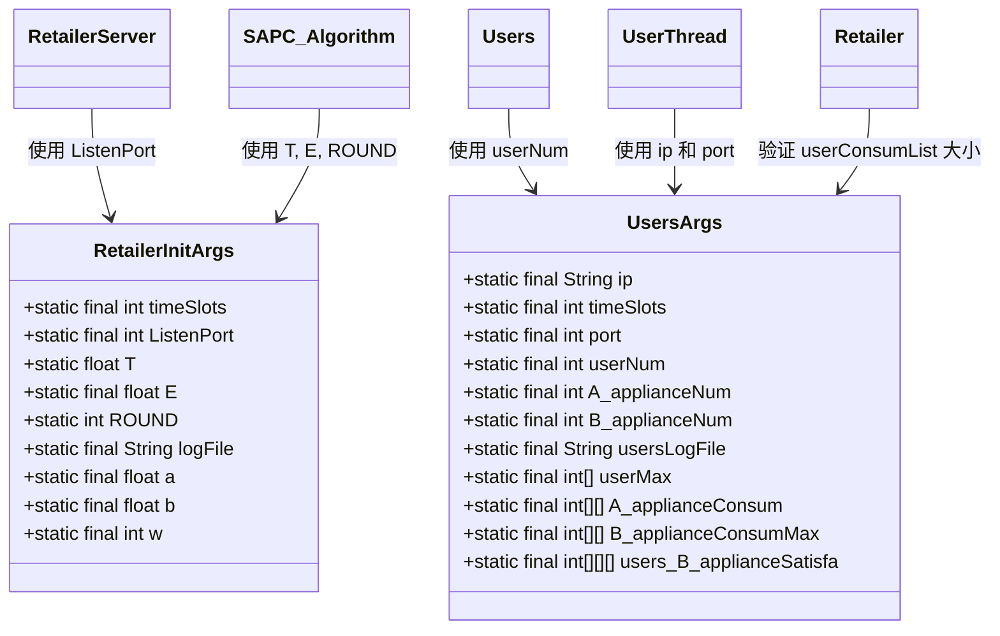

# 配置管理

<cite>
**本文档引用的文件**  
- [RetailerInitArgs.java](file://src/main/java/io/leavesfly/smartgrid/retailer/RetailerInitArgs.java)
- [UsersArgs.java](file://src/main/java/io/leavesfly/smartgrid/user/UsersArgs.java)
- [RetailerServer.java](file://src/main/java/io/leavesfly/smartgrid/retailer/RetailerServer.java)
- [Users.java](file://src/main/java/io/leavesfly/smartgrid/user/Users.java)
- [SAPC_Algorithm.java](file://src/main/java/io/leavesfly/smartgrid/retailer/SAPC_Algorithm.java)
- [Retailer.java](file://src/main/java/io/leavesfly/smartgrid/retailer/Retailer.java)
- [UserThread.java](file://src/main/java/io/leavesfly/smartgrid/user/UserThread.java)
</cite>

## 目录
1. [引言](#引言)
2. [配置类概述](#配置类概述)
3. [RetailerInitArgs 详细配置说明](#retailerinitargs-详细配置说明)
4. [UsersArgs 详细配置说明](#usersargs-详细配置说明)
5. [典型配置场景示例](#典型配置场景示例)
6. [配置扩展与安全修改指南](#配置扩展与安全修改指南)
7. [结论](#结论)

## 引言
本配置管理文档旨在全面介绍智能电网模拟系统中的两个核心配置类：`RetailerInitArgs` 和 `UsersArgs`。通过详细说明其各项参数的默认值、取值范围及对系统行为的影响，帮助开发者理解如何通过调整这些参数来控制系统的规模、网络通信和算法行为。文档还提供典型使用场景和安全修改建议，确保系统在不同需求下稳定运行。

## 配置类概述
系统通过两个静态配置类集中管理零售商端和用户端的关键参数：

- **RetailerInitArgs**：零售商端初始化参数，控制模拟算法、端口监听、日志路径等。
- **UsersArgs**：用户端初始化参数，定义用户数量、网络连接信息、用电行为模型等。

这两个类采用 `public static final` 字段方式定义配置，确保全局可访问且不可变，适用于多线程环境下的共享配置。



**图示来源**  
- [RetailerInitArgs.java](file://src/main/java/io/leavesfly/smartgrid/retailer/RetailerInitArgs.java#L3-L15)
- [UsersArgs.java](file://src/main/java/io/leavesfly/smartgrid/user/UsersArgs.java#L3-L45)
- [RetailerServer.java](file://src/main/java/io/leavesfly/smartgrid/retailer/RetailerServer.java#L11-L13)
- [Users.java](file://src/main/java/io/leavesfly/smartgrid/user/Users.java#L5)
- [UserThread.java](file://src/main/java/io/leavesfly/smartgrid/user/UserThread.java#L15)
- [SAPC_Algorithm.java](file://src/main/java/io/leavesfly/smartgrid/retailer/SAPC_Algorithm.java#L50-L52)
- [Retailer.java](file://src/main/java/io/leavesfly/smartgrid/retailer/Retailer.java#L89)

## RetailerInitArgs 详细配置说明
`RetailerInitArgs` 类定义了零售商端的核心运行参数，影响算法执行、通信和日志记录。

### timeSlots
- **描述**：时间槽数量，表示一天中划分的电价时段数。
- **默认值**：4
- **取值范围**：正整数
- **影响**：决定价格向量长度和用户用电计划的时间粒度。增加该值可提高模拟精度，但增加计算复杂度。
- **代码引用**：[RetailerInitArgs.java#L3](file://src/main/java/io/leavesfly/smartgrid/retailer/RetailerInitArgs.java#L3)

### ListenPort
- **描述**：零售商服务器监听的端口号。
- **默认值**：1234
- **取值范围**：1024–65535（建议避开系统保留端口）
- **影响**：客户端（用户）通过此端口连接到零售商。需确保端口未被占用且防火墙允许。
- **代码引用**：[RetailerInitArgs.java#L4](file://src/main/java/io/leavesfly/smartgrid/retailer/RetailerInitArgs.java#L4)

### T（初始温度）
- **描述**：模拟退火算法的初始温度。
- **默认值**：`Math.exp(-1)` ≈ 0.3679
- **取值范围**：大于 `E` 的正浮点数
- **影响**：控制算法初期接受劣解的概率。值越大，搜索空间越广，收敛速度越慢。
- **代码引用**：[RetailerInitArgs.java#L5](file://src/main/java/io/leavesfly/smartgrid/retailer/RetailerInitArgs.java#L5)

### E（终止温度）
- **描述**：模拟退火算法的终止温度。
- **默认值**：`Math.exp(-5)` ≈ 0.0067
- **取值范围**：小于 `T` 的正浮点数
- **影响**：当温度降至 `E` 以下时，算法停止。值越小，搜索越精细，运行时间越长。
- **代码引用**：[RetailerInitArgs.java#L6](file://src/main/java/io/leavesfly/smartgrid/retailer/RetailerInitArgs.java#L6)

### ROUND
- **描述**：当前迭代轮次。
- **默认值**：1
- **取值范围**：正整数
- **影响**：用于温度衰减计算 `T = T / log(ROUND)`。由算法自动递增，不建议手动修改初始值。
- **代码引用**：[RetailerInitArgs.java#L7](file://src/main/java/io/leavesfly/smartgrid/retailer/RetailerInitArgs.java#L7)

### logFile
- **描述**：零售商日志文件的存储路径。
- **默认值**："E:\\RetailerLog.txt"
- **取值范围**：合法文件路径
- **影响**：日志输出位置。需确保路径存在且有写权限。Windows 和 Linux 路径分隔符需注意。
- **代码引用**：[RetailerInitArgs.java#L8](file://src/main/java/io/leavesfly/smartgrid/retailer/RetailerInitArgs.java#L8)

### a, b, w
- **描述**：算法中的常数参数（具体用途需结合 `RetailerProfitAlgorithm` 分析）。
- **默认值**：a=0.005, b=0.001, w=1
- **取值范围**：正浮点数（a, b），正整数（w）
- **影响**：可能用于利润计算或权重调整。修改时需验证对利润函数的影响。
- **代码引用**：[RetailerInitArgs.java#L10-L12](file://src/main/java/io/leavesfly/smartgrid/retailer/RetailerInitArgs.java#L10-L12)

**本节来源**  
- [RetailerInitArgs.java](file://src/main/java/io/leavesfly/smartgrid/retailer/RetailerInitArgs.java#L3-L15)
- [SAPC_Algorithm.java](file://src/main/java/io/leavesfly/smartgrid/retailer/SAPC_Algorithm.java#L50-L52)
- [RetailerServer.java](file://src/main/java/io/leavesfly/smartgrid/retailer/RetailerServer.java#L11)

## UsersArgs 详细配置说明
`UsersArgs` 类定义了用户端的配置参数，包括网络连接、用户数量和用电行为模型。

### ip
- **描述**：零售商服务器的IP地址。
- **默认值**："127.0.0.1"
- **取值范围**：合法IPv4地址
- **影响**：用户线程通过此IP连接服务器。在分布式部署时需修改为服务器实际IP。
- **代码引用**：[UsersArgs.java#L3](file://src/main/java/io/leavesfly/smartgrid/user/UsersArgs.java#L3)

### timeSlots
- **描述**：与 `RetailerInitArgs.timeSlots` 一致，确保时间维度匹配。
- **默认值**：4
- **取值范围**：正整数
- **影响**：必须与零售商端保持一致，否则会导致数组越界或逻辑错误。
- **代码引用**：[UsersArgs.java#L4](file://src/main/java/io/leavesfly/smartgrid/user/UsersArgs.java#L4)

### port
- **描述**：连接零售商服务器的端口。
- **默认值**：1234
- **取值范围**：1024–65535
- **影响**：必须与 `RetailerInitArgs.ListenPort` 一致，否则连接失败。
- **代码引用**：[UsersArgs.java#L5](file://src/main/java/io/leavesfly/smartgrid/user/UsersArgs.java#L5)

### userNum
- **描述**：模拟的用户总数。
- **默认值**：2
- **取值范围**：正整数
- **影响**：直接影响系统规模。增加用户数会提升计算负载和网络通信量。零售商端会验证接收到的用户数据数量是否匹配此值。
- **代码引用**：[UsersArgs.java#L6](file://src/main/java/io/leavesfly/smartgrid/user/UsersArgs.java#L6)

### A_applianceNum, B_applianceNum
- **描述**：A类和B类电器的数量。
- **默认值**：均为4
- **取值范围**：正整数
- **影响**：定义用户用电行为的复杂度。影响 `A_applianceConsum` 和 `B_applianceConsumMax` 数组的维度。
- **代码引用**：[UsersArgs.java#L7-L8](file://src/main/java/io/leavesfly/smartgrid/user/UsersArgs.java#L7-L8)

### usersLogFile
- **描述**：用户端日志文件路径。
- **默认值**："E://UsersLog.txt"
- **取值范围**：合法文件路径
- **影响**：日志输出位置。注意路径分隔符在不同操作系统下的兼容性。
- **代码引用**：[UsersArgs.java#L9](file://src/main/java/io/leavesfly/smartgrid/user/UsersArgs.java#L9)

### userMax, A_applianceConsum, B_applianceConsumMax
- **描述**：用户最大用电量、A类电器基础用电量、B类电器最大用电量。
- **默认值**：见静态代码块初始化
- **取值范围**：非负整数
- **影响**：定义用户的用电需求模型。是计算用户满意度和用电计划的基础数据。
- **代码引用**：[UsersArgs.java#L14-L24](file://src/main/java/io/leavesfly/smartgrid/user/UsersArgs.java#L14-L24)

### users_B_applianceSatisfa
- **描述**：B类电器在不同时间段的满意度矩阵。
- **默认值**：二维数组，维度为 `[B_applianceNum][timeSlots]`
- **取值范围**：非负整数
- **影响**：直接影响用户在不同电价下的用电决策。值越高表示该时段使用该电器的满意度越高。
- **代码引用**：[UsersArgs.java#L25-L44](file://src/main/java/io/leavesfly/smartgrid/user/UsersArgs.java#L25-L44)

**本节来源**  
- [UsersArgs.java](file://src/main/java/io/leavesfly/smartgrid/user/UsersArgs.java#L3-L45)
- [UserThread.java](file://src/main/java/io/leavesfly/smartgrid/user/UserThread.java#L15)
- [SAPC_Algorithm.java](file://src/main/java/io/leavesfly/smartgrid/retailer/SAPC_Algorithm.java#L140)

## 典型配置场景示例

### 小规模测试配置
适用于快速验证系统功能和调试。

```java
// RetailerInitArgs.java
public final static int timeSlots = 2;
public final static int ListenPort = 1234;
public static float T = 0.5f;
public static final float E = 0.1f;
public final static int userNum = 1;

// UsersArgs.java
public final static int userNum = 1;
public final static int[] userMax = {5};
public final static int[][] A_applianceConsum = {{1, 2}};
```

**特点**：
- 时间槽少，计算快
- 用户数少，便于观察单个用户行为
- 温度衰减快，算法快速收敛

### 大规模模拟配置
适用于性能测试和真实场景模拟。

```java
// RetailerInitArgs.java
public final static int timeSlots = 24; // 每小时一个时段
public final static int ListenPort = 8080;
public static float T = 1.0f;
public static final float E = 0.001f;
public final static int userNum = 100;

// UsersArgs.java
public final static int userNum = 100;
// 需要生成100个用户的用电模型数据
```

**特点**：
- 高时间分辨率，模拟更真实
- 大量用户，测试系统并发能力
- 更精细的温度控制，算法搜索更充分

**本节来源**  
- [RetailerInitArgs.java](file://src/main/java/io/leavesfly/smartgrid/retailer/RetailerInitArgs.java)
- [UsersArgs.java](file://src/main/java/io/leavesfly/smartgrid/user/UsersArgs.java)

## 配置扩展与安全修改指南
为确保系统稳定，扩展配置时应遵循以下原则：

1. **保持两端参数一致性**  
   修改 `timeSlots` 或 `userNum` 时，必须同时在 `RetailerInitArgs` 和 `UsersArgs` 中同步更新，否则会导致数组越界或逻辑验证失败。

2. **合理设置温度参数**  
   `T` 和 `E` 的比值影响算法收敛速度。建议 `T/E > 10`，避免过早收敛。可通过实验调整找到最优组合。

3. **网络端口安全**  
   避免使用知名服务端口（如80、443）。在生产环境中，应通过配置文件而非硬编码管理IP和端口。

4. **日志路径可配置化**  
   建议将 `logFile` 路径改为相对路径或通过环境变量注入，提高部署灵活性。

5. **用户数据动态生成**  
   对于大规模模拟，硬编码用户数据不现实。应设计数据生成器或从文件加载，避免 `UsersArgs` 类过于臃肿。

6. **添加参数验证**  
   在系统启动时添加配置验证逻辑，例如检查 `T > E`、`userNum > 0` 等，及时发现错误配置。

**本节来源**  
- [RetailerInitArgs.java](file://src/main/java/io/leavesfly/smartgrid/retailer/RetailerInitArgs.java)
- [UsersArgs.java](file://src/main/java/io/leavesfly/smartgrid/user/UsersArgs.java)
- [Retailer.java](file://src/main/java/io/leavesfly/smartgrid/retailer/Retailer.java#L89)
- [SAPC_Algorithm.java](file://src/main/java/io/leavesfly/smartgrid/retailer/SAPC_Algorithm.java#L50)

## 结论
`RetailerInitArgs` 和 `UsersArgs` 是系统的核心配置枢纽，通过合理调整其参数，可以灵活控制模拟的规模、精度和行为模式。开发者在修改配置时，应充分理解各参数的含义和相互关系，遵循一致性原则，确保系统稳定运行。未来可考虑将这些静态配置迁移至外部配置文件（如JSON或YAML），以实现更灵活的运行时配置管理。