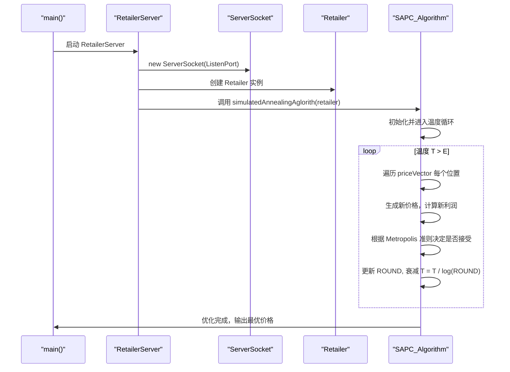
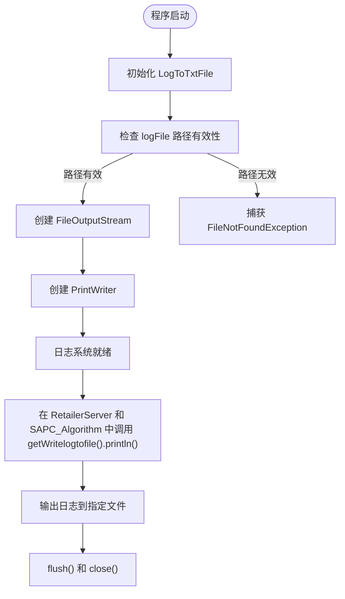

# 零售商配置

<cite>
**本文档引用的文件**  
- [RetailerInitArgs.java](file://src/main/java/io/leavesfly/smartgrid/retailer/RetailerInitArgs.java)
- [RetailerServer.java](file://src/main/java/io/leavesfly/smartgrid/retailer/RetailerServer.java)
- [SAPC_Algorithm.java](file://src/main/java/io/leavesfly/smartgrid/retailer/SAPC_Algorithm.java)
- [RetailerProfitAlgorithm.java](file://src/main/java/io/leavesfly/smartgrid/retailer/RetailerProfitAlgorithm.java)
- [LogToTxtFile.java](file://src/main/java/io/leavesfly/smartgrid/retailer/LogToTxtFile.java)
- [Retailer.java](file://src/main/java/io/leavesfly/smartgrid/retailer/Retailer.java)
- [PriceVector.java](file://src/main/java/io/leavesfly/smartgrid/retailer/PriceVector.java)
</cite>

## 目录
1. [引言](#引言)
2. [核心静态配置参数详解](#核心静态配置参数详解)
3. [利润计算参数分析](#利润计算参数分析)
4. [系统启动与配置加载流程](#系统启动与配置加载流程)
5. [配置对模拟退火算法的影响](#配置对模拟退火算法的影响)
6. [端口冲突规避与参数调优建议](#端口冲突规避与参数调优建议)
7. [日志与调试支持](#日志与调试支持)
8. [结论](#结论)

## 引言
本文档详细说明零售商系统中 `RetailerInitArgs` 类所定义的全部静态配置参数。这些参数在系统初始化阶段被加载，直接影响模拟退火算法（SA）的执行行为、收敛速度以及零售商利润优化效果。文档将结合 `RetailerServer` 的启动流程和 `SAPC_Algorithm` 的调用逻辑，全面解析各参数的作用、默认值、取值范围及其实际影响。

**本节不涉及具体源码分析，因此无须列出源文件引用。**

## 核心静态配置参数详解

`RetailerInitArgs` 类定义了零售商系统运行所需的核心静态参数，这些参数在程序启动时即被初始化并贯穿整个优化过程。

### timeSlots（时段数量）
- **默认值**: `4`
- **含义**: 将一天划分为4个独立的电价时段，用于动态定价策略。
- **作用**: 决定价格向量 `PriceVector` 的维度，影响用户用电行为的建模粒度。
- **取值范围**: 正整数，需与 `PriceVector` 类中 `timeSolts` 字段保持一致。
- **影响**: 增加时段数量可提升定价灵活性，但会显著增加搜索空间，延长算法收敛时间。

### ListenPort（监听端口）
- **默认值**: `1234`
- **含义**: 零售商服务器监听客户端（用户）连接的网络端口号。
- **作用**: 由 `RetailerServer` 在启动时创建 `ServerSocket` 实例绑定此端口。
- **取值范围**: 1024–65535（避免使用知名服务端口或系统保留端口）。
- **影响**: 若端口被占用，服务器将抛出 `IOException` 导致启动失败。

### T（初始温度）
- **默认值**: `(float) Math.exp(-1)` ≈ 0.3679
- **含义**: 模拟退火算法的初始温度，控制算法初期接受劣解的概率。
- **作用**: 温度越高，算法越倾向于探索解空间；随着迭代进行，温度逐步下降。
- **取值范围**: 大于终止温度 `E` 的正浮点数。
- **影响**: 初始温度过高可能导致收敛缓慢；过低则易陷入局部最优。

### E（终止温度）
- **默认值**: `(float) Math.exp(-5)` ≈ 0.0067
- **含义**: 算法停止运行的温度阈值。
- **作用**: 当当前温度 `T` 降至 `E` 以下时，模拟退火过程结束。
- **取值范围**: 小于初始温度 `T` 的正浮点数。
- **影响**: 终止温度越低，算法运行轮次越多，解的质量可能更高，但耗时更长。

### ROUND（优化轮次）
- **默认值**: `1`
- **含义**: 当前优化轮次计数器，用于温度衰减计算。
- **作用**: 每完成一轮完整的价格向量更新，`ROUND` 自增1，并用于更新温度 `T = T / log(ROUND)`。
- **取值范围**: 正整数。
- **影响**: 直接影响温度下降速率，进而决定算法的探索-开发平衡。

### logFile（日志文件路径）
- **默认值**: `"E:\\RetailerLog.txt"`
- **含义**: 系统运行日志输出文件的绝对路径。
- **作用**: `LogToTxtFile` 类在静态初始化块中使用该路径创建 `FileOutputStream`，用于记录调试信息和优化过程。
- **取值范围**: 有效的文件系统路径，需确保程序有写权限。
- **影响**: 路径无效或无写权限将导致日志功能失效，影响问题排查。

**Section sources**  
- [RetailerInitArgs.java](file://src/main/java/io/leavesfly/smartgrid/retailer/RetailerInitArgs.java#L1-L15)

## 利润计算参数分析

这些参数用于计算零售商在给定用电量和价格向量下的净利润，是优化目标函数的核心组成部分。

### a、b、w（利润模型系数）
- **默认值**: 
  - `a = 0.005f`
  - `b = 0.001f`
  - `w = 1`
- **含义**:
  - `a`: 二次成本项系数，代表电力供应的边际成本增长。
  - `b`: 三次成本项系数，进一步强化高负载时的成本惩罚。
  - `w`: 成本项权重，用于调节总成本在利润中的比重。
- **利润计算公式**:
  ```
  总收入 = Σ(各时段用电量 × 各时段电价)
  总成本 = w × Σ(a × 用电量² + b × 用电量³)
  净利润 = 总收入 - 总成本
  ```
- **作用**: 在最大化收入的同时，抑制过高用电负荷带来的运营成本。
- **取值范围**: 
  - `a`, `b`: 正浮点数，反映实际电网运营成本特性。
  - `w`: 正整数，用于放大或缩小成本影响。
- **影响**: 增大 `a` 或 `b` 会使算法更倾向于设定高价以抑制需求，从而降低峰值负荷；`w` 越大，成本约束越强，利润曲线更平缓。

**Section sources**  
- [RetailerProfitAlgorithm.java](file://src/main/java/io/leavesfly/smartgrid/retailer/RetailerProfitAlgorithm.java#L3-L35)
- [RetailerInitArgs.java](file://src/main/java/io/leavesfly/smartgrid/retailer/RetailerInitArgs.java#L13-L15)

## 系统启动与配置加载流程

零售商系统通过 `RetailerServer` 类启动，其主流程依赖于 `RetailerInitArgs` 中的配置参数。



**Diagram sources**  
- [RetailerServer.java](file://src/main/java/io/leavesfly/smartgrid/retailer/RetailerServer.java#L1-L42)
- [SAPC_Algorithm.java](file://src/main/java/io/leavesfly/smartgrid/retailer/SAPC_Algorithm.java#L1-L197)

**Section sources**  
- [RetailerServer.java](file://src/main/java/io/leavesfly/smartgrid/retailer/RetailerServer.java#L1-L42)
- [SAPC_Algorithm.java](file://src/main/java/io/leavesfly/smartgrid/retailer/SAPC_Algorithm.java#L1-L197)

## 配置对模拟退火算法的影响

`RetailerInitArgs` 中的参数共同决定了模拟退火算法的性能表现。

### 温度参数 (T, E) 与收敛速度
- **高初始温度 T**: 增加早期接受劣解的概率，有助于跳出局部最优，但可能导致收敛速度变慢。
- **低终止温度 E**: 允许算法进行更多轮次的精细搜索，提高解的质量，但延长运行时间。
- **温度衰减策略**: `T = T / log(ROUND)` 是一种缓慢衰减方式，有利于充分探索解空间。

### 优化轮次 (ROUND) 与探索-开发平衡
- `ROUND` 的增长直接影响温度下降速率。
- 初始阶段（ROUND 较小）温度下降较慢，侧重于**探索**（Exploration）。
- 后期阶段（ROUND 较大）温度下降加快，侧重于**开发**（Exploitation），在当前最优解附近精细搜索。

### 时段数量 (timeSlots) 与搜索空间
- 搜索空间大小随 `timeSlots` 呈指数级增长。
- 更多时段提供更灵活的定价策略，但也要求更高的 `ROUND` 和更长的运行时间以确保收敛。

**Section sources**  
- [SAPC_Algorithm.java](file://src/main/java/io/leavesfly/smartgrid/retailer/SAPC_Algorithm.java#L1-L197)
- [RetailerInitArgs.java](file://src/main/java/io/leavesfly/smartgrid/retailer/RetailerInitArgs.java#L3-L9)

## 端口冲突规避与参数调优建议

### 修改监听端口以避免冲突
- **问题**: 默认端口 `1234` 可能被其他应用占用。
- **解决方案**: 
  1. 在 `RetailerInitArgs.java` 中修改 `ListenPort` 的值，例如改为 `12345`。
  2. 确保所有客户端（用户端）代码中的连接端口同步更新。
  3. 推荐使用 `10000` 以上的端口号以减少冲突概率。

### 调整温度参数以平衡探索与开发
- **追求快速收敛**: 适当提高 `E`（如 `0.01f`），减少总轮次。
- **追求高质量解**: 适当降低 `E`（如 `0.001f`），并确保 `ROUND` 能够增长到足够大。
- **调整衰减速率**: 可修改衰减公式，例如使用 `T = T * 0.95` 实现指数衰减，以获得更稳定的收敛行为。

### 利润参数调优
- **反映真实成本**: `a` 和 `b` 应根据实际电网的发电和输电成本进行校准。
- **调节优化目标**: 增大 `w` 可使算法更关注成本控制，适用于成本敏感型零售商。

**本节为实践建议，不直接分析特定源码文件，因此无须列出源文件引用。**

## 日志与调试支持

系统通过 `LogToTxtFile` 类实现日志功能，其行为依赖于 `RetailerInitArgs.logFile` 配置。



**Diagram sources**  
- [LogToTxtFile.java](file://src/main/java/io/leavesfly/smartgrid/retailer/LogToTxtFile.java#L1-L32)
- [RetailerInitArgs.java](file://src/main/java/io/leavesfly/smartgrid/retailer/RetailerInitArgs.java#L7)

**Section sources**  
- [LogToTxtFile.java](file://src/main/java/io/leavesfly/smartgrid/retailer/LogToTxtFile.java#L1-L32)

## 结论

`RetailerInitArgs` 类是整个零售商系统的核心配置中心，其定义的静态参数不仅设定了系统的基本运行环境（如端口、日志路径），更深刻影响了模拟退火算法的优化行为和最终的利润结果。正确理解和调优这些参数，对于实现高效、稳定的智能电网定价策略至关重要。建议在实际部署前，根据具体场景对温度参数、利润系数和端口设置进行充分测试和调整。

**本节为总结性内容，不直接分析特定源码文件，因此无须列出源文件引用。**