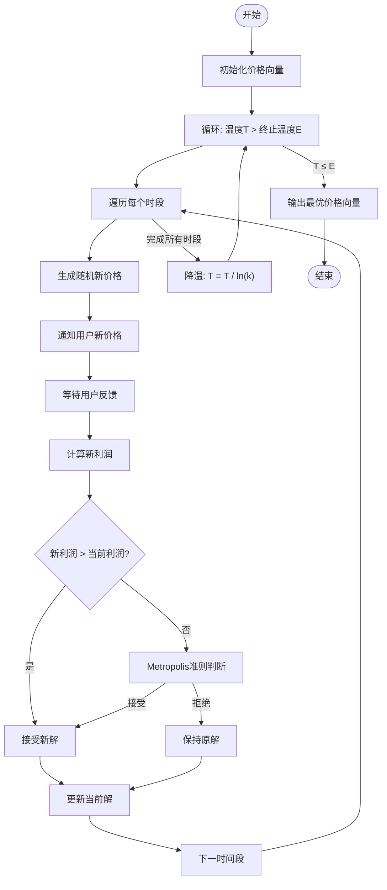
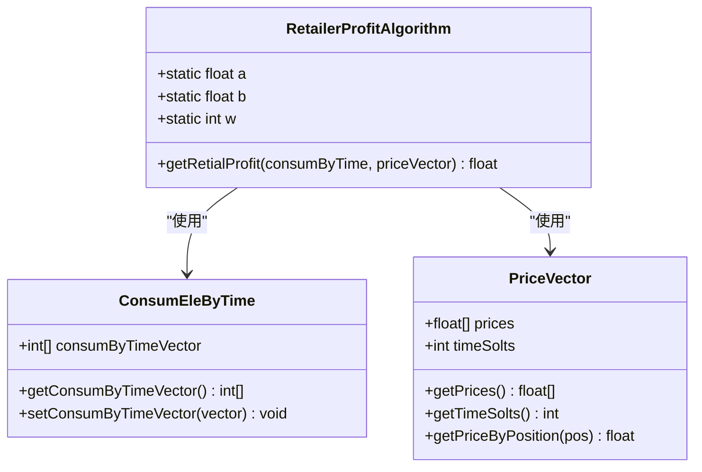
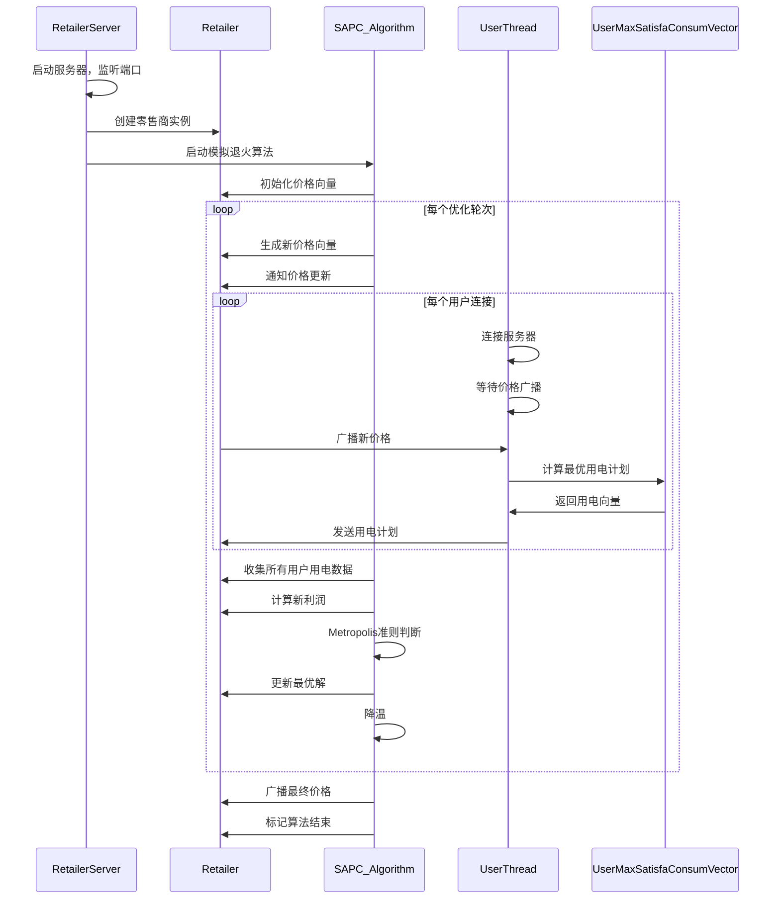
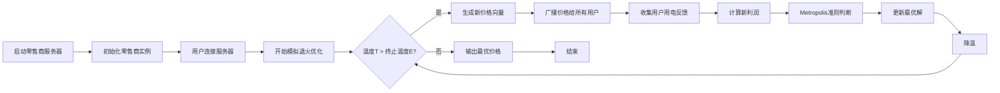
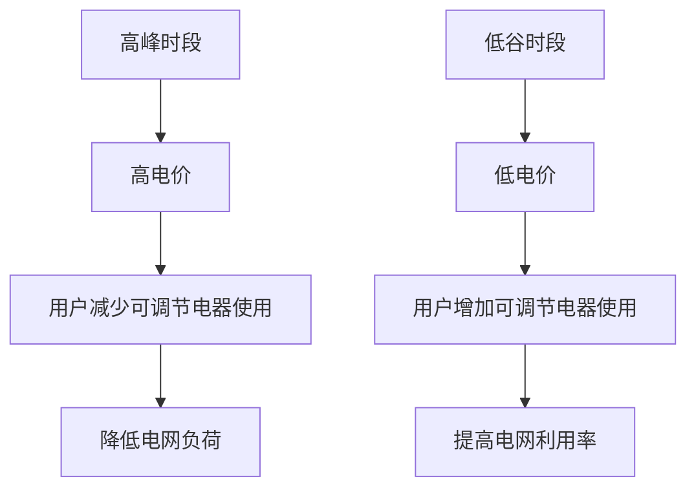
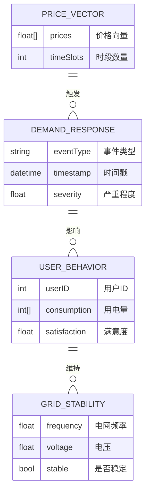

# 项目概述

<cite>
**本文档引用的文件**  
- [README.md](file://README.md)
- [RetailerServer.java](file://src/main/java/io/leavesfly/smartgrid/retailer/RetailerServer.java)
- [Retailer.java](file://src/main/java/io/leavesfly/smartgrid/retailer/Retailer.java)
- [SAPC_Algorithm.java](file://src/main/java/io/leavesfly/smartgrid/retailer/SAPC_Algorithm.java)
- [RetailerProfitAlgorithm.java](file://src/main/java/io/leavesfly/smartgrid/retailer/RetailerProfitAlgorithm.java)
- [UserThread.java](file://src/main/java/io/leavesfly/smartgrid/user/UserThread.java)
- [UserMaxSatisfaConsumVector.java](file://src/main/java/io/leavesfly/smartgrid/user/UserMaxSatisfaConsumVector.java)
- [RetailerInitArgs.java](file://src/main/java/io/leavesfly/smartgrid/retailer/RetailerInitArgs.java)
- [UsersArgs.java](file://src/main/java/io/leavesfly/smartgrid/user/UsersArgs.java)
</cite>

## 目录
1. [引言](#引言)
2. [系统架构](#系统架构)
3. [核心算法分析](#核心算法分析)
4. [组件交互流程](#组件交互流程)
5. [系统工作流程](#系统工作流程)
6. [配置参数说明](#配置参数说明)
7. [实际应用场景](#实际应用场景)
8. [结论](#结论)

## 引言

智能电网需求响应管理系统（SmartGrid）是一个基于实时电价控制的电力资源优化系统，旨在通过动态电价机制实现供需平衡。系统通过模拟退火算法（SAPC）优化零售商利润，同时考虑用户用电满意度，构建了一个闭环的需求响应管理框架。该系统模拟了零售商与用户之间的互动过程，零售商根据用户用电行为调整电价策略，用户则根据电价调整用电计划，从而实现电力系统的整体优化。

**Section sources**
- [README.md](file://README.md#L1-L50)

## 系统架构

智能电网需求响应管理系统采用客户端-服务器架构，分为零售商模块和用户模块两大核心部分。系统通过Socket通信实现模块间的数据交换，采用多线程技术处理并发请求，确保系统的实时性和响应性。

```mermaid
graph TB
subgraph "零售商模块"
RS[RetailerServer]
R[Retailer]
SA[SAPC_Algorithm]
PV[PriceVector]
RPA[RetailerProfitAlgorithm]
RT[RetailerThread]
end
subgraph "用户模块"
U[Users]
UT[UserThread]
OUCV[OneUserConsumVector]
UMCV[UserMaxSatisfaConsumVector]
end
RS --> RT
RT --> R
R --> SA
R --> PV
R --> RPA
U --> UT
UT --> OUCV
UT --> UMCV
UMCV --> PV
RT < --> UT
```

**Diagram sources**
- [RetailerServer.java](file://src/main/java/io/leavesfly/smartgrid/retailer/RetailerServer.java#L1-L43)
- [UserThread.java](file://src/main/java/io/leavesfly/smartgrid/user/UserThread.java#L1-L87)

**Section sources**
- [README.md](file://README.md#L50-L100)

## 核心算法分析

### 模拟退火算法（SAPC）

系统采用模拟退火算法（Simulated Annealing Price Control）进行电价优化。该算法通过模拟物理退火过程，在解空间中搜索最优电价向量。算法从初始温度T开始，逐步降低温度，允许在早期阶段接受较差的解以避免陷入局部最优，随着温度降低，逐渐收敛到全局最优解。



**Diagram sources**
- [SAPC_Algorithm.java](file://src/main/java/io/leavesfly/smartgrid/retailer/SAPC_Algorithm.java#L1-L198)

### 零售商利润计算

零售商利润计算考虑了收入和成本两个方面。收入来自用户电费支付，成本与总用电量的二次方和三次方相关，反映了电力系统的边际成本递增特性。

**利润计算公式**:
```
利润 = Σ(各时段用电量 × 电价) - w × Σ(a × 用电量² + b × 用电量³)
```

其中：
- a = 0.005 (二次成本系数)
- b = 0.001 (三次成本系数)
- w = 1 (成本权重)



**Diagram sources**
- [RetailerProfitAlgorithm.java](file://src/main/java/io/leavesfly/smartgrid/retailer/RetailerProfitAlgorithm.java#L1-L36)
- [RetailerInitArgs.java](file://src/main/java/io/leavesfly/smartgrid/retailer/RetailerInitArgs.java#L1-L16)

**Section sources**
- [SAPC_Algorithm.java](file://src/main/java/io/leavesfly/smartgrid/retailer/SAPC_Algorithm.java#L1-L198)
- [RetailerProfitAlgorithm.java](file://src/main/java/io/leavesfly/smartgrid/retailer/RetailerProfitAlgorithm.java#L1-L36)

## 组件交互流程

系统通过Socket通信实现零售商与用户之间的交互。零售商服务器监听指定端口，用户客户端连接到服务器，形成双向通信通道。系统采用生产者-消费者模式，零售商作为生产者生成价格向量，用户作为消费者反馈用电计划。



**Diagram sources**
- [RetailerServer.java](file://src/main/java/io/leavesfly/smartgrid/retailer/RetailerServer.java#L1-L43)
- [UserThread.java](file://src/main/java/io/leavesfly/smartgrid/user/UserThread.java#L1-L87)
- [SAPC_Algorithm.java](file://src/main/java/io/leavesfly/smartgrid/retailer/SAPC_Algorithm.java#L1-L198)

**Section sources**
- [RetailerServer.java](file://src/main/java/io/leavesfly/smartgrid/retailer/RetailerServer.java#L1-L43)
- [UserThread.java](file://src/main/java/io/leavesfly/smartgrid/user/UserThread.java#L1-L87)

## 系统工作流程

系统工作流程从启动到算法收敛可分为以下几个阶段：

1. **初始化阶段**：零售商服务器启动，创建零售商实例，初始化价格向量和算法参数
2. **连接阶段**：用户客户端连接到零售商服务器，建立通信通道
3. **优化阶段**：零售商使用模拟退火算法迭代优化价格向量
4. **收敛阶段**：当温度降低到终止温度时，算法收敛，输出最优价格策略



**Diagram sources**
- [README.md](file://README.md#L100-L150)
- [SAPC_Algorithm.java](file://src/main/java/io/leavesfly/smartgrid/retailer/SAPC_Algorithm.java#L1-L198)

**Section sources**
- [README.md](file://README.md#L100-L150)

## 配置参数说明

### 零售商配置参数

| 参数 | 类型 | 默认值 | 说明 |
|------|------|--------|------|
| timeSlots | int | 4 | 时段数量 |
| ListenPort | int | 1234 | 服务监听端口 |
| T | float | e⁻¹ | 模拟退火初始温度 |
| E | float | e⁻⁵ | 模拟退火终止温度 |
| ROUND | int | 1 | 当前优化轮次 |
| logFile | String | E:\RetailerLog.txt | 日志文件路径 |
| a | float | 0.005 | 利润计算二次项系数 |
| b | float | 0.001 | 利润计算三次项系数 |
| w | int | 1 | 成本权重 |

### 用户配置参数

| 参数 | 类型 | 默认值 | 说明 |
|------|------|--------|------|
| userNum | int | 2 | 用户数量 |
| timeSlots | int | 4 | 时段数量 |
| ip | String | 127.0.0.1 | 服务器IP地址 |
| port | int | 1234 | 服务器端口 |
| A_applianceNum | int | 4 | A类电器数量（不可调节） |
| B_applianceNum | int | 4 | B类电器数量（可调节） |
| userMax | int[] | [10,12] | 各用户最大用电量限制 |
| A_applianceConsum | int[][] | 见代码 | A类电器固定用电量 |
| B_applianceConsumMax | int[][] | 见代码 | B类电器最大用电量 |
| users_B_applianceSatisfa | int[][][] | 见代码 | B类电器用户满意度 |

**Section sources**
- [RetailerInitArgs.java](file://src/main/java/io/leavesfly/smartgrid/retailer/RetailerInitArgs.java#L1-L16)
- [UsersArgs.java](file://src/main/java/io/leavesfly/smartgrid/user/UsersArgs.java#L1-L46)

## 实际应用场景

### 峰谷电价调节

在高峰时段，系统通过提高电价引导用户减少用电；在低谷时段，通过降低电价鼓励用户增加用电。这种动态定价机制有效平滑了负荷曲线，提高了电网运行效率。



### 需求响应事件处理

当电网出现紧急情况时，系统可以快速调整电价策略，激励用户立即减少用电。零售商通过模拟退火算法快速找到最优应急价格方案，确保电网安全稳定运行。



**Section sources**
- [README.md](file://README.md#L150-L185)
- [UserMaxSatisfaConsumVector.java](file://src/main/java/io/leavesfly/smartgrid/user/UserMaxSatisfaConsumVector.java#L1-L49)

## 结论

智能电网需求响应管理系统通过模拟退火算法实现了电价的动态优化，在零售商利润和用户满意度之间找到了平衡点。系统采用清晰的模块化设计，零售商模块负责价格优化和利润计算，用户模块模拟用户对价格的响应行为。通过Socket通信机制，系统实现了零售商与用户之间的实时互动，形成了一个闭环的需求响应管理框架。

该系统不仅为智能电网的研究提供了有价值的模拟平台，也为实际电力系统的优化调度提供了理论参考。未来可以通过引入更多优化算法、增加图形化界面和实时数据可视化功能，进一步提升系统的实用性和用户体验。

**Section sources**
- [README.md](file://README.md#L1-L185)
- [SAPC_Algorithm.java](file://src/main/java/io/leavesfly/smartgrid/retailer/SAPC_Algorithm.java#L1-L198)